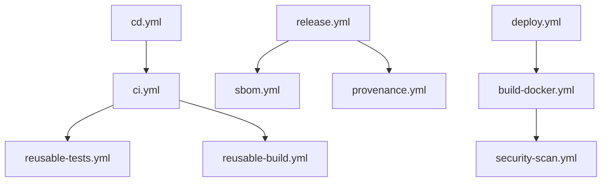

# GitHub Actions Workflows

Enterprise-grade CI/CD pipeline for DevSkyy platform.

## Workflow Structure

### Core Pipelines

- **ci.yml** - Continuous Integration
  - Runs on: push, pull_request
  - Calls: reusable-tests.yml, reusable-build.yml
  - Purpose: Validate code quality and build

- **cd.yml** - Continuous Deployment
  - Runs on: push to main, version tags
  - Environments: staging, production
  - Purpose: Automated deployment

### Code Quality

- **python-quality.yml** - Python Code Analysis
  - Tools: Ruff, MyPy, Black, Coverage
  - Coverage threshold: 90%
  - Runs: Parallel quality checks

### Security

- **security-scan.yml** - Security Analysis
  - Tools: Bandit, pip-audit, Safety, TruffleHog
  - Scheduled: Daily at 4 AM UTC
  - Purpose: Detect vulnerabilities and secrets

- **dependency-review.yml** - Dependency Analysis
  - Runs on: Pull requests
  - Checks: License compliance, vulnerability review
  - Fails on: High severity issues

### Build & Release

- **build-docker.yml** - Docker Image Build
  - Registry: GitHub Container Registry (ghcr.io)
  - Scanning: Trivy security scan
  - Caching: GitHub Actions cache

- **release.yml** - Release Automation
  - Triggers: Version tags (v*)
  - Publishes to: PyPI, GitHub Releases
  - Generates: Changelog, release notes

### Quality Gates

DevSkyy enforces these quality gates across all pipelines:

1. **Lint & Type Check** - Ruff, Black, isort, mypy
2. **Security Scan** - Bandit, Safety, pip-audit, Trivy
3. **Test Coverage ≥90%** - Pytest with coverage enforcement
4. **Performance SLOs** - P95 < 200ms, error rate < 0.5%
5. **Container Security** - Trivy scanning (filesystem and image)
6. **Secret Scanning** - TruffleHog, detect-secrets
7. **SBOM Generation** - CycloneDX, SPDX formats
8. **Error Ledger** - JSON audit trail

### Compliance & Attestation

- **sbom.yml** - Software Bill of Materials
  - Formats: CycloneDX, SPDX
  - Submission: GitHub dependency graph
  - Retention: 90 days

- **provenance.yml** - Build Provenance
  - Standard: SLSA Level 3
  - Attestation: Build artifacts
  - Purpose: Supply chain security

### AI & Testing

- **ai-tests.yml** - AI System Tests
  - Tests: Agent, ML, Integration
  - Paths: agent/**, ml/**, ai_orchestration/**
  - Secrets: API keys for Anthropic, OpenAI

### Reusable Workflows

- **reusable-tests.yml** - Shared Test Runner
  - Inputs: python-version, coverage-threshold
  - Matrix: Python 3.11, 3.12
  - Parallel execution with pytest-xdist

- **reusable-build.yml** - Shared Build Process
  - Inputs: environment, python-version
  - Outputs: Build artifacts
  - Retention: 30 days

- **reusable-security.yml** - Security Scanning Suite
  - Safety, Bandit, Trivy, pip-audit, Semgrep
  - Fails on HIGH/CRITICAL vulnerabilities

- **reusable-quality.yml** - Code Quality Checks
  - Ruff, Black, isort, Mypy
  - OpenAPI validation with check-jsonschema

- **reusable-test.yml** - Test Suite
  - Unit, integration, API, security tests
  - PostgreSQL + Redis services
  - Coverage threshold: 90%

- **deploy.yml** - Production Deployment
  - Cloud Run, Kubernetes deployments
  - SLSA provenance generation
  - Database migrations via Cloud Run Jobs

## Usage Examples

### Trigger CI manually:
```bash
gh workflow run ci.yml
```

### Create a release:
```bash
git tag v1.0.0
git push origin v1.0.0
```

### Run security scan:
```bash
gh workflow run security-scan.yml
```

## Required Secrets

Configure these in **Settings → Secrets and variables → Actions**:

```bash
# API Keys (if needed)
ANTHROPIC_API_KEY        # For Claude API
OPENAI_API_KEY          # For OpenAI API
CODECOV_TOKEN           # For coverage uploads

# Database (required for deployment)
DATABASE_URL            # PostgreSQL connection string

# Deployment (if needed)
DOCKER_USERNAME         # For Docker Hub
DOCKER_PASSWORD         # For Docker Hub
AWS_ACCESS_KEY_ID       # For AWS deployment
AWS_SECRET_ACCESS_KEY   # For AWS deployment
GCP_SA_KEY             # For Google Cloud deployment
KUBE_CONFIG            # For Kubernetes deployment
SLACK_WEBHOOK          # For deployment notifications
PYPI_API_TOKEN         # For PyPI publishing

# Auto-provided
GITHUB_TOKEN           # Automatically provided by GitHub
```

## Workflow Dependencies



## Best Practices

1. **Parallel Execution**: Independent jobs run in parallel
2. **Reusability**: Common workflows are reusable
3. **Security First**: Multiple security scans at different stages
4. **Fail Fast**: Critical checks fail the pipeline immediately
5. **Caching**: pip and Docker layer caching enabled
6. **Artifacts**: Build outputs retained for debugging
7. **Truth Protocol**: All gates enforce zero-defect deployment

## Maintenance

- Review workflow runs weekly
- Update action versions monthly
- Monitor security scan results daily
- Archive old workflow runs (>90 days)

## Troubleshooting

### Common Issues

#### Tests Failing

**Coverage below 90%:**
```bash
# Run tests locally with coverage
pytest --cov=. --cov-report=html --cov-report=term
open htmlcov/index.html  # View coverage report
```

**Fix:** Add tests for uncovered code paths.

#### Security Scan Failures

**HIGH/CRITICAL CVEs found:**
```bash
# Run security scans locally
pip install bandit safety pip-audit
bandit -r . -f json
safety check
pip-audit
```

**Fix:** Update vulnerable dependencies or apply patches.

#### Workflow Debugging

**View detailed logs:**
1. Go to **Actions** tab
2. Click failing workflow run
3. Expand failed job
4. Review logs and artifacts

**Re-run workflows:**
```bash
# Via GitHub UI
Actions → Failed Run → Re-run failed jobs

# Or push empty commit
git commit --allow-empty -m "chore: trigger CI"
git push
```

**Download artifacts:**
```bash
# Via GitHub CLI
gh run list
gh run view <run-id>
gh run download <run-id>
```

## References

- [GitHub Actions Documentation](https://docs.github.com/actions)
- [Truth Protocol](../../CLAUDE.md)
- [DevSkyy Documentation](../../README.md)
- [Security Policy](../../SECURITY.md)
