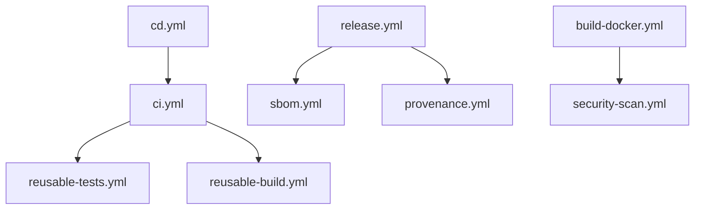

# GitHub Actions Workflows

Enterprise-grade CI/CD pipeline for DevSkyy platform.

## Workflow Structure

### Core Pipelines

- **ci.yml** - Continuous Integration
  - Runs on: push, pull_request
  - Calls: reusable-tests.yml, reusable-build.yml
  - Purpose: Validate code quality and build

- **cd.yml** - Continuous Deployment
  - Runs on: push to main, version tags
  - Environments: staging, production
  - Purpose: Automated deployment

### Code Quality

- **python-quality.yml** - Python Code Analysis
  - Tools: Ruff, MyPy, Black, Coverage
  - Coverage threshold: 90%
  - Runs: Parallel quality checks

### Security

- **security-scan.yml** - Security Analysis
  - Tools: Bandit, pip-audit, Safety, TruffleHog
  - Scheduled: Daily at 4 AM UTC
  - Purpose: Detect vulnerabilities and secrets

- **dependency-review.yml** - Dependency Analysis
  - Runs on: Pull requests
  - Checks: License compliance, vulnerability review
  - Fails on: High severity issues

### Build & Release

- **build-docker.yml** - Docker Image Build
  - Registry: GitHub Container Registry (ghcr.io)
  - Scanning: Trivy security scan
  - Caching: GitHub Actions cache

- **release.yml** - Release Automation
  - Triggers: Version tags (v*)
  - Publishes to: PyPI, GitHub Releases
  - Generates: Changelog, release notes

### Compliance & Attestation

- **sbom.yml** - Software Bill of Materials
  - Formats: CycloneDX, SPDX
  - Submission: GitHub dependency graph
  - Retention: 90 days

- **provenance.yml** - Build Provenance
  - Standard: SLSA Level 3
  - Attestation: Build artifacts
  - Purpose: Supply chain security

### AI & Testing

- **ai-tests.yml** - AI System Tests
  - Tests: Agent, ML, Integration
  - Paths: agent/**, ml/**, ai_orchestration/**
  - Secrets: API keys for Anthropic, OpenAI

### Reusable Workflows

- **reusable-tests.yml** - Shared Test Runner
  - Inputs: python-version, coverage-threshold
  - Matrix: Python 3.11, 3.12
  - Parallel execution with pytest-xdist

- **reusable-build.yml** - Shared Build Process
  - Inputs: environment, python-version
  - Outputs: Build artifacts
  - Retention: 30 days

## Usage Examples

### Trigger CI manually:
```bash
gh workflow run ci.yml
```

### Create a release:
```bash
git tag v1.0.0
git push origin v1.0.0
```

### Run security scan:
```bash
gh workflow run security-scan.yml
```

## Required Secrets

- `ANTHROPIC_API_KEY` - For AI tests
- `OPENAI_API_KEY` - For AI tests
- `PYPI_API_TOKEN` - For PyPI publishing
- `GITHUB_TOKEN` - Auto-provided by GitHub

## Workflow Dependencies



## Best Practices

1. **Parallel Execution**: Independent jobs run in parallel
2. **Reusability**: Common workflows are reusable
3. **Security First**: Multiple security scans at different stages
4. **Fail Fast**: Critical checks fail the pipeline immediately
5. **Caching**: pip and Docker layer caching enabled
6. **Artifacts**: Build outputs retained for debugging

## Maintenance

- Review workflow runs weekly
- Update action versions monthly
- Monitor security scan results daily
- Archive old workflow runs (>90 days)
