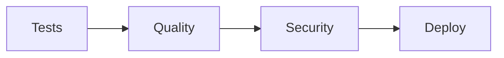

# DevSkyy GitHub Actions Workflows

Modular CI/CD automation following the **Truth Protocol** for DevSkyy's enterprise-grade multi-agent platform.

## 📋 Table of Contents

- [Overview](#overview)
- [Workflows](#workflows)
- [Truth Protocol Compliance](#truth-protocol-compliance)
- [Quick Start](#quick-start)
- [Workflow Details](#workflow-details)
- [Troubleshooting](#troubleshooting)

## 🎯 Overview

DevSkyy's CI/CD pipeline ensures **zero-defect deployment** through automated testing, security scanning, and performance validation using a modular, reusable workflow architecture. All workflows align with the Truth Protocol requirements:

- ✅ **90%+ test coverage** requirement (enforced)
- ✅ **No HIGH/CRITICAL CVEs** allowed
- ✅ **Reusable workflow components** for maintainability
- ✅ **SBOM generation** for compliance
- ✅ **Parallel execution** for speed

## 🚀 Workflows

| Workflow | Purpose | Trigger | Status |
|----------|---------|---------|--------|
| [CI Orchestrator](#ci-orchestrator) | Main CI/CD coordination | Push, PR, Daily | Required |
| [Reusable Test Suite](#reusable-test-suite) | Multi-version Python testing | Called by ci.yml | Required |
| [Reusable Quality](#reusable-quality-suite) | Code quality checks | Called by ci.yml | Required |
| [Reusable Security](#reusable-security-suite) | Security scanning + SBOM | Called by ci.yml | Required |
| [Deploy](#deploy) | Cloud Run deployment | Main branch only | Conditional |

## 📜 Truth Protocol Compliance

Every workflow enforces DevSkyy's Truth Protocol:

### Pipeline Flow
```
Tests → Quality → Security → Deploy (main only)
```

### Quality Gates
1. **Multi-version Testing** - Python 3.10, 3.11, 3.12
2. **Code Quality** - Ruff, Black, isort, Flake8, mypy
3. **Security Scan** - Safety, pip-audit, Bandit, Semgrep, Trivy
4. **Test Coverage ≥90%** - Enforced via Python script
5. **SBOM Generation** - CycloneDX format
6. **Container Security** - Trivy image scanning

## 🏁 Quick Start

### Enable Workflows

1. **Push code** to any branch:
   ```bash
   git add .
   git commit -m "feat: add new feature"
   git push origin your-branch
   ```

2. **Create Pull Request** to `main` or `develop`:
   - All workflows run automatically
   - Checks must pass before merge
   - Review security findings

3. **Monitor Progress**:
   - Visit **Actions** tab in GitHub
   - View real-time logs
   - Download artifacts

### Required Secrets

Configure these in **Settings → Secrets and variables → Actions**:

```bash
# Google Cloud (for deployment)
GCP_WIP                 # Workload Identity Provider
GCP_SA                  # Service Account

# GitHub (auto-configured)
GITHUB_TOKEN           # For GHCR access
```

## 📖 Workflow Details

### CI Orchestrator

**File:** `ci.yml`

Main workflow that coordinates all CI/CD activities using reusable workflows.

#### Jobs Flow



#### Features

- **Reusable workflows**: DRY principle, single source of truth
- **Job dependencies**: Sequential execution with fail-fast
- **Scheduled runs**: Daily at 3 AM UTC for regression detection
- **Main-only deploy**: Production deployment only on main branch

#### Permissions

```yaml
permissions:
  contents: read
  id-token: write      # For OIDC authentication
  packages: write      # For GHCR
  security-events: write  # For security findings
```

#### Usage

```yaml
on:
  pull_request:        # All PRs
  push:
    branches: [main, develop]
  workflow_dispatch:   # Manual trigger
  schedule:
    - cron: "0 3 * * *"  # Daily 3 AM UTC
```

---

### Reusable Test Suite

**File:** `reusable-test.yml`

Multi-version Python testing with strict coverage enforcement.

#### Matrix Strategy

```yaml
matrix:
  python-version: ["3.10", "3.11", "3.12"]
```

#### Steps

1. **Setup Python** with pip caching
2. **Install dependencies** from requirements.txt
3. **Run pytest** with parallel execution (`-n auto`)
4. **Enforce ≥90% coverage** using Python XML parser
5. **Upload artifacts** for review

#### Coverage Enforcement

```python
# Parses coverage.xml and exits 1 if < 90%
import xml.etree.ElementTree as ET
tree = ET.parse('coverage.xml')
pct = float(tree.getroot().attrib['line-rate']) * 100
sys.exit(0 if pct >= 90 else 1)
```

#### Artifacts

- Test results (uploaded)
- Coverage XML (uploaded)

---

### Reusable Quality Suite

**File:** `reusable-quality.yml`

Code quality and type checking with multiple linters.

#### Tools

1. **Ruff** - Fast Python linter
2. **Black** - Code formatter
3. **isort** - Import sorter
4. **Flake8** - PEP8 compliance
5. **mypy** - Static type checking
6. **OpenAPI validation** - Schema validation (if exists)

#### Usage

```yaml
quality:
  uses: ./.github/workflows/reusable-quality.yml
  secrets: inherit
  needs: tests
```

---

### Reusable Security Suite

**File:** `reusable-security.yml`

Comprehensive security scanning with SBOM generation.

#### Security Tools

1. **Safety** - Known vulnerability database
2. **pip-audit** - PyPI vulnerability scanner
3. **Bandit** - Python security linter
4. **Semgrep** - Semantic code analysis
5. **Trivy** - Filesystem vulnerability scanner
6. **CycloneDX** - SBOM generation (CycloneDX JSON)

#### SBOM Generation

```bash
cyclonedx-py --format json -o sbom.json
```

- **Format**: CycloneDX JSON
- **Retention**: 90 days
- **Use**: Compliance and audit

#### Permissions

```yaml
permissions:
  security-events: write  # For GitHub Security tab
```

#### Artifacts

- SBOM (sbom.json) - 90 days retention

---

### Deploy

**File:** `deploy.yml`

Google Cloud Run deployment with health checks.

#### Deployment Flow

1. **Build Docker image** with SHA tag
2. **Scan image** with Trivy (blocks on vulnerabilities)
3. **Push to GHCR** (GitHub Container Registry)
4. **Authenticate to Google Cloud** via OIDC
5. **Deploy to Cloud Run** with gcloud CLI
6. **Run DB migrations** using Neon
7. **Health check** via curl

#### Environment

```yaml
env:
  SERVICE_NAME: api
  REGION: us-central1
  IMAGE: ghcr.io/${{ github.repository }}/api:${{ github.sha }}
```

#### Permissions

```yaml
permissions:
  contents: read
  id-token: write    # For Google OIDC
  packages: write    # For GHCR
```

#### Conditional Execution

```yaml
if: github.ref == 'refs/heads/main'
```

Only runs on main branch pushes.

---

## 🔧 Troubleshooting

### Common Issues

#### Tests Failing

**Coverage below 90%:**
```bash
# Run tests locally with coverage
pytest --cov=. --cov-report=html --cov-report=term
open htmlcov/index.html  # View coverage report
```

**Fix:** Add tests for uncovered code paths.

#### Security Scan Failures

**HIGH/CRITICAL CVEs found:**
```bash
# Run security scans locally
pip install safety pip-audit bandit
safety check --full-report
pip-audit --strict
bandit -r .
```

**Fix:** Update vulnerable dependencies or apply patches.

#### Quality Check Failures

**Linting errors:**
```bash
# Fix formatting automatically
pip install ruff black isort
ruff check . --fix
black .
isort .
```

**Type errors:**
```bash
# Run mypy locally
pip install mypy
mypy .
```

### Workflow Debugging

**View detailed logs:**
1. Go to **Actions** tab
2. Click failing workflow run
3. Expand failed job
4. Review logs and artifacts

**Re-run workflows:**
```bash
# Via GitHub UI
Actions → Failed Run → Re-run failed jobs

# Or push empty commit
git commit --allow-empty -m "chore: trigger CI"
git push
```

**Download artifacts:**
```bash
# Via GitHub CLI
gh run list
gh run view <run-id>
gh run download <run-id>
```

### Getting Help

**Resources:**
- [GitHub Actions Docs](https://docs.github.com/actions)
- [Truth Protocol](../../CLAUDE.md)
- [DevSkyy Documentation](../../README.md)

**Contact:**
- Create issue in GitHub
- Tag: `ci-cd`, `workflows`, `help-wanted`

---

## 📊 Workflow Status

Check workflow status:

[](https://github.com/The-Skyy-Rose-Collection-LLC/DevSkyy/actions/workflows/ci.yml)

---

## 🎓 Best Practices

### For Developers

1. **Run tests locally** before pushing
2. **Check security scans** with local tools
3. **Review CI logs** if builds fail
4. **Write tests** for new features (maintain ≥90%)
5. **Follow Truth Protocol** requirements

### For Reviewers

1. **Check CI status** before approving PRs
2. **Review security findings** in artifacts
3. **Validate coverage** doesn't decrease
4. **Ensure all checks pass** before merge

### For Maintainers

1. **Monitor workflow runs** weekly
2. **Update reusable workflows** when needed
3. **Keep secrets** up to date
4. **Review SBOM** for supply chain security

---

## 📝 Changelog

### 2025-11-17 - Modular Reusable Workflows
- ✅ Refactored to reusable workflow architecture
- ✅ Added multi-version Python testing (3.10, 3.11, 3.12)
- ✅ Implemented strict 90% coverage enforcement
- ✅ Integrated Google Cloud Run deployment
- ✅ Added SBOM generation with CycloneDX
- ✅ Configured OIDC authentication for secure deployments

---

**DevSkyy Workflows - Modular CI/CD Automation**

Built with ❤️ following the Truth Protocol for zero-defect deployment.
