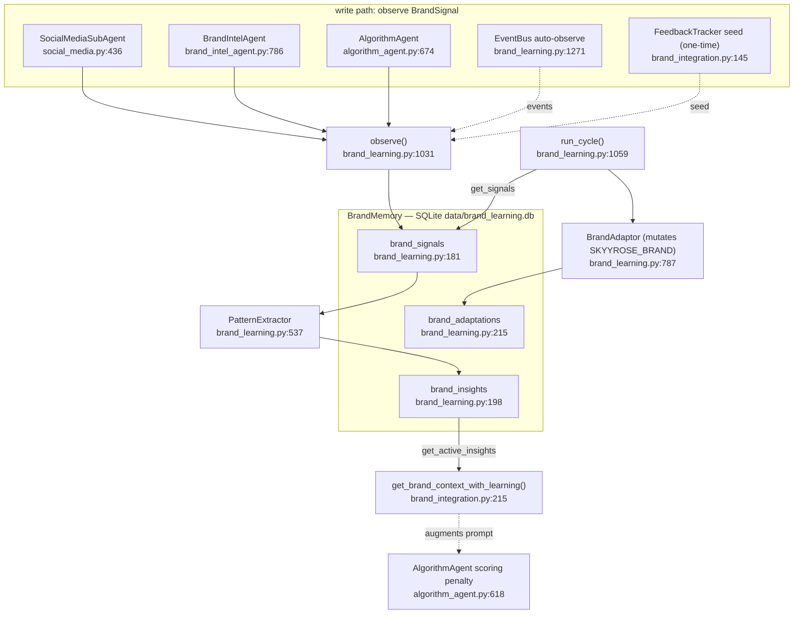

# F6 — brand-learning (SQLite feedback loop, NOT vector RAG)

**Entry class:** `BrandLearningLoop` — `orchestration/brand_learning.py:948`; factory `create_brand_learning_loop()` :1310; wiring `wire_brand_learning()` — `orchestration/brand_integration.py:38`
**Storage:** SQLite — `./data/brand_learning.db` (3 tables). NO embeddings, NO vector store.
**Confidence:** HIGH (full file read + bi-directional grep vs I1/I2)

## Flowchart

## Findings
- **SQLite, not vector RAG — CONFIRMED.** Only stdlib `sqlite3` imported; no chromadb/pinecone/embedding import. 3 tables: brand_signals (raw agent outputs + accept/reject), brand_insights (statistical patterns in 8 categories), brand_adaptations (mutations to live `SKYYROSE_BRAND` dict).
- It learns **acceptance-rate patterns** (which provider/agent produces accepted brand copy), NOT semantic similarity. No ML inference at store or read time.
- **ZERO shared infra with I1/I2** (bi-directional grep clean). **F6 does NOT belong in a unified RAG proposal** — it is an orthogonal feedback loop. List as out-of-scope-for-merge in Phase 3.

## Gaps
- `main_enterprise.py` has no direct `brand_learning` ref; `on_startup()` wiring not observed there (may be wired via a separate module or not yet).
- `on_cycle_check()` periodic trigger defined (`brand_integration.py:280`) but no scheduler/cron call site found.
