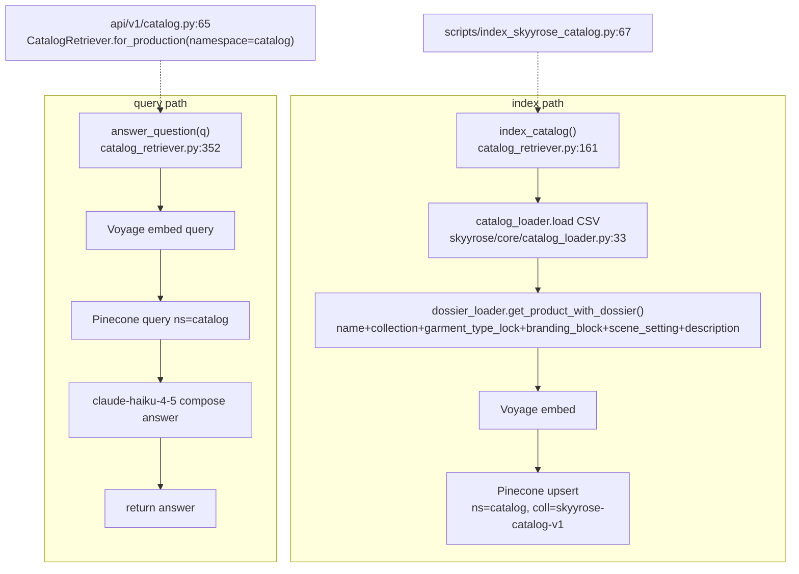

# F3 — catalog-retriever

**Entry:** `CatalogRetriever.index_catalog()` :161 / `.answer_question()` :352 — `orchestration/catalog_retriever.py`
**Store:** Voyage embeddings + Pinecone — collection `skyyrose-catalog-v1`, namespace `catalog`
**LLM:** `claude-haiku-4-5-20251001`
**Confidence:** HIGH (both production callers read; content composition traced to dossier_loader)

## Flowchart

## Findings
- **Two production callers:** `scripts/index_skyyrose_catalog.py:67` (index) and `api/v1/catalog.py:65` via `CatalogRetriever.for_production(namespace="catalog")` (query) → the Voyage+Pinecone path.
- **Content composition** now via `dossier_loader.get_product_with_dossier()` = name + collection + garment_type_lock + branding_block + scene_setting + description. (00-features.md described an older composition — branding_spec+description+name — STALE; reconcile.)
- Source of truth: catalog CSV `wordpress-theme/skyyrose-flagship/data/skyyrose-catalog.csv` loaded by `skyyrose/core/catalog_loader.py:33`.

## Gaps
- Overlap with F2's `skyyrose-catalog` collection (LightRAG) — same CSV feeding two different vector stores under near-identical collection names. Strong Phase 2 candidate.
