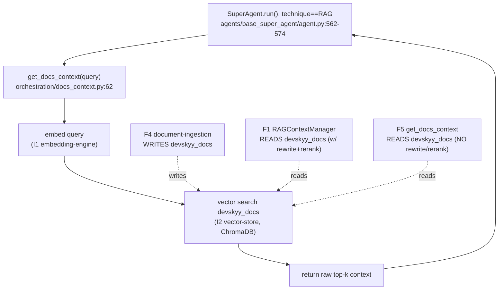

# F5 — docs-context

**Entry:** `get_docs_context()` — `orchestration/docs_context.py:62`
**Call site:** `agents/base_super_agent/agent.py:562-574` (all 6 SuperAgents, when technique == RAG)
**Store:** ChromaDB — collection `devskyy_docs` (SAME as F1 reader / F4 writer)
**Confidence:** HIGH (call site + collection target confirmed)

## Flowchart

## Findings
- **CRITICAL OVERLAP CONFIRMED:** F4 (writer), F5 (reader), F1 (reader) all target the SAME `devskyy_docs` ChromaDB collection with **no coordination / no locking**.
- **F5 bypasses F1's pipeline** — no query rewriting, no reranking, no caching. A SuperAgent on the RAG technique gets raw top-k, while the "richer" F1 path exists but is barely wired (see F1's no-arg ctor bug).
- Two readers of one collection with divergent quality = the central duplication thesis.

## Gaps
- Whether any agent ever routes through F1 instead of F5 in production — F1 looks effectively dead, F5 is the live reader. Confirm in Phase 2.
