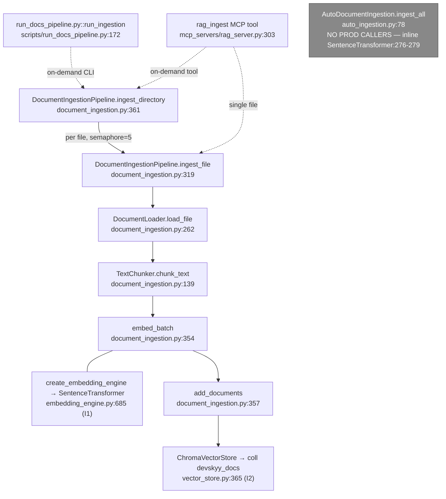

# F4 — document-ingestion (the WRITE side of devskyy_docs)

**Live entry:** `DocumentIngestionPipeline.ingest_directory()` :361 / `.ingest_file()` :319 — `orchestration/document_ingestion.py`
**Dead entry:** `AutoDocumentIngestion.ingest_all()` — `orchestration/auto_ingestion.py:78` (ZERO production callers)
**Store:** ChromaDB — collection `devskyy_docs` (`vector_store.py:222`)
**Confidence:** HIGH

## Flowchart

## Findings
- **`AutoDocumentIngestion` is dead code** — no caller in api/, agents/, scripts/, main_enterprise.py, core/registry. It also re-implements embedding INLINE (`auto_ingestion.py:276-279`, `SentenceTransformer("all-MiniLM-L6-v2")`) instead of using I1 → a second embedding code path. (00-features.md's claim that AutoDocumentIngestion defines the scan scope is correct about the code, but that code is never run.)
- **Live writers** are CLI (`run_docs_pipeline.py:202`) and the MCP `rag_ingest` tool (`rag_server.py:326/336`). Both on-demand; **nothing ingests at FastAPI startup**.
- Scan dirs (in the dead class) = docs/, README.md, CLAUDE.md, .claude/ — confirmed NOT knowledge-base/ or graphify.
- **No write/read coordination on `devskyy_docs`.** Writer = sync `collection.add()`, readers (F1/F5) hold a 5-min `VectorSearchCache` TTL → up to 5-min stale window if ingest runs during serving.

## Gaps
- Whether AutoDocumentIngestion is invoked from a deploy script / worker container outside the repo tree.
- Actual prod `EMBEDDING_PROVIDER` env value (default sentence-transformers, 384-dim).
