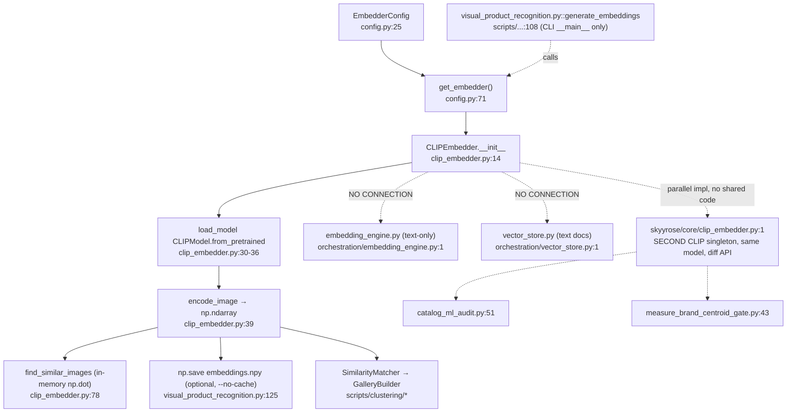

# F7 — image-embeddings (CLIP, no store, offline-only)

**Entry:** `CLIPEmbedder` — `scripts/image_embeddings/clip_embedder.py:14`; factory `get_embedder()` `config.py:71`
**Model:** `openai/clip-vit-base-patch32` (512-d)
**Store:** NONE (optional `.npy` cache in the CALLER, not the embedder)
**Confidence:** HIGH

## Flowchart

## Findings
- **No store — CONFIRMED.** Embedder returns numpy only. The only persistence is an optional `.npy` disk cache in the *caller* (`visual_product_recognition.py:125`), opt-out via `--no-cache`. Not a vector DB.
- **Offline-only.** Single live caller is a CLI tool; zero imports in api/ or agents/. Not wired to any live retrieval path.
- **ZERO overlap with I1/I2** (text-only). Separate image island.
- **NEW DUPLICATION FINDING:** a SECOND CLIP embedder exists at `skyyrose/core/clip_embedder.py:1` — same model (`clip-vit-base-patch32`, 512-d) but different API (`embed_image`/`embed_text`/`cosine_similarity`), used by `catalog_ml_audit.py:51` + `measure_brand_centroid_gate.py:43`. Plus `skyyrose/core/dino_embedder.py` exists. Two parallel CLIP impls, no shared code → Phase 2 candidate.

## Gaps
- `skyyrose/core/__init__.py` re-exports not read.
- `product-embeddings.json` (33 SKUs × 512-d) referenced by catalog_ml_audit but not inspected.
