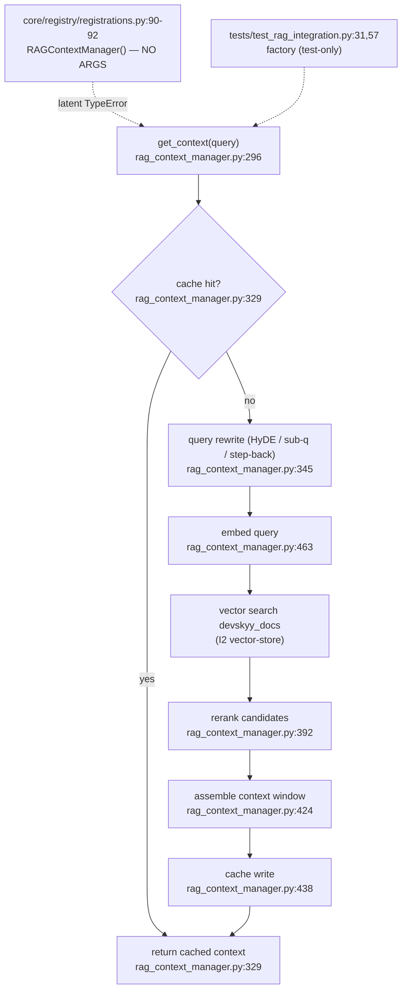

# F1 — orchestration-rag-pipeline

**Entry:** `RAGContextManager.get_context()` — `orchestration/rag_context_manager.py:296`
**Store:** ChromaDB (default) / Pinecone — collection `devskyy_docs`
**Confidence:** HIGH (read all call sites + the pipeline body)

## Flowchart

## Findings
- **Only production caller** is `core/registry/registrations.py:90-92`, which instantiates `RAGContextManager()` with **no args** → latent `TypeError` (the factory that injects deps is exercised only in tests).
- Pipeline = rewrite → embed → search → rerank → assemble → cache, gated by a front cache check.
- Depends on shared infra: I1 embedding-engine, I2 vector-store, I3 query-rewriter, I4 reranker.

## Gaps
- Whether the no-arg ctor path is ever hit at runtime (registry may be lazy / unused in prod) — not proven from code alone.
