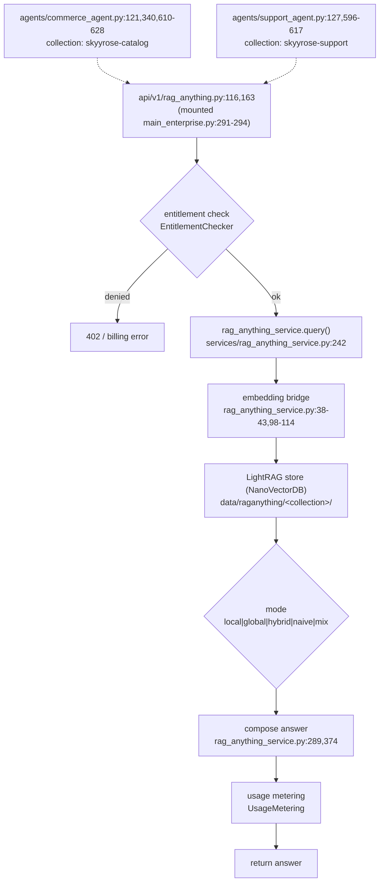

# F2 — raganything-multimodal-rag

**Entry (API):** `POST` mounted at `main_enterprise.py:291-294` → `api/v1/rag_anything.py:116,163`
**Service:** `services/rag_anything_service.py:242,289,374`
**Store:** LightRAG NanoVectorDB — `data/raganything/<collection>/` (SEPARATE from F1/F3)
**Confidence:** HIGH (docstring + working_dir + import scan all confirm separate store)

## Flowchart

## Findings
- **Separate-store thesis CONFIRMED:** docstring `rag_anything_service.py:12-13`; working_dir `data/raganything/<collection>/`; **no chromadb / pinecone import** in the service. This store does not share with F1/F3.
- **Embedding bridge CONFIRMED** at lines 38-43, 98-114 — it reuses the embedding engine (I1) but writes to its own NanoVectorDB.
- **Billing-gated** — EntitlementChecker before, UsageMetering after. This is the only RAG path with a paywall.
- Retrieval modes: local / global / hybrid / naive / mix.
- Consumers: commerce_agent (collection `skyyrose-catalog`), support_agent (collection `skyyrose-support`).

## Gaps
- Whether `skyyrose-catalog` (here) overlaps content with F3's `skyyrose-catalog-v1` Pinecone namespace — two stores, similar names, same source CSV? Flag for Phase 2.
