# Pathfinder — Unified Proposal (Phase 3)

**Thesis:** DevSkyy does not need a grand RAG merge. The shared substrate (I1 embed, I2 vector-store, I3 rewrite, I4 rerank) already exists and is sound. The damage is narrow: **one accidental fork (D1) caused by one never-finished wiring (S1)**, plus two scattered consolidations (D2 embedding entrypoints, D3 CLIP). Three systems (catalog QA, multimodal KB, brand feedback) are legitimately separate and must stay so. The simplest unified architecture = **finish the wiring that was already designed, then delete what the finish makes redundant.**

---

## Target architecture (one combined view)

```mermaid
flowchart TD
    subgraph SUB [Shared retrieval substrate — already exists, keep]
        I1["embedding-engine (I1)<br/>create_embedding_engine()<br/>orchestration/embedding_engine.py:685"]
        I2["vector-store (I2)<br/>create_vector_store() Chroma+Pinecone<br/>orchestration/vector_store.py:810"]
        I3["query-rewriter (I3)<br/>orchestration/query_rewriter.py:40"]
        I4["reranker (I4)<br/>orchestration/reranker.py"]
    end

    subgraph DOCRAG [Document RAG — ONE reader after merge]
        WRITE["DocumentIngestionPipeline (writer)<br/>document_ingestion.py:319/361"]
        DOCS[("ChromaDB devskyy_docs")]
        RCM["RAGContextManager.get_context() (KEEP+WIRE)<br/>rag_context_manager.py:296"]
        WRITE --> DOCS
        RCM -->|read| DOCS
        WRITE -. uses .-> I1
        WRITE -. uses .-> I2
        RCM -. uses .-> I1 & I2 & I3 & I4
    end

    AGENTS["12 EnhancedSuperAgent subclasses<br/>agents/base_super_agent/agent.py:562"]
    AGENTS -->|"self._rag_manager.get_context()"| RCM

    DEL["get_docs_context() — DELETE (D1)<br/>orchestration/docs_context.py:62"]
    style DEL fill:#a33,color:#fff
    AGENTS -. was .-> DEL

    subgraph SPECIAL [Specialized lanes — KEEP SEPARATE]
        F3["CatalogRetriever (Pinecone+Voyage+Haiku)<br/>catalog_retriever.py:352"]
        PC[("Pinecone skyyrose-catalog-v1")]
        F4["RAGAnythingService (billing-gated)<br/>rag_anything_service.py"]
        LR[("LightRAG NanoVectorDB graph")]
        F3 --> PC
        F3 -. uses .-> I1 & I2
        F4 --> LR
    end
    APICAT["/api/v1/catalog"] --> F3
    APIRAG["/api/v1/rag (auth+billing)"] --> F4

    subgraph ORTHO [Orthogonal — NOT RAG]
        F6["brand-learning (SQLite feedback loop)<br/>brand_learning.py:948"]
        BDB[("SQLite brand_learning.db")]
        F6 --> BDB
    end

    subgraph IMG [Image embedding — consolidate to ONE]
        CLIP["skyyrose/core/clip_embedder.py:1 (KEEP)"]
        CLIPDEL["scripts/image_embeddings/clip_embedder.py:14 (FOLD IN, D3)"]
        style CLIPDEL fill:#a33,color:#fff
        CLIPDEL -. consolidate .-> CLIP
    end
```

---

## The four changes (smallest set that resolves the report)

### Change 1 — Finish the RAG DI wiring (S1) + collapse F1/F5 (D1)  ·  KEYSTONE
This is the single highest-leverage move; it cascades.
1. Fix `core/registry/registrations.py:90-92` to construct `RAGContextManager` with a real `vector_store` (await `create_rag_context_manager()` in an async startup hook, or pass the built store).
2. Call `register_all_services()` from `main_enterprise.py` lifespan (currently never called).
3. Resolve `"rag_manager"` and inject it into `EnhancedSuperAgent` (wire `set_rag_manager()` / constructor injection — `set_rag_manager()` is defined at `api/dashboard.py:352` but never invoked).
4. Replace `agents/base_super_agent/agent.py:562-566` raw `get_docs_context()` call with `self._rag_manager.get_context(prompt)`.
5. **Delete** `orchestration/docs_context.py::get_docs_context` once no caller remains.
**Result:** all 12 agents get rewrite+rerank+cache instead of raw top-k; the dead richer path becomes the live path; the primitive fork disappears.

### Change 2 — One embedding entrypoint (D2)
Route `orchestration/auto_ingestion.py:279` and `prompts/rag_mcp_hybrid.py:381` through `create_embedding_engine()`. The `rag_context_manager.py:473` inline fallback is removed for free by Change 1 (engine is injected). Leave `semantic_analyzer.py` (code-diff) and `llm/evaluation_metrics.py` (eval) — specialized, correct as-is.

### Change 3 — One CLIP image embedder (D3)
Consolidate `scripts/image_embeddings/clip_embedder.py` onto `skyyrose/core/clip_embedder.py` (the singleton already wired into the brand-gate path). Keep `dino_embedder.py` (different model).

### Change 4 — Remove dead RAG intent (housekeeping)
- `orchestration/auto_ingestion.py` `AutoDocumentIngestion` has **zero production callers** — delete, or wire it as the startup ingest if that was the intent (decide explicitly, don't leave dead).
- `agents/base_super_agent/learning_module.py:307` `flush_rag_queue()` is a `TODO`-stub writing an in-memory dict referencing a non-existent Pinecone index — remove or implement.

---

## What deliberately does NOT change
- **F3 CatalogRetriever** — already on I1/I2 factories; specialized content + LLM compose. Untouched.
- **F4 RAGAnythingService** — separate LightRAG stack, billing/tenant trust model. Untouched.
- **F6 brand-learning** — SQLite feedback loop, no embeddings. Out of RAG scope entirely.
- **knowledge-base/ markdown and graphify graph.json** — confirmed NOT ingested by app RAG (the `#S1336` seed pointed at dev tooling, not a runtime corpus). No app-side change.

---

## Sequencing & risk
1. **Change 1 first** (keystone, unblocks others). Risk: medium — touches startup + agent base class; needs `devskyy_docs` to actually be populated (open gap: unknown if the collection has content at runtime — verify before/after).
2. Change 2, 3, 4 are independent and parallelizable after Change 1.
3. No paid-API or production-write actions in any change (all code-level). No STOP-AND-SHOW gate.

> Open gap carried from Phase 2: whether ChromaDB `devskyy_docs` is populated in prod. If empty, agents currently get silent empty context (F5's `except: pass`) — Change 1 should add a startup ingest trigger or a health check, not just swap the reader.
