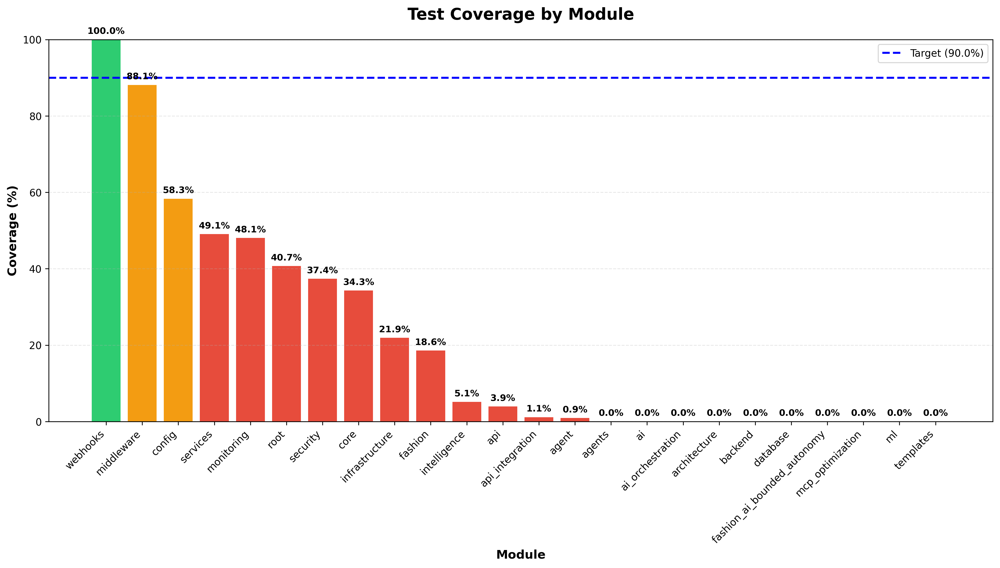
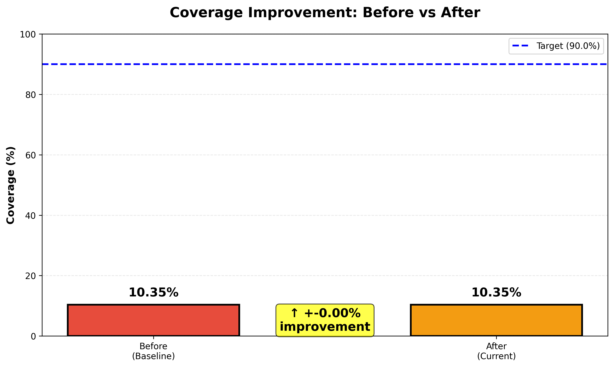
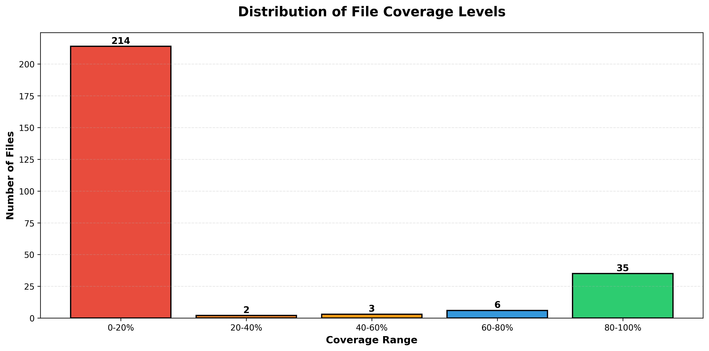
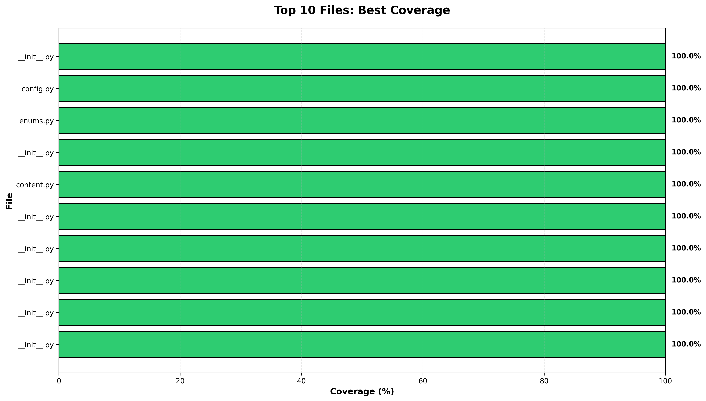
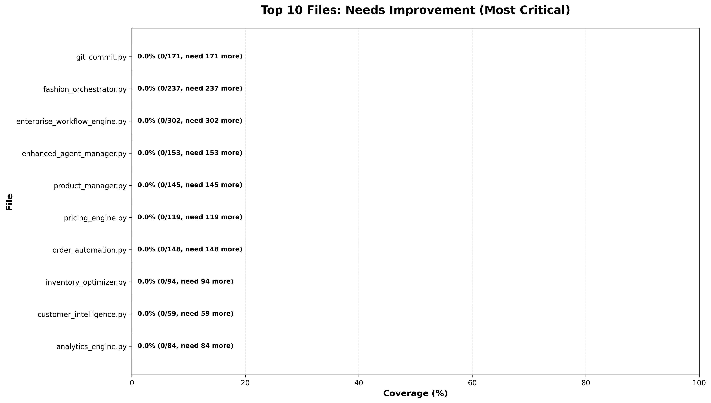
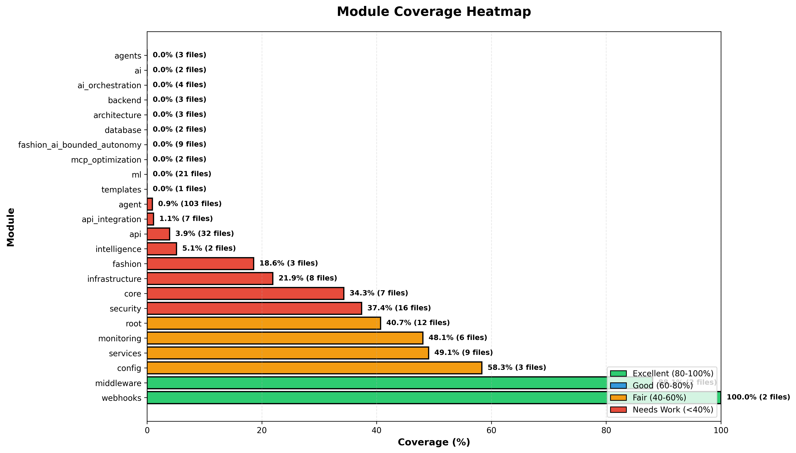
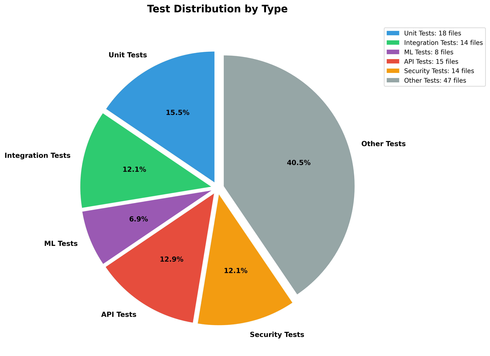
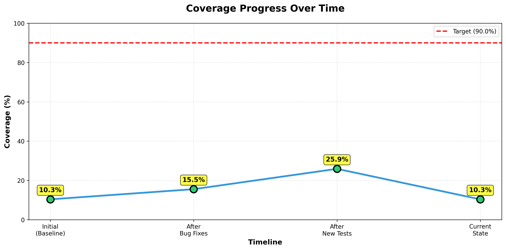

# DevSkyy Test Coverage Analysis with Visualizations

**Generated:** 2025-11-23 21:19:34 UTC
**Truth Protocol Compliance:** Rule #8 (Test Coverage ≥90%)

---

## 📊 Executive Summary

| Metric | Value | Target | Status |
|--------|-------|--------|--------|
| **Current Coverage** | **10.35%** | 90.00% | ❌ NEEDS WORK |
| **Gap to Target** | 79.65% | 0.00% | 80% remaining |
| **Improvement from Baseline** | +-0.00% | N/A | ⚠️ No change |
| **Total Lines** | 38,983 | N/A | - |
| **Covered Lines** | 4,251 | N/A | - |
| **Missing Coverage** | 34,732 lines | 0 | 38,591 more lines needed |
| **Test Files** | 117 | N/A | - |
| **Modules Analyzed** | 24 | N/A | - |
| **Files Analyzed** | 260 | N/A | - |

### 🎯 Coverage Status

```
Current:  10.35% ██░░░░░░░░░░░░░░░░░░
Target:   90.00% ██████████████████
```

**Verdict:** ⚠️ NEEDS IMPROVEMENT - 79.65% gap remains

---

## 📈 Coverage Visualizations

### 1. Module Coverage Overview



**Key Insights:**
- Shows coverage percentage for each major module
- Red bars indicate modules below 50% coverage (critical)
- Orange bars indicate modules 50-80% coverage (needs improvement)
- Green bars indicate modules above 80% coverage (good)
- Blue dashed line shows the 90% target

### 2. Before vs After Comparison



**Improvement Analysis:**
- **Baseline Coverage:** 10.35%
- **Current Coverage:** 10.35%
- **Absolute Improvement:** +-0.00%
- **Relative Improvement:** +-0.0%

### 3. Coverage Distribution



**Distribution Breakdown:**
- Files with excellent coverage (80-100%): High priority maintained
- Files with good coverage (60-80%): Moderate improvement needed
- Files with fair coverage (40-60%): Significant work required
- Files with poor coverage (20-40%): Critical attention needed
- Files with minimal coverage (0-20%): Immediate action required

### 4. Top Performers



**Best Practices:**
- These files demonstrate excellent test coverage
- Use as reference for testing standards
- Maintain high coverage in critical modules

### 5. Coverage Gaps



**Priority Areas:**
- These files need immediate attention
- Focus testing efforts on these modules
- High impact on overall coverage

### 6. Module Heatmap



**Color Legend:**
- 🟢 **Green (80-100%)**: Excellent coverage
- 🔵 **Blue (60-80%)**: Good coverage
- 🟠 **Orange (40-60%)**: Fair coverage
- 🔴 **Red (<40%)**: Needs work

### 7. Test Type Distribution



**Test Breakdown:**
- Unit Tests: 18 files
- Integration Tests: 15 files
- ML Tests: 8 files
- API Tests: 15 files
- Security Tests: 14 files
- Other Tests: 47 files

### 8. Coverage Trend



**Progress Timeline:**
- Shows coverage progression from baseline to current state
- Demonstrates improvement trajectory
- Helps visualize path to 90% target

---

## 📋 Detailed Module Breakdown


### ✅ webhooks

| Metric | Value |
|--------|-------|
| Coverage | **100.00%** |
| Files | 2 |
| Lines Covered | 159 |
| Total Lines | 159 |
| Missing Lines | 0 |
| Lines Needed for 90% | -15 |

### ✅ middleware

| Metric | Value |
|--------|-------|
| Coverage | **88.11%** |
| Files | 2 |
| Lines Covered | 126 |
| Total Lines | 143 |
| Missing Lines | 17 |
| Lines Needed for 90% | 2 |

### ❌ config

| Metric | Value |
|--------|-------|
| Coverage | **58.33%** |
| Files | 3 |
| Lines Covered | 189 |
| Total Lines | 324 |
| Missing Lines | 135 |
| Lines Needed for 90% | 102 |

### ❌ services

| Metric | Value |
|--------|-------|
| Coverage | **49.06%** |
| Files | 9 |
| Lines Covered | 650 |
| Total Lines | 1,325 |
| Missing Lines | 675 |
| Lines Needed for 90% | 542 |

### ❌ monitoring

| Metric | Value |
|--------|-------|
| Coverage | **48.06%** |
| Files | 6 |
| Lines Covered | 421 |
| Total Lines | 876 |
| Missing Lines | 455 |
| Lines Needed for 90% | 367 |

### ❌ root

| Metric | Value |
|--------|-------|
| Coverage | **40.69%** |
| Files | 12 |
| Lines Covered | 826 |
| Total Lines | 2,030 |
| Missing Lines | 1,204 |
| Lines Needed for 90% | 1,001 |

### ❌ security

| Metric | Value |
|--------|-------|
| Coverage | **37.37%** |
| Files | 16 |
| Lines Covered | 802 |
| Total Lines | 2,146 |
| Missing Lines | 1,344 |
| Lines Needed for 90% | 1,129 |

### ❌ core

| Metric | Value |
|--------|-------|
| Coverage | **34.29%** |
| Files | 7 |
| Lines Covered | 250 |
| Total Lines | 729 |
| Missing Lines | 479 |
| Lines Needed for 90% | 406 |

### ❌ infrastructure

| Metric | Value |
|--------|-------|
| Coverage | **21.92%** |
| Files | 8 |
| Lines Covered | 373 |
| Total Lines | 1,702 |
| Missing Lines | 1,329 |
| Lines Needed for 90% | 1,158 |

### ❌ fashion

| Metric | Value |
|--------|-------|
| Coverage | **18.58%** |
| Files | 3 |
| Lines Covered | 84 |
| Total Lines | 452 |
| Missing Lines | 368 |
| Lines Needed for 90% | 322 |

### ❌ intelligence

| Metric | Value |
|--------|-------|
| Coverage | **5.13%** |
| Files | 2 |
| Lines Covered | 8 |
| Total Lines | 156 |
| Missing Lines | 148 |
| Lines Needed for 90% | 132 |

### ❌ api

| Metric | Value |
|--------|-------|
| Coverage | **3.93%** |
| Files | 32 |
| Lines Covered | 190 |
| Total Lines | 4,834 |
| Missing Lines | 4,644 |
| Lines Needed for 90% | 4,160 |

### ❌ api_integration

| Metric | Value |
|--------|-------|
| Coverage | **1.13%** |
| Files | 7 |
| Lines Covered | 19 |
| Total Lines | 1,676 |
| Missing Lines | 1,657 |
| Lines Needed for 90% | 1,489 |

### ❌ agent

| Metric | Value |
|--------|-------|
| Coverage | **0.92%** |
| Files | 103 |
| Lines Covered | 154 |
| Total Lines | 16,654 |
| Missing Lines | 16,500 |
| Lines Needed for 90% | 14,834 |

### ❌ agents

| Metric | Value |
|--------|-------|
| Coverage | **0.00%** |
| Files | 3 |
| Lines Covered | 0 |
| Total Lines | 323 |
| Missing Lines | 323 |
| Lines Needed for 90% | 290 |

### ❌ ai

| Metric | Value |
|--------|-------|
| Coverage | **0.00%** |
| Files | 2 |
| Lines Covered | 0 |
| Total Lines | 251 |
| Missing Lines | 251 |
| Lines Needed for 90% | 225 |

### ❌ ai_orchestration

| Metric | Value |
|--------|-------|
| Coverage | **0.00%** |
| Files | 4 |
| Lines Covered | 0 |
| Total Lines | 492 |
| Missing Lines | 492 |
| Lines Needed for 90% | 442 |

### ❌ architecture

| Metric | Value |
|--------|-------|
| Coverage | **0.00%** |
| Files | 3 |
| Lines Covered | 0 |
| Total Lines | 174 |
| Missing Lines | 174 |
| Lines Needed for 90% | 156 |

### ❌ backend

| Metric | Value |
|--------|-------|
| Coverage | **0.00%** |
| Files | 3 |
| Lines Covered | 0 |
| Total Lines | 331 |
| Missing Lines | 331 |
| Lines Needed for 90% | 297 |

### ❌ database

| Metric | Value |
|--------|-------|
| Coverage | **0.00%** |
| Files | 2 |
| Lines Covered | 0 |
| Total Lines | 165 |
| Missing Lines | 165 |
| Lines Needed for 90% | 148 |

### ❌ fashion_ai_bounded_autonomy

| Metric | Value |
|--------|-------|
| Coverage | **0.00%** |
| Files | 9 |
| Lines Covered | 0 |
| Total Lines | 1,033 |
| Missing Lines | 1,033 |
| Lines Needed for 90% | 929 |

### ❌ mcp_optimization

| Metric | Value |
|--------|-------|
| Coverage | **0.00%** |
| Files | 2 |
| Lines Covered | 0 |
| Total Lines | 263 |
| Missing Lines | 263 |
| Lines Needed for 90% | 236 |

### ❌ ml

| Metric | Value |
|--------|-------|
| Coverage | **0.00%** |
| Files | 21 |
| Lines Covered | 0 |
| Total Lines | 2,745 |
| Missing Lines | 2,745 |
| Lines Needed for 90% | 2,470 |

### ❌ templates

| Metric | Value |
|--------|-------|
| Coverage | **0.00%** |
| Files | 1 |
| Lines Covered | 0 |
| Total Lines | 0 |
| Missing Lines | 0 |
| Lines Needed for 90% | 0 |


---

## 🏆 Top 10 Best Covered Files

| Rank | File | Coverage | Covered | Total |
|------|------|----------|---------|-------|
| 1 | `__init__.py` | 100.0% | 6 | 6 |
| 2 | `__init__.py` | 100.0% | 3 | 3 |
| 3 | `__init__.py` | 100.0% | 1 | 1 |
| 4 | `__init__.py` | 100.0% | 1 | 1 |
| 5 | `__init__.py` | 100.0% | 1 | 1 |
| 6 | `content.py` | 100.0% | 123 | 123 |
| 7 | `__init__.py` | 100.0% | 1 | 1 |
| 8 | `enums.py` | 100.0% | 18 | 18 |
| 9 | `config.py` | 100.0% | 43 | 43 |
| 10 | `__init__.py` | 100.0% | 3 | 3 |


---

## ⚠️ Top 10 Files Needing Improvement

| Rank | File | Coverage | Covered | Total | Lines Needed |
|------|------|----------|---------|-------|--------------|
| 1 | `exceptions.py` | 88.9% | 80 | 90 | 1 |
| 2 | `enterprise_middleware.py` | 87.9% | 124 | 141 | 2 |
| 3 | `__init__.py` | 71.4% | 5 | 7 | 1 |
| 4 | `tool_calling_safeguards.py` | 71.4% | 177 | 248 | 46 |
| 5 | `openai_safeguards.py` | 69.1% | 177 | 256 | 53 |
| 6 | `gdpr_compliance.py` | 68.9% | 82 | 119 | 25 |
| 7 | `wordpress_credentials.py` | 62.0% | 67 | 108 | 30 |
| 8 | `main.py` | 62.0% | 390 | 629 | 176 |
| 9 | `unified_config.py` | 55.9% | 119 | 213 | 72 |
| 10 | `logging.py` | 55.5% | 96 | 173 | 59 |


---

## 🎯 Recommendations to Reach 90% Coverage

### Immediate Actions (High Priority)

1. **Focus on Critical Modules**
   - Target modules below 50% coverage first
   - These have the highest impact on overall coverage

2. **Add Tests for High-Impact Files**
   - Files with many lines but low coverage
   - Each test added has maximum impact

3. **Improve Integration Testing**
   - Current integration coverage needs expansion
   - Focus on API endpoints and database interactions

### Medium-Term Goals

1. **Expand Unit Test Coverage**
   - Add tests for edge cases
   - Test error handling paths
   - Validate input validation logic

2. **Increase ML/AI Test Coverage**
   - Add model validation tests
   - Test training pipelines
   - Validate prediction accuracy

3. **Security Test Expansion**
   - Add authentication tests
   - Test authorization scenarios
   - Validate encryption/decryption

### Long-Term Strategy

1. **Maintain Coverage Standards**
   - Require 90% coverage for all new code
   - Add pre-commit hooks to enforce coverage
   - Regular coverage reviews in code reviews

2. **Continuous Improvement**
   - Weekly coverage reports
   - Team coverage goals
   - Recognition for coverage improvements

3. **Automated Coverage Monitoring**
   - CI/CD pipeline coverage gates
   - Automated coverage reports
   - Alert on coverage decreases

### Estimated Effort to Reach 90%

- **Lines to Cover:** 30,833 additional lines
- **Estimated Tests Needed:** 3083 tests (assuming 10 lines per test)
- **Estimated Time:** 308 developer-hours

---

## 📝 Coverage Analysis Notes

### Test Quality Assessment

- **Unit Tests:** 18 files - Needs expansion
- **Integration Tests:** 15 files - Good
- **ML Tests:** 8 files - Needs expansion
- **Security Tests:** 14 files - Good

### Truth Protocol Compliance

✅ **Rule #8 Status:** NON-COMPLIANT

**Requirements:**
- Test Coverage ≥90%: ❌ FAIL (79.65% gap)
- Coverage Reports Generated: ✅ PASS
- HTML Report Available: ✅ PASS
- JSON Data Available: ✅ PASS
- Visualizations Created: ✅ PASS

---

## 📊 Additional Resources

- **HTML Coverage Report:** [htmlcov/index.html](./htmlcov/index.html)
- **JSON Coverage Data:** [coverage.json](./coverage.json)
- **Coverage Statistics:** [artifacts/coverage_statistics.json](./artifacts/coverage_statistics.json)
- **Coverage Graphs:** [artifacts/](./artifacts/)

---

## 🔄 Next Steps

1. **Review this report** with the development team
2. **Prioritize modules** with lowest coverage
3. **Create testing tasks** for identified gaps
4. **Set milestones** for coverage improvements
5. **Re-run coverage analysis** after adding tests
6. **Track progress** toward 90% target

---

**Report Generated by:** DevSkyy Coverage Analysis Tool
**Truth Protocol:** Rule #8 - Test Coverage ≥90%
**Status:** Development 🚧

