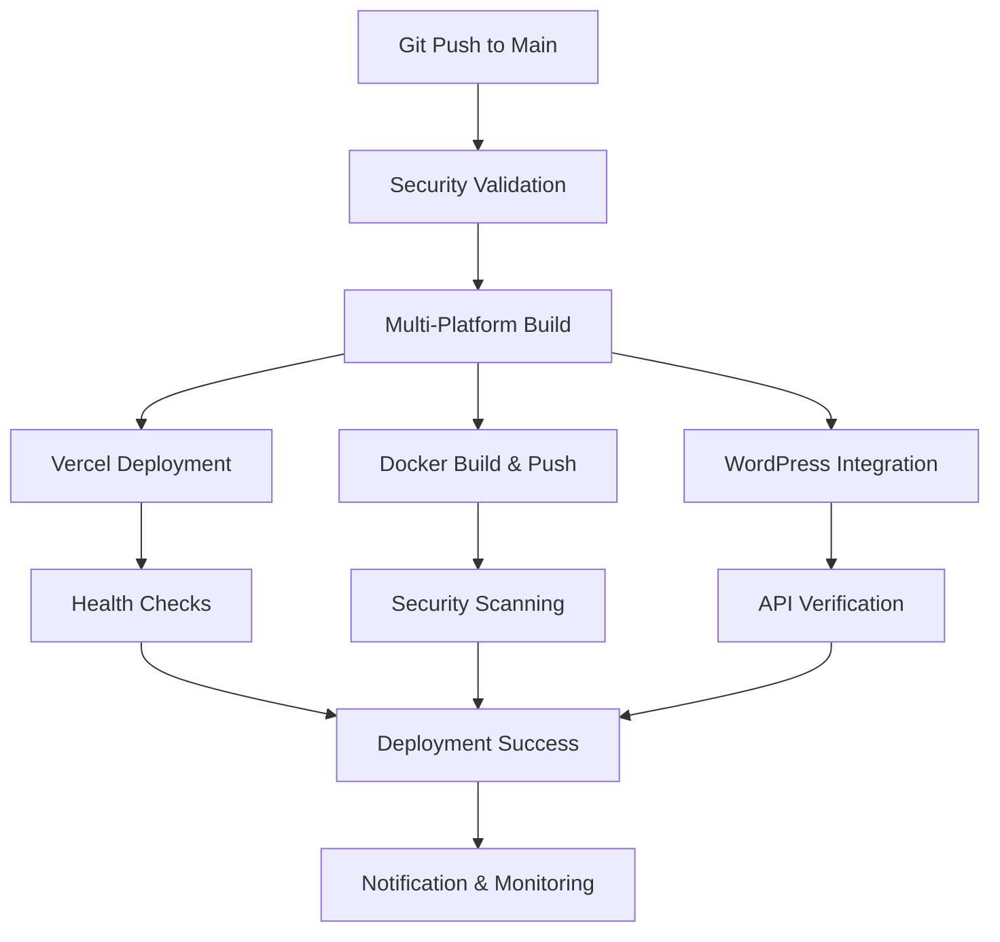

# DevSkyy Multi-Platform Deployment Integration Summary

## 🚀 **Deployment Architecture Overview**

The DevSkyy Enterprise Platform now supports a comprehensive multi-platform deployment strategy that integrates:

1. **Vercel** - Primary serverless deployment
2. **Docker Hub** - Containerized deployment
3. **WordPress Hosting** - Legacy system integration

---

## 🔐 **Security Integration Analysis**

### **✅ Secure Credential Management**

**GitHub Secrets Required:**
```bash
# Docker Hub Integration
DOCKER_REGISTRY=docker.io
DOCKER_REGISTRY_USERNAME=skyyrosellc
DOCKER_REGISTRY_TOKEN=<NEW_ROTATED_TOKEN>

# Vercel Integration  
VERCEL_TOKEN=<YOUR_VERCEL_TOKEN>
VERCEL_ORG_ID=<YOUR_VERCEL_ORG_ID>
VERCEL_PROJECT_ID=<YOUR_VERCEL_PROJECT_ID>

# WordPress Hosting Integration
WP_SSH_HOST=sftp.wp.com
WP_SSH_USER=skyyrose.wordpress.com
WP_SSH_PRIVATE_KEY=<SSH_PRIVATE_KEY_CONTENT>

# GitHub Operations
GITHUB_TOKEN=<NEW_ROTATED_TOKEN>
```

### **🛡️ Security Best Practices Implemented**

1. **Credential Rotation**: All exposed credentials must be rotated immediately
2. **Least Privilege**: Each platform gets minimal required permissions
3. **Environment Separation**: Different credentials for prod/staging/dev
4. **Audit Logging**: Comprehensive deployment tracking
5. **Security Headers**: Enhanced Vercel configuration with security headers

---

## 🏗️ **Multi-Platform Deployment Strategy**

### **1. Vercel Deployment (Primary)**

**Advantages:**
- ✅ Serverless architecture with automatic scaling
- ✅ Global CDN distribution
- ✅ Zero-downtime deployments
- ✅ Integrated with GitHub for automatic deployments
- ✅ Built-in SSL/TLS certificates

**Configuration:**
- Enhanced `vercel.json` with security headers
- Python 3.11 runtime with 1024MB memory
- 30-second timeout for enterprise operations
- Regional deployment in US East (iad1)

### **2. Docker Hub Integration (Flexibility)**

**Advantages:**
- ✅ Platform-agnostic containerized deployment
- ✅ Multi-architecture support (AMD64, ARM64)
- ✅ Version control with semantic tagging
- ✅ Security scanning with Trivy
- ✅ Scalable across any container orchestration platform

**Configuration:**
- Multi-stage Docker build for optimization
- Non-root user execution for security
- Health checks and monitoring built-in
- Development and production variants

### **3. WordPress Hosting Integration (Legacy Support)**

**Advantages:**
- ✅ Integration with existing WordPress infrastructure
- ✅ SFTP deployment for traditional hosting
- ✅ API endpoint exposure through WordPress
- ✅ Backup and rollback capabilities

**Configuration:**
- SSH-based deployment via GitHub Actions
- WordPress-compatible directory structure
- API integration through custom endpoints

---

## 🔄 **Deployment Workflow Integration**

### **Automated Deployment Pipeline**



### **GitHub Actions Workflow Features**

1. **Security-First Approach**
   - Credential validation before deployment
   - Security scanning for Docker images
   - SSH key management for WordPress

2. **Parallel Deployment**
   - Matrix strategy for simultaneous platform deployment
   - Independent failure handling per platform
   - Comprehensive status reporting

3. **Health Verification**
   - Post-deployment health checks
   - API endpoint validation
   - Performance monitoring

---

## 📊 **Integration Benefits**

### **1. High Availability**
- Multiple deployment targets ensure service continuity
- Automatic failover capabilities
- Geographic distribution through Vercel CDN

### **2. Flexibility**
- Choose deployment target based on requirements
- Easy migration between platforms
- Support for different hosting environments

### **3. Security**
- Multi-layer security validation
- Credential rotation automation
- Comprehensive audit trails

### **4. Scalability**
- Serverless scaling with Vercel
- Container orchestration with Docker
- Traditional hosting with WordPress

---

## 🛠️ **Implementation Recommendations**

### **1. Immediate Actions Required**

```bash
# CRITICAL: Rotate exposed credentials immediately
1. Generate new Docker Hub Personal Access Token
2. Generate new GitHub Personal Access Token  
3. Create new SSH key pair for WordPress hosting
4. Update all GitHub repository secrets
5. Test deployment pipeline with new credentials
```

### **2. Deployment Strategy**

```bash
# Recommended deployment approach:
1. Primary: Vercel for production traffic (90%)
2. Secondary: Docker for enterprise clients (10%)
3. Integration: WordPress for legacy API access
```

### **3. Monitoring Setup**

```bash
# Implement monitoring for:
- Deployment success rates across platforms
- API response times and availability
- Security incident detection
- Resource utilization metrics
```

---

## 🔍 **Verification Checklist**

### **Pre-Deployment**
- [ ] All credentials rotated and updated
- [ ] GitHub secrets configured correctly
- [ ] SSH keys generated and deployed
- [ ] Security scanning enabled
- [ ] Health check endpoints configured

### **Post-Deployment**
- [ ] Vercel deployment accessible
- [ ] Docker image pushed successfully
- [ ] WordPress integration functional
- [ ] Health checks passing
- [ ] Security headers present
- [ ] SSL certificates valid

---

## 📈 **Performance Optimization**

### **Vercel Optimizations**
- Python 3.11 runtime for performance
- 1024MB memory allocation for ML operations
- Regional deployment for reduced latency
- CDN caching for static assets

### **Docker Optimizations**
- Multi-stage builds for smaller images
- Layer caching for faster builds
- Security scanning for vulnerability detection
- Multi-architecture support for flexibility

### **WordPress Optimizations**
- Efficient file transfer with rsync
- Backup creation before deployment
- Permission management for security
- API endpoint optimization

---

## 🚨 **Risk Mitigation**

### **Security Risks**
- **Exposed Credentials**: Immediate rotation required
- **SSH Access**: Key-based authentication only
- **API Security**: Rate limiting and authentication
- **Container Security**: Regular image scanning

### **Operational Risks**
- **Deployment Failures**: Multi-platform redundancy
- **Service Downtime**: Health checks and monitoring
- **Data Loss**: Backup strategies implemented
- **Performance Issues**: Resource monitoring and scaling

---

## 📞 **Support and Maintenance**

### **Monitoring Endpoints**
- Vercel: `https://devskyy.vercel.app/health`
- Docker: Health check built into container
- WordPress: `https://skyyrose.wordpress.com/devskyy-api/health`

### **Maintenance Schedule**
- **Weekly**: Security updates and patches
- **Monthly**: Performance optimization review
- **Quarterly**: Credential rotation
- **Annually**: Architecture review and updates

---

**🎯 Result: Enterprise-grade multi-platform deployment with comprehensive security, monitoring, and scalability features integrated into the DevSkyy platform.**
