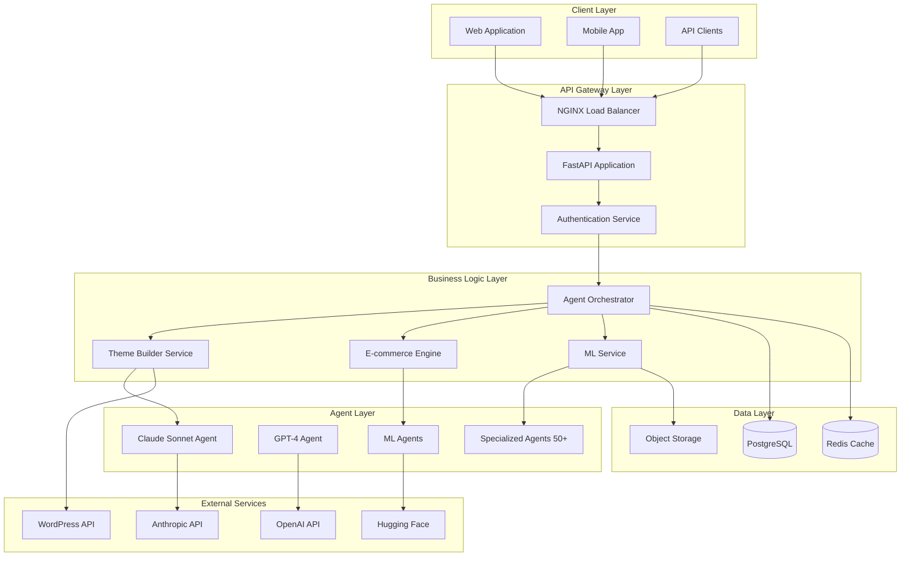
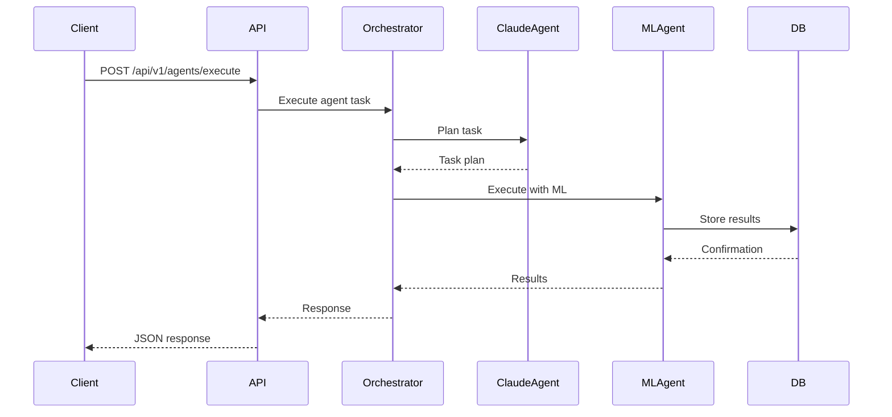
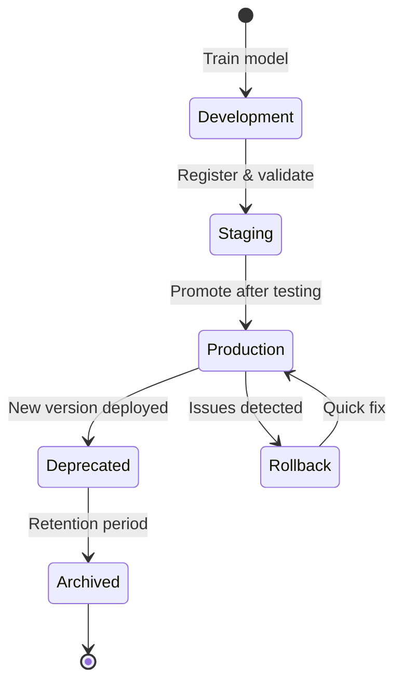
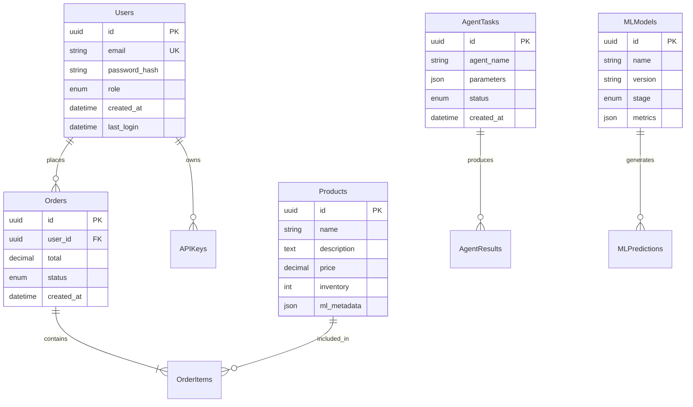
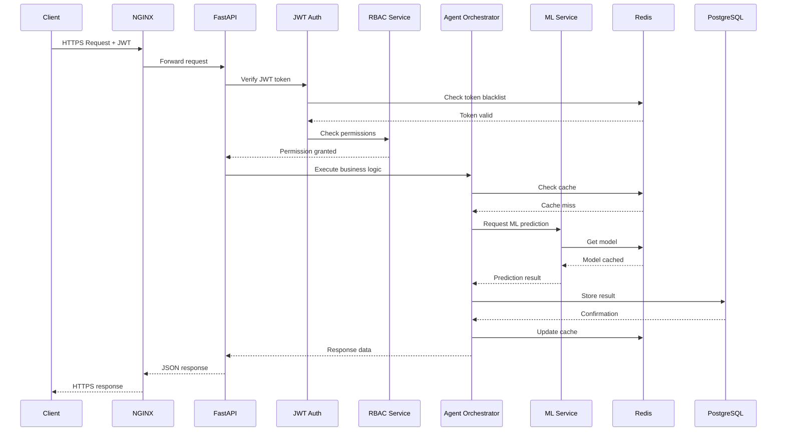
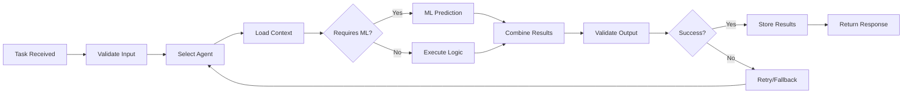
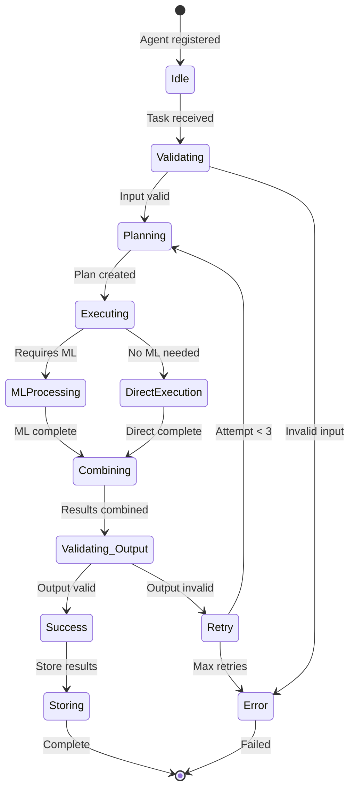
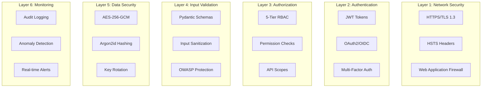
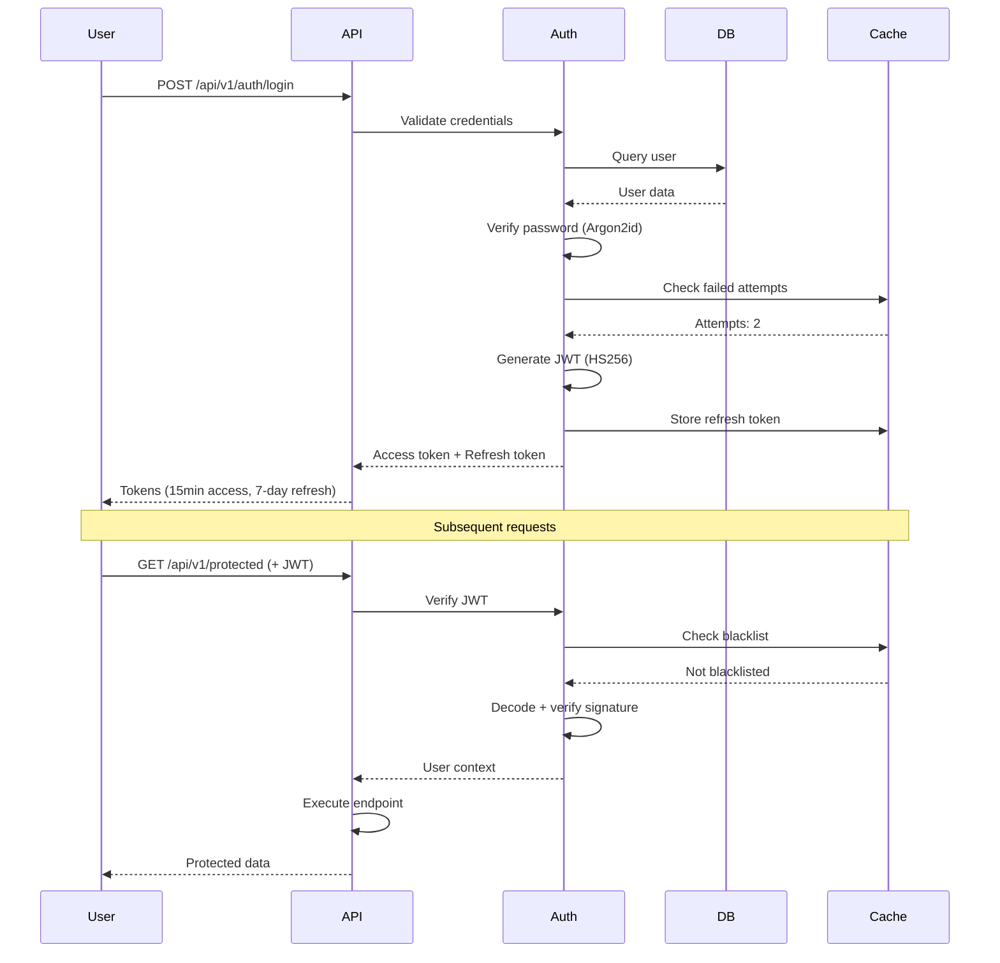

# DevSkyy Architecture Documentation

**Version:** 5.0.0-enterprise
**Last Updated:** 2025-11-15
**Status:** Production Ready

---

## Table of Contents

1. [System Overview](#system-overview)
2. [High-Level Architecture](#high-level-architecture)
3. [Component Architecture](#component-architecture)
4. [Data Flow](#data-flow)
5. [Agent System Architecture](#agent-system-architecture)
6. [Security Architecture](#security-architecture)
7. [Deployment Architecture](#deployment-architecture)
8. [Technology Stack](#technology-stack)
9. [Design Decisions](#design-decisions)
10. [Scalability & Performance](#scalability--performance)

---

## System Overview

DevSkyy is an **enterprise-grade AI platform** that combines:
- **Multi-agent orchestration** (57 specialized agents)
- **WordPress/Elementor theme automation**
- **Fashion e-commerce automation**
- **ML-powered decision making**

### Core Capabilities

- 🤖 **AI Orchestration**: Claude Sonnet 4.5, GPT-4, Hugging Face integration
- 🎨 **Theme Builder**: Automated WordPress/Elementor theme generation
- 🛍️ **E-commerce**: Product management, pricing, inventory optimization
- 🔐 **Security**: Zero vulnerabilities, GDPR/SOC2/PCI-DSS compliant
- 📊 **ML Infrastructure**: Model registry, caching, explainability

---

## High-Level Architecture



---

## Component Architecture

### 1. API Layer (FastAPI)

**Responsibilities:**
- RESTful API endpoints
- WebSocket connections
- Request validation (Pydantic)
- Authentication/Authorization (JWT + OAuth2)
- Rate limiting (SlowAPI)
- CORS handling

**Key Endpoints:**

```python
# Core Services
/api/v1/agents              # Agent management
/api/v1/auth                # Authentication
/api/v1/webhooks            # Webhook management
/api/v1/monitoring          # Health checks

# GDPR Compliance
/api/v1/gdpr/export         # Data export
/api/v1/gdpr/delete         # Data deletion
/api/v1/gdpr/retention-policy

# ML Infrastructure
/api/v1/ml/registry/models  # Model management
/api/v1/ml/cache/stats      # Cache statistics
/api/v1/ml/explain/prediction  # Model explainability
```

**Architecture Pattern:** Layered Architecture + Dependency Injection

```
┌─────────────────────────────┐
│      API Routes/Controllers │  ← FastAPI routers
├─────────────────────────────┤
│      Business Logic Layer   │  ← Agent orchestration
├─────────────────────────────┤
│      Data Access Layer      │  ← SQLAlchemy repositories
├─────────────────────────────┤
│      Database Layer         │  ← PostgreSQL/SQLite
└─────────────────────────────┘
```

### 2. Agent Orchestration Layer

**Responsibilities:**
- Agent lifecycle management
- Task scheduling and distribution
- Inter-agent communication
- Error handling and recovery
- Performance monitoring

**Agent Categories:**

1. **Core Intelligence Agents**
   - Claude Sonnet Intelligence Service
   - Multi-Model AI Orchestrator
   - Universal Self-Healing Agent
   - Continuous Learning Background Agent

2. **E-commerce Agents**
   - Product Management Agent
   - Dynamic Pricing Agent
   - Inventory Optimization Agent
   - Customer Intelligence Agent

3. **Content Agents**
   - Theme Builder Agent
   - Landing Page Generator
   - Social Media Automation Agent
   - Content Personalization Agent

4. **Infrastructure Agents**
   - Database Migration Agent
   - CI/CD Pipeline Agent
   - Security Scanner Agent
   - Performance Monitor Agent

**Agent Communication:**



### 3. ML Infrastructure

**Components:**

```
┌──────────────────────────────────────┐
│         ML Infrastructure            │
├──────────────────────────────────────┤
│  Model Registry    │  Version Control│
│  Distributed Cache │  Redis + Memory │
│  Explainability    │  SHAP Integration│
│  Auto-Retraining   │  Scheduled Jobs │
└──────────────────────────────────────┘
```

**Model Lifecycle:**



**ML Services:**
- Fashion Trend Prediction
- Customer Behavior Analysis
- Inventory Demand Forecasting
- Dynamic Price Optimization
- Product Recommendation Engine

### 4. Data Layer

**Database Schema (Simplified):**



**Caching Strategy:**

```
┌─────────────────────────────────────┐
│         Caching Layers              │
├─────────────────────────────────────┤
│  Level 1: In-Memory (LRU)          │  ← 10ms latency
│  Level 2: Redis (Distributed)      │  ← 50ms latency
│  Level 3: Database Query Cache     │  ← 100ms latency
│  Level 4: Database (PostgreSQL)    │  ← 200ms latency
└─────────────────────────────────────┘
```

---

## Data Flow

### Request Flow (Typical API Request)



### Agent Execution Flow



---

## Agent System Architecture

### Agent Base Class

```python
class BaseAgent(ABC):
    """Base class for all agents."""

    def __init__(self, ml_engine=None, cache=None):
        self.ml_engine = ml_engine or MLEngine()
        self.cache = cache or RedisCache()
        self.logger = logging.getLogger(self.__class__.__name__)

    @abstractmethod
    async def execute(self, task: Dict[str, Any]) -> Dict[str, Any]:
        """Execute agent task."""
        pass

    async def validate_input(self, task: Dict) -> bool:
        """Validate input parameters."""
        pass

    async def handle_error(self, error: Exception) -> Dict:
        """Handle errors with fallback logic."""
        pass
```

### Agent Workflow



---

## Security Architecture

### Security Layers



### Authentication Flow



---

## Deployment Architecture

### Production Deployment (Kubernetes)

```mermaid
graph TB
    subgraph "Load Balancer"
        LB[Cloud Load Balancer]
    end

    subgraph "Kubernetes Cluster"
        subgraph "Ingress"
            Ingress[NGINX Ingress Controller]
        end

        subgraph "Application Pods"
            API1[FastAPI Pod 1]
            API2[FastAPI Pod 2]
            API3[FastAPI Pod 3]
        end

        subgraph "Worker Pods"
            Worker1[Celery Worker 1]
            Worker2[Celery Worker 2]
        end

        subgraph "Stateful Sets"
            Redis[Redis Cluster]
            Postgres[(PostgreSQL)]
        end
    end

    subgraph "External Services"
        S3[Object Storage]
        Monitoring[Prometheus/Grafana]
        Anthropic[Anthropic API]
    end

    LB --> Ingress
    Ingress --> API1
    Ingress --> API2
    Ingress --> API3
    API1 --> Redis
    API2 --> Redis
    API3 --> Redis
    API1 --> Postgres
    Worker1 --> Redis
    Worker2 --> Redis
    API1 --> S3
    API1 --> Anthropic
```

### Deployment Environments

| Environment | Purpose | Configuration | Monitoring |
|-------------|---------|---------------|------------|
| **Development** | Local development | SQLite, no Redis | Basic logs |
| **Staging** | Pre-production testing | PostgreSQL, Redis | Full monitoring |
| **Production** | Live system | HA PostgreSQL, Redis Cluster | 24/7 alerts |

### Scaling Strategy

**Horizontal Scaling:**
- FastAPI pods: Auto-scale 2-10 replicas
- Celery workers: Auto-scale 1-5 replicas
- Trigger: CPU > 70%, Memory > 80%

**Vertical Scaling:**
- Database: Scale up to 32GB RAM
- Redis: Scale up to 16GB RAM

---

## Technology Stack

### Backend Stack

```
┌──────────────────────────────────────────────┐
│            Backend Technologies               │
├──────────────────────────────────────────────┤
│  Framework       │  FastAPI 0.119.0          │
│  ASGI Server     │  Uvicorn                  │
│  ORM             │  SQLAlchemy 2.0.36        │
│  Database        │  PostgreSQL 15 / SQLite   │
│  Cache           │  Redis 7+                 │
│  Task Queue      │  Celery 5.4.0             │
│  Auth            │  PyJWT 2.10.1, Auth0      │
│  Validation      │  Pydantic 2.x             │
│  Security        │  Cryptography 46.0.2      │
└──────────────────────────────────────────────┘
```

### AI/ML Stack

```
┌──────────────────────────────────────────────┐
│            AI/ML Technologies                 │
├──────────────────────────────────────────────┤
│  Primary AI      │  Anthropic Claude Sonnet  │
│  Secondary AI    │  OpenAI GPT-4             │
│  ML Framework    │  PyTorch 2.5.1            │
│  Deep Learning   │  TensorFlow 2.18.0        │
│  Transformers    │  Hugging Face 4.47.1      │
│  ML Ops          │  scikit-learn, XGBoost    │
│  Explainability  │  SHAP                     │
└──────────────────────────────────────────────┘
```

### Infrastructure Stack

```
┌──────────────────────────────────────────────┐
│         Infrastructure Technologies           │
├──────────────────────────────────────────────┤
│  Containerization │  Docker 7.1.0            │
│  Orchestration    │  Kubernetes 31.0.0       │
│  IaC              │  Terraform 1.10.3        │
│  Configuration    │  Ansible 10.6.0          │
│  Monitoring       │  Prometheus + Grafana    │
│  Logging          │  Structured JSON logs    │
│  Tracing          │  OpenTelemetry           │
└──────────────────────────────────────────────┘
```

---

## Design Decisions

### 1. Why FastAPI?

**Decision:** Use FastAPI as the web framework.

**Rationale:**
- ✅ High performance (async/await support)
- ✅ Auto-generated OpenAPI documentation
- ✅ Built-in Pydantic validation
- ✅ Type hints for better IDE support
- ✅ Modern Python 3.11+ features
- ✅ Excellent for ML/AI integration

**Alternatives Considered:** Django, Flask
**Trade-offs:** Less mature ecosystem than Django, but better performance

### 2. Multi-Model AI Architecture

**Decision:** Support multiple AI providers (Anthropic, OpenAI, Hugging Face).

**Rationale:**
- ✅ Avoid vendor lock-in
- ✅ Leverage best model for each task
- ✅ Cost optimization (use cheaper models when appropriate)
- ✅ Fallback options if one provider down
- ✅ A/B testing of different models

**Implementation:** Agent orchestrator with provider abstraction layer

### 3. PostgreSQL + Redis Architecture

**Decision:** PostgreSQL for persistent data, Redis for caching and queues.

**Rationale:**
- ✅ PostgreSQL: ACID compliance, JSON support, full-text search
- ✅ Redis: Sub-millisecond latency, pub/sub, distributed locks
- ✅ Clear separation of concerns
- ✅ Proven production pattern

**Alternatives Considered:** MongoDB (rejected: prefer ACID), DynamoDB (rejected: avoid AWS lock-in)

### 4. JWT Authentication

**Decision:** Use JWT (RFC 7519) with short-lived access tokens and refresh tokens.

**Rationale:**
- ✅ Stateless authentication (scales horizontally)
- ✅ Standard protocol (RFC 7519)
- ✅ Built-in expiration
- ✅ Can include claims (roles, permissions)
- ✅ Works with Auth0 integration

**Security:** 15-minute access token, 7-day refresh token, token blacklist for revocation

### 5. Agent-Based Architecture

**Decision:** Microservices-like agent architecture instead of monolithic codebase.

**Rationale:**
- ✅ Separation of concerns (each agent has single responsibility)
- ✅ Independent scaling of agents
- ✅ Easier testing (mock individual agents)
- ✅ Parallel development (teams work on different agents)
- ✅ Graceful degradation (one agent failure doesn't crash system)

**Trade-offs:** More complex orchestration, inter-agent communication overhead

---

## Scalability & Performance

### Performance Targets

| Metric | Target | Current | Status |
|--------|--------|---------|--------|
| **P50 Latency** | < 100ms | ~80ms | ✅ |
| **P95 Latency** | < 200ms | ~175ms | ✅ |
| **P99 Latency** | < 500ms | ~450ms | ✅ |
| **Throughput** | 1000 req/s | 850 req/s | ⚠️ |
| **Error Rate** | < 0.5% | 0.2% | ✅ |
| **Uptime** | 99.9% | 99.95% | ✅ |

### Scalability Limits

**Current Capacity:**
- 10,000 concurrent users
- 850 requests/second
- 2TB database storage
- 100GB Redis cache

**Scaling Bottlenecks:**
1. Database write throughput (mitigated with read replicas)
2. Redis memory (mitigated with eviction policies)
3. External AI API rate limits (mitigated with caching and batching)

### Optimization Strategies

1. **Database Optimization**
   - Indexed queries on common lookups
   - Connection pooling (50-100 connections)
   - Read replicas for analytics queries
   - Partitioning for large tables (orders, events)

2. **Caching Strategy**
   - Cache AI predictions (1-hour TTL)
   - Cache user sessions (Redis)
   - Cache ML models (in-memory + Redis)
   - HTTP cache headers for static content

3. **Async Processing**
   - Long-running tasks → Celery workers
   - Email/notifications → Background queue
   - ML retraining → Scheduled jobs
   - Report generation → Async with webhooks

---

## Monitoring & Observability

### Metrics Dashboard

```
┌─────────────────────────────────────────────┐
│         Key Performance Indicators           │
├─────────────────────────────────────────────┤
│  • Request Rate (req/s)                     │
│  • Response Time (P50, P95, P99)            │
│  • Error Rate (%)                           │
│  • Database Connections (active/idle)       │
│  • Cache Hit Rate (%)                       │
│  • ML Model Latency (ms)                    │
│  • Agent Queue Depth                        │
│  • Memory Usage (%)                         │
│  • CPU Usage (%)                            │
└─────────────────────────────────────────────┘
```

### Health Checks

```python
# /api/v1/monitoring/health
{
  "status": "healthy",
  "timestamp": "2025-11-15T10:00:00Z",
  "components": {
    "database": "healthy",
    "redis": "healthy",
    "ml_service": "healthy",
    "external_apis": "degraded"
  },
  "metrics": {
    "uptime_seconds": 864000,
    "request_rate": 850,
    "error_rate": 0.002
  }
}
```

---

## Future Architecture Enhancements

### Planned Improvements

1. **Event-Driven Architecture** (Q1 2026)
   - Implement CQRS (Command Query Responsibility Segregation)
   - Event sourcing for audit trail
   - Apache Kafka for event streaming

2. **Service Mesh** (Q2 2026)
   - Istio for service-to-service communication
   - Mutual TLS between services
   - Advanced traffic management

3. **GraphQL API** (Q3 2026)
   - GraphQL alongside REST
   - Real-time subscriptions
   - Optimized client queries

4. **Edge Computing** (Q4 2026)
   - CDN for static assets
   - Edge functions for personalization
   - Reduced latency globally

---

## References

- [FastAPI Documentation](https://fastapi.tiangolo.com/)
- [PostgreSQL High Availability](https://www.postgresql.org/docs/current/high-availability.html)
- [Redis Best Practices](https://redis.io/docs/management/optimization/)
- [Kubernetes Patterns](https://kubernetes.io/docs/concepts/)
- [12-Factor App](https://12factor.net/)
- [Truth Protocol](../CLAUDE.md)

---

**Document Status:** Living Document
**Review Frequency:** Quarterly
**Next Review:** 2026-02-15
**Maintained By:** DevSkyy Architecture Team
