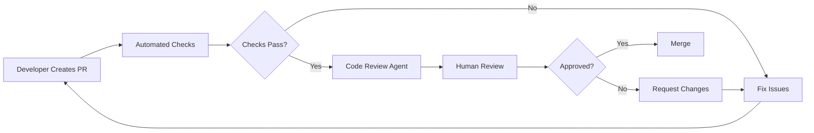

# Code Review Guide

## 📋 Overview

This guide documents DevSkyy's code review processes, standards, and automated review systems. Code reviews are essential for maintaining code quality, ensuring security, and facilitating knowledge sharing across the team.

**Last Updated:** November 2024  
**Version:** 5.0.0  
**Status:** Production Ready

---

## 📚 Table of Contents

1. [Code Review Philosophy](#code-review-philosophy)
2. [Review Process](#review-process)
3. [Automated Code Review Agent](#automated-code-review-agent)
4. [Review Checklist](#review-checklist)
5. [Security Review](#security-review)
6. [Performance Review](#performance-review)
7. [Code Quality Standards](#code-quality-standards)
8. [Review Tools](#review-tools)
9. [Common Review Patterns](#common-review-patterns)
10. [Best Practices](#best-practices)

---

## Code Review Philosophy

### Core Principles

1. **Truth over Speed** - Prioritize correctness over rapid delivery
2. **Transparency** - All changes must be traceable and verifiable
3. **Security First** - Security vulnerabilities are blocking issues
4. **Continuous Learning** - Reviews are learning opportunities
5. **Respectful Communication** - Critique code, not people

### Review Objectives

- ✅ Catch bugs and logic errors before production
- ✅ Ensure security best practices are followed
- ✅ Maintain code quality and consistency
- ✅ Share knowledge across the team
- ✅ Validate architectural decisions
- ✅ Verify documentation completeness

---

## Review Process

### Standard Review Workflow



### Review Stages

#### Stage 1: Automated Checks (0-5 minutes)

- Linting (Ruff, ESLint)
- Formatting (Black, Prettier)
- Type checking (MyPy, TypeScript)
- Unit tests
- Security scan (Bandit, Safety)
- Build verification

#### Stage 2: Automated Code Review (5-10 minutes)

- AI-powered code analysis
- Security pattern detection
- Performance analysis
- Code quality metrics
- Complexity analysis

#### Stage 3: Human Review (1-24 hours)

- Logic verification
- Architecture review
- Edge case analysis
- Documentation review
- Security deep dive

#### Stage 4: Final Approval (5-30 minutes)

- Response to feedback
- Re-review if needed
- Final approval
- Merge to target branch

---

## Automated Code Review Agent

### Code Reviewer Agent (`.claude/agents/code-reviewer.md`)

**Purpose:** AI-powered automated code review using Claude Sonnet

#### Features

- **Truth Protocol** - Never guess syntax or fabricate APIs
- **Version Verification** - Explicit version requirements
- **Security Analysis** - OWASP Top 10 compliance
- **Documentation Checks** - Source citation requirements
- **Performance Review** - Complexity and optimization analysis
- **Best Practice Enforcement** - Language-specific patterns

#### Usage

The code reviewer agent runs automatically on all pull requests and can be invoked manually:

```bash
# Manual review via CLI
claude review --file path/to/file.py

# Review entire PR
claude review --pr 123
```

#### Review Categories

| Category | Focus | Examples |
|----------|-------|----------|
| Correctness | Syntax, logic, types | Missing colons, type mismatches |
| Security | Vulnerabilities, patterns | SQL injection, XSS, secrets |
| Performance | Efficiency, scalability | N+1 queries, blocking I/O |
| Maintainability | Readability, structure | Naming, complexity, DRY |
| Documentation | Comments, docstrings | Missing docs, unclear APIs |

### Review Output Structure

```json
{
  "review_id": "rev_1699999999",
  "timestamp": "2024-11-11T09:00:00Z",
  "pr_number": 123,
  "files_reviewed": 15,
  "comments": [
    {
      "file": "api/auth.py",
      "line": 45,
      "severity": "error",
      "category": "security",
      "message": "Hardcoded API key detected",
      "recommendation": "Move to environment variable using os.getenv()",
      "code_snippet": "api_key = 'sk-1234567890'",
      "suggested_fix": "api_key = os.getenv('API_KEY')",
      "references": [
        "SECURITY.md#api-key-management",
        "https://owasp.org/Top10/A02_2021-Cryptographic_Failures/"
      ]
    }
  ],
  "metrics": {
    "overall_score": 85,
    "security_score": 78,
    "quality_score": 90,
    "documentation_score": 82
  },
  "summary": {
    "errors": 2,
    "warnings": 8,
    "suggestions": 15,
    "blocking_issues": 2
  }
}
```

---

## Review Checklist

### General Code Review

- [ ] **Correctness**
  - [ ] Code compiles/runs without errors
  - [ ] Logic is correct and handles edge cases
  - [ ] Type annotations are accurate
  - [ ] Error handling is appropriate
  - [ ] No syntax errors or typos

- [ ] **Security**
  - [ ] No hardcoded secrets or credentials
  - [ ] Input validation is present
  - [ ] SQL queries are parameterized
  - [ ] User input is sanitized
  - [ ] Authentication/authorization checks are correct
  - [ ] No security vulnerabilities (XSS, CSRF, injection)

- [ ] **Performance**
  - [ ] No N+1 query problems
  - [ ] Appropriate caching is used
  - [ ] Async/await used correctly
  - [ ] Resources are properly released
  - [ ] No blocking operations in async code

- [ ] **Code Quality**
  - [ ] Code follows style guide (PEP 8, Airbnb, etc.)
  - [ ] Variable names are descriptive
  - [ ] Functions are single-purpose and focused
  - [ ] No code duplication (DRY principle)
  - [ ] Magic numbers replaced with constants
  - [ ] Complexity is reasonable (cyclomatic complexity < 10)

- [ ] **Testing**
  - [ ] Unit tests added for new functionality
  - [ ] Edge cases are tested
  - [ ] Tests are meaningful and not trivial
  - [ ] Test coverage meets requirements (90%+)
  - [ ] Integration tests for API changes

- [ ] **Documentation**
  - [ ] Docstrings for all public functions
  - [ ] Complex logic has explanatory comments
  - [ ] API changes are documented
  - [ ] README updated if needed
  - [ ] Breaking changes clearly marked

### Python-Specific Checklist

- [ ] **Language Standards**
  - [ ] PEP 8 compliant
  - [ ] Type hints on all functions
  - [ ] Docstrings in Google style
  - [ ] Python 3.11+ compatible

- [ ] **Best Practices**
  - [ ] List comprehensions instead of loops (where appropriate)
  - [ ] Context managers for resources (`with` statement)
  - [ ] Decorators for cross-cutting concerns
  - [ ] Async/await for I/O operations
  - [ ] F-strings for string formatting

- [ ] **Common Issues**
  - [ ] No mutable default arguments
  - [ ] Proper exception handling (no bare `except:`)
  - [ ] No circular imports
  - [ ] Proper use of `__all__`
  - [ ] Virtual environment specified

### JavaScript/TypeScript Checklist

- [ ] **Language Standards**
  - [ ] ES6+ syntax
  - [ ] TypeScript strict mode
  - [ ] No `any` types (use proper types)
  - [ ] Proper async/await usage

- [ ] **Best Practices**
  - [ ] `const` and `let`, not `var`
  - [ ] Arrow functions where appropriate
  - [ ] Destructuring for cleaner code
  - [ ] Array methods (map, filter, reduce)
  - [ ] Promises handled correctly

- [ ] **Common Issues**
  - [ ] No console.log in production
  - [ ] No == (use ===)
  - [ ] Proper error handling in promises
  - [ ] No memory leaks (event listeners cleaned up)
  - [ ] Proper null/undefined checks

---

## Security Review

### Security Review Priority

All security issues are reviewed with high priority and must be fixed before merging.

#### Critical Security Issues (Must Fix)

1. **Hardcoded Secrets**
   ```python
   # ❌ CRITICAL - Hardcoded secret
   api_key = "sk-1234567890"
   
   # ✅ CORRECT - Environment variable
   import os
   api_key = os.getenv("API_KEY")
   ```

2. **SQL Injection**
   ```python
   # ❌ CRITICAL - SQL injection vulnerability
   query = f"SELECT * FROM users WHERE id={user_id}"
   cursor.execute(query)
   
   # ✅ CORRECT - Parameterized query
   query = "SELECT * FROM users WHERE id=%s"
   cursor.execute(query, (user_id,))
   ```

3. **XSS Vulnerabilities**
   ```javascript
   // ❌ CRITICAL - XSS vulnerability
   element.innerHTML = userInput;
   
   // ✅ CORRECT - Safe text content
   element.textContent = userInput;
   // Or sanitize
   element.innerHTML = DOMPurify.sanitize(userInput);
   ```

4. **Command Injection**
   ```python
   # ❌ CRITICAL - Command injection
   os.system(f"rm {filename}")
   
   # ✅ CORRECT - Safe subprocess
   import subprocess
   subprocess.run(["rm", filename], check=True)
   ```

#### High Security Issues (Should Fix)

5. **Weak Cryptography**
   ```python
   # ❌ HIGH - Weak hashing
   import hashlib
   password_hash = hashlib.md5(password.encode()).hexdigest()
   
   # ✅ CORRECT - Strong hashing
   import bcrypt
   password_hash = bcrypt.hashpw(password.encode(), bcrypt.gensalt())
   ```

6. **Path Traversal**
   ```python
   # ❌ HIGH - Path traversal vulnerability
   file_path = f"/uploads/{user_filename}"
   
   # ✅ CORRECT - Safe path handling
   from pathlib import Path
   upload_dir = Path("/uploads")
   file_path = (upload_dir / user_filename).resolve()
   if not file_path.is_relative_to(upload_dir):
       raise ValueError("Invalid path")
   ```

7. **Insecure Deserialization**
   ```python
   # ❌ HIGH - Insecure pickle
   import pickle
   data = pickle.loads(user_data)
   
   # ✅ CORRECT - Safe JSON
   import json
   data = json.loads(user_data)
   ```

### Security Review Checklist

- [ ] **Authentication & Authorization**
  - [ ] Proper authentication on all endpoints
  - [ ] Authorization checks before data access
  - [ ] JWT tokens properly validated
  - [ ] Session management is secure
  - [ ] Password requirements enforced

- [ ] **Input Validation**
  - [ ] All user input is validated
  - [ ] Type checking on inputs
  - [ ] Length limits enforced
  - [ ] Whitelist validation where possible
  - [ ] Proper error messages (no info leakage)

- [ ] **Data Protection**
  - [ ] Sensitive data encrypted at rest
  - [ ] TLS/HTTPS for data in transit
  - [ ] No sensitive data in logs
  - [ ] Proper handling of PII
  - [ ] Secure deletion of data

- [ ] **API Security**
  - [ ] Rate limiting implemented
  - [ ] CORS properly configured
  - [ ] API keys rotated regularly
  - [ ] Webhook signatures verified
  - [ ] Input size limits enforced

- [ ] **Dependencies**
  - [ ] No known vulnerabilities (run `pip-audit`, `npm audit`)
  - [ ] Dependencies pinned to specific versions
  - [ ] Minimal dependencies (reduce attack surface)
  - [ ] Regular dependency updates

### Security Review Tools

```bash
# Python security scanning
pip install bandit safety pip-audit

# Run security checks
bandit -r agent/ api/ security/
safety check
pip-audit

# JavaScript security scanning
npm install -g npm-audit
npm audit --production

# Pre-commit security hooks
pre-commit install
pre-commit run --all-files
```

---

## Performance Review

### Performance Review Checklist

- [ ] **Database Queries**
  - [ ] No N+1 query problems
  - [ ] Proper indexing on queried fields
  - [ ] Query results are paginated
  - [ ] Connection pooling is used
  - [ ] Transactions are properly scoped

- [ ] **Caching**
  - [ ] Frequently accessed data is cached
  - [ ] Cache invalidation is handled
  - [ ] TTL is appropriate
  - [ ] Cache hit/miss monitored

- [ ] **Async Operations**
  - [ ] I/O operations are async
  - [ ] No blocking calls in async functions
  - [ ] Proper error handling in async code
  - [ ] Concurrent operations where appropriate

- [ ] **Resource Management**
  - [ ] Files are properly closed
  - [ ] Database connections are released
  - [ ] Memory leaks prevented
  - [ ] Large files handled with streaming

- [ ] **Algorithm Complexity**
  - [ ] Time complexity is reasonable
  - [ ] Space complexity is acceptable
  - [ ] No unnecessary loops or iterations
  - [ ] Efficient data structures used

### Performance Red Flags

```python
# ❌ N+1 Query Problem
for user in users:
    orders = db.query(Order).filter(Order.user_id == user.id).all()

# ✅ Optimized with Join
users = db.query(User).options(joinedload(User.orders)).all()
```

```python
# ❌ Blocking I/O in Async Function
async def fetch_data():
    return requests.get(url).json()  # Blocking!

# ✅ Non-blocking Async
import aiohttp
async def fetch_data():
    async with aiohttp.ClientSession() as session:
        async with session.get(url) as response:
            return await response.json()
```

```python
# ❌ No Caching for Expensive Operation
def get_recommendations(user_id):
    return expensive_ml_computation(user_id)

# ✅ With Caching
from functools import lru_cache

@lru_cache(maxsize=1000)
def get_recommendations(user_id):
    return expensive_ml_computation(user_id)
```

---

## Code Quality Standards

### Style Guide Compliance

| Language | Style Guide | Linter | Formatter |
|----------|-------------|--------|-----------|
| Python | PEP 8 (119 char) | Ruff | Black |
| JavaScript | Airbnb | ESLint | Prettier |
| TypeScript | TypeScript | ESLint | Prettier |
| HTML/CSS | BEM | Stylelint | Prettier |

### Complexity Limits

- **Cyclomatic Complexity:** < 10 per function
- **Function Length:** < 50 lines (exceptions allowed with justification)
- **File Length:** < 500 lines (split larger files)
- **Parameters:** < 5 per function (use objects for more)
- **Nesting Depth:** < 4 levels

### Code Quality Metrics

```python
# Calculate code quality score
quality_score = (
    documentation_score * 0.3 +
    test_coverage * 0.3 +
    complexity_score * 0.2 +
    style_compliance * 0.2
)

# Target: 85+ for production code
```

### Documentation Standards

#### Python Docstring Example

```python
def optimize_price(
    product_data: Dict[str, Any],
    market_data: Dict[str, Any],
    strategy: str = "profit_max"
) -> Dict[str, float]:
    """
    Optimize product pricing using ML algorithms.
    
    This function uses machine learning models to determine the optimal
    price for a product based on market conditions, competitor pricing,
    and demand forecasts.
    
    Args:
        product_data: Product information including:
            - base_price: Current product price
            - cost: Production/acquisition cost
            - inventory: Current stock level
        market_data: Market conditions including:
            - demand_score: Predicted demand (0-1)
            - competitor_avg_price: Average competitor pricing
            - season_factor: Seasonal adjustment factor
        strategy: Pricing strategy ('profit_max', 'market_share', 'balanced')
    
    Returns:
        Dictionary containing:
            - optimal_price: Recommended price
            - confidence: Model confidence score (0-1)
            - expected_revenue_increase: Percentage increase estimate
            - reasoning: Human-readable explanation
    
    Raises:
        ValueError: If product_data or market_data is invalid
        HTTPException: If ML model is unavailable
    
    Example:
        >>> product = {"base_price": 99.99, "cost": 40, "inventory": 50}
        >>> market = {"demand_score": 0.8, "competitor_avg_price": 110}
        >>> result = optimize_price(product, market, "profit_max")
        >>> print(result["optimal_price"])
        119.99
    
    Note:
        This function uses the DynamicPricingEngine ML model which
        requires training data from the last 90 days. Model accuracy
        decreases for products with < 30 days of sales history.
    
    See Also:
        - DynamicPricingEngine: ML model documentation
        - PRICING_GUIDE.md: Detailed pricing strategy guide
    """
```

---

## Review Tools

### Automated Review Tools

#### 1. Code Quality

```bash
# Python
ruff check agent/ api/ security/
black --check agent/ api/ security/
mypy agent/ api/ security/

# JavaScript/TypeScript
eslint src/
prettier --check src/
tsc --noEmit
```

#### 2. Security

```bash
# Python
bandit -r agent/ api/ security/
safety check
pip-audit

# JavaScript
npm audit
retire --path src/
```

#### 3. Testing

```bash
# Python
pytest tests/ --cov=agent --cov=api --cov-report=html

# JavaScript
jest --coverage
```

#### 4. Performance

```bash
# Python profiling
python -m cProfile -o profile.stats main.py
snakeviz profile.stats

# Load testing
locust -f tests/load_test.py
```

### Manual Review Tools

#### VS Code Extensions

- **Python:** Pylance, Python, Ruff
- **JavaScript/TypeScript:** ESLint, Prettier
- **Git:** GitLens, GitHub Pull Requests
- **General:** SonarLint, Code Spell Checker

#### Browser Extensions

- **GitHub:** Refined GitHub, Octotree
- **Security:** HTTPS Everywhere, uBlock Origin

---

## Common Review Patterns

### Pattern 1: API Endpoint Review

```python
# Review Checklist for API Endpoints:
# ✅ Authentication required
# ✅ Input validation (Pydantic model)
# ✅ Authorization checks
# ✅ Error handling
# ✅ Rate limiting
# ✅ Documentation
# ✅ Tests

from fastapi import APIRouter, Depends, HTTPException
from pydantic import BaseModel, validator
from security.jwt_auth import verify_jwt_token, check_permission

router = APIRouter()

class ProductCreate(BaseModel):
    """Product creation model with validation."""
    name: str
    price: float
    
    @validator('price')
    def validate_price(cls, v):
        if v <= 0:
            raise ValueError('Price must be positive')
        return v

@router.post("/api/v1/products")
async def create_product(
    product: ProductCreate,
    token: str = Depends(verify_jwt_token)
) -> Dict[str, Any]:
    """
    Create a new product.
    
    Requires: DEVELOPER role or higher
    """
    # ✅ Check permissions
    if not await check_permission(token, "products", "write"):
        raise HTTPException(403, "Insufficient permissions")
    
    try:
        # ✅ Business logic
        result = await product_service.create(product)
        return result
    except Exception as e:
        # ✅ Error handling
        logger.error(f"Product creation failed: {e}")
        raise HTTPException(500, "Product creation failed")
```

### Pattern 2: Database Query Review

```python
# Review Checklist for Database Queries:
# ✅ No N+1 queries
# ✅ Proper indexing
# ✅ Pagination
# ✅ Transaction handling
# ✅ Error handling

from sqlalchemy.orm import joinedload

async def get_user_with_orders(user_id: int, page: int = 1, limit: int = 20):
    """
    Get user with their orders (optimized).
    
    ✅ Uses joinedload to prevent N+1
    ✅ Implements pagination
    ✅ Proper error handling
    """
    try:
        offset = (page - 1) * limit
        
        user = await db.query(User).options(
            joinedload(User.orders)
        ).filter(
            User.id == user_id
        ).offset(offset).limit(limit).first()
        
        if not user:
            raise ValueError(f"User {user_id} not found")
        
        return user
        
    except Exception as e:
        logger.error(f"Database query failed: {e}")
        raise
```

### Pattern 3: Async Function Review

```python
# Review Checklist for Async Functions:
# ✅ Proper async/await usage
# ✅ No blocking calls
# ✅ Error handling
# ✅ Resource cleanup
# ✅ Timeout handling

import asyncio
import aiohttp

async def fetch_external_data(url: str, timeout: int = 30):
    """
    Fetch data from external API (non-blocking).
    
    ✅ Uses aiohttp for async HTTP
    ✅ Implements timeout
    ✅ Proper resource cleanup
    ✅ Error handling
    """
    try:
        async with aiohttp.ClientSession() as session:
            async with session.get(
                url,
                timeout=aiohttp.ClientTimeout(total=timeout)
            ) as response:
                response.raise_for_status()
                return await response.json()
                
    except asyncio.TimeoutError:
        logger.error(f"Request to {url} timed out")
        raise
    except aiohttp.ClientError as e:
        logger.error(f"HTTP request failed: {e}")
        raise
```

---

## Best Practices

### 1. Review Size

- ✅ **Small PRs** (< 400 lines): Easier to review thoroughly
- ⚠️ **Medium PRs** (400-800 lines): Split if possible
- ❌ **Large PRs** (> 800 lines): Must be split into smaller PRs

```bash
# Check PR size before creating
git diff --stat main...feature-branch
```

### 2. Review Timing

- ✅ **Review within 24 hours** for urgent PRs
- ✅ **Review within 48 hours** for standard PRs
- ✅ **Set aside dedicated review time** (1-2 hours daily)

### 3. Review Comments

```markdown
# ✅ Good Comment
**Security Issue:** Hardcoded API key on line 45

This creates a security risk as the key will be committed to version control.

**Recommendation:** Move to environment variable:
\`\`\`python
api_key = os.getenv("API_KEY")
\`\`\`

**Reference:** SECURITY.md#api-key-management

# ❌ Bad Comment
bad code fix it
```

### 4. Review Response

```markdown
# ✅ Good Response
Thank you for catching this! I've:
1. Moved the API key to environment variable
2. Added validation for missing env vars
3. Updated documentation

Changes in commit abc123

# ❌ Bad Response
ok fixed
```

### 5. Approval Criteria

- ✅ All automated checks pass
- ✅ No blocking security issues
- ✅ Code quality meets standards
- ✅ Tests are comprehensive
- ✅ Documentation is complete
- ✅ Performance is acceptable

### 6. Follow-up

```markdown
# Create follow-up issues for non-blocking items
- [ ] #123 - Add caching to optimize performance
- [ ] #124 - Improve error messages
- [ ] #125 - Add integration tests
```

---

## CI/CD Integration

### GitHub Actions Example

```yaml
# .github/workflows/code-review.yml
name: Automated Code Review

on:
  pull_request:
    types: [opened, synchronize, reopened]

jobs:
  review:
    runs-on: ubuntu-latest
    
    steps:
      - uses: actions/checkout@v3
      
      - name: Set up Python
        uses: actions/setup-python@v4
        with:
          python-version: '3.11'
      
      - name: Install dependencies
        run: |
          pip install -r requirements-dev.txt
      
      - name: Lint with Ruff
        run: ruff check agent/ api/ security/
      
      - name: Format check with Black
        run: black --check agent/ api/ security/
      
      - name: Type check with MyPy
        run: mypy agent/ api/ security/
      
      - name: Security scan with Bandit
        run: bandit -r agent/ api/ security/
      
      - name: Dependency scan
        run: |
          pip-audit
          safety check
      
      - name: Run tests with coverage
        run: |
          pytest tests/ \
            --cov=agent \
            --cov=api \
            --cov=security \
            --cov-report=xml \
            --cov-fail-under=90
      
      - name: Upload coverage
        uses: codecov/codecov-action@v3
      
      - name: AI Code Review
        env:
          ANTHROPIC_API_KEY: ${{ secrets.ANTHROPIC_API_KEY }}
        run: |
          python scripts/ai_code_review.py \
            --pr ${{ github.event.pull_request.number }}
```

---

## Related Documentation

- [Code Repair Guide](code_repair.md) - Automated code repair tools and workflows
- [Security Policy](SECURITY.md) - Security guidelines and vulnerability reporting
- [Contributing Guide](CONTRIBUTING.md) - Contribution process and standards
- [Style Guide](docs/STYLE_GUIDE.md) - Code style standards and conventions

---

## Review Templates

### Pull Request Template

```markdown
## Description
<!-- Brief description of changes -->

## Type of Change
- [ ] Bug fix
- [ ] New feature
- [ ] Breaking change
- [ ] Documentation update
- [ ] Security fix
- [ ] Performance improvement

## Checklist
- [ ] Code follows style guidelines
- [ ] Self-review completed
- [ ] Comments added for complex logic
- [ ] Documentation updated
- [ ] Tests added/updated
- [ ] All tests pass
- [ ] No security vulnerabilities
- [ ] Performance impact considered

## Testing
<!-- Describe testing performed -->

## Screenshots (if applicable)
<!-- Add screenshots for UI changes -->

## Related Issues
<!-- Link to related issues -->
Closes #XXX
```

### Review Comment Template

```markdown
## [Category] Issue Title

**Severity:** Critical/High/Medium/Low
**Type:** Security/Performance/Bug/Style

**Description:**
[Clear description of the issue]

**Current Code:**
\`\`\`python
[problematic code]
\`\`\`

**Recommendation:**
\`\`\`python
[suggested fix]
\`\`\`

**Reasoning:**
[Explanation of why this is better]

**References:**
- [Link to docs/standards]
- [Related issue/PR]
```

---

## Support

For questions about code review:

- **GitHub Discussions:** [DevSkyy Discussions](https://github.com/The-Skyy-Rose-Collection-LLC/DevSkyy/discussions)
- **Email:** dev@skyyrose.co
- **Documentation:** [Official Docs](/docs)

---

**Last Updated:** November 2024  
**Version:** 5.0.0  
**Maintainer:** DevSkyy Platform Team

*© 2024 Skyy Rose LLC. All rights reserved.*
