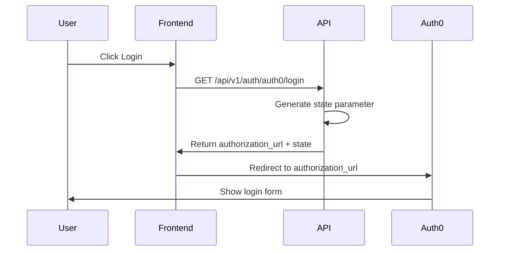
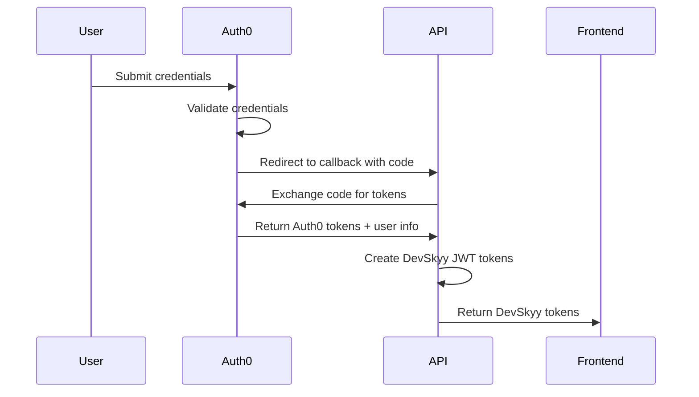
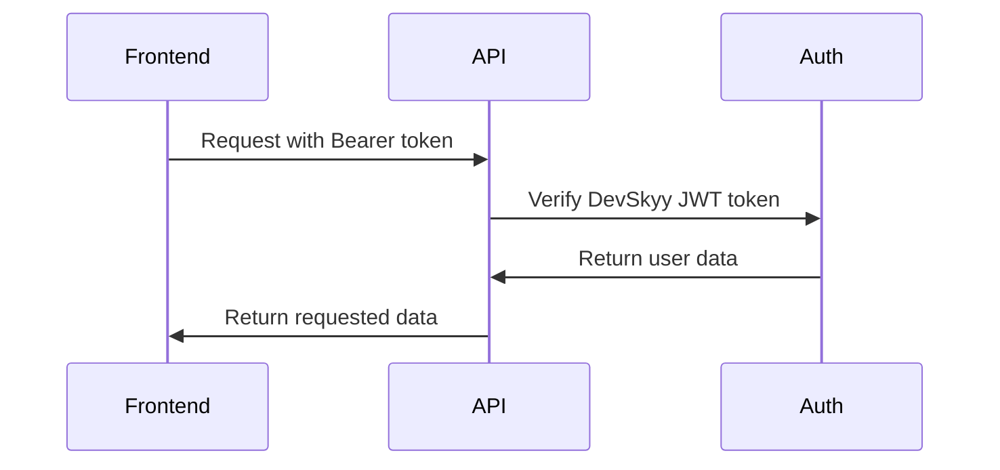

# Auth0 Integration Guide for DevSkyy Platform

## Overview

This guide provides detailed information about the Auth0 integration in the DevSkyy platform, including setup, configuration, and advanced features for enterprise-grade authentication.

## Table of Contents

1. [Architecture Overview](#architecture-overview)
2. [Auth0 Configuration](#auth0-configuration)
3. [Integration Components](#integration-components)
4. [Authentication Flow](#authentication-flow)
5. [Token Management](#token-management)
6. [Security Features](#security-features)
7. [Enterprise Features](#enterprise-features)
8. [Troubleshooting](#troubleshooting)

## Architecture Overview

The DevSkyy Auth0 integration implements a hybrid authentication system that combines Auth0's enterprise-grade authentication with DevSkyy's internal JWT token system.

### Key Components

1. **Auth0OAuth2Client**: FastAPI-compatible OAuth2 client
2. **JWT Token Bridge**: Converts Auth0 tokens to DevSkyy JWT format
3. **FastAPI Endpoints**: RESTful API endpoints for authentication
4. **Hybrid Verification**: Supports both Auth0 and DevSkyy tokens

### Integration Flow

```
User → Auth0 Login → Auth0 Callback → DevSkyy JWT → API Access
```

## Auth0 Configuration

### Environment Variables

```bash
# Auth0 Configuration
AUTH0_DOMAIN=your-tenant.auth0.com
AUTH0_CLIENT_ID=your-client-id
AUTH0_CLIENT_SECRET=your-client-secret
AUTH0_AUDIENCE=https://api.devskyy.com
AUTH0_ALGORITHMS=["RS256"]

# DevSkyy Configuration
DEVSKYY_SECRET_KEY=your-256-bit-secret-key
DEVSKYY_JWT_ALGORITHM=HS256
FRONTEND_URL=https://app.devskyy.com
API_BASE_URL=https://api.devskyy.com
```

### Auth0 Tenant Settings

```yaml
# auth0/tenant.yaml
tenant:
  friendly_name: "DevSkyy Enterprise Platform"
  picture_url: "https://devskyy.com/logo.png"
  support_email: "support@devskyy.com"
  support_url: "https://devskyy.com/support"
  
  # Security Settings
  default_audience: "https://api.devskyy.com"
  default_directory: "Username-Password-Authentication"
  
  # Session Settings
  session_lifetime: 168  # 7 days in hours
  idle_session_lifetime: 72  # 3 days in hours
  session_cookie_timeout: 168
  
  # Password Policy
  password_policy: "good"
  password_complexity_options:
    min_length: 8
  password_no_personal_info:
    enable: true
  password_dictionary:
    enable: true
  password_history:
    enable: true
    size: 5
```

### Application Configuration

```yaml
# Auth0 Application Settings
application:
  name: "DevSkyy API"
  app_type: "regular_web"
  callbacks:
    - "https://api.devskyy.com/api/v1/auth/auth0/callback"
    - "http://localhost:8000/api/v1/auth/auth0/callback"  # Development
  allowed_logout_urls:
    - "https://app.devskyy.com"
    - "http://localhost:3000"  # Development
  allowed_origins:
    - "https://app.devskyy.com"
    - "http://localhost:3000"  # Development
  web_origins:
    - "https://app.devskyy.com"
    - "http://localhost:3000"  # Development
  
  # JWT Configuration
  jwt_configuration:
    lifetime_in_seconds: 36000
    secret_encoded: false
    scopes: {}
    alg: "RS256"
  
  # Refresh Token Configuration
  refresh_token:
    rotation_type: "rotating"
    expiration_type: "expiring"
    leeway: 0
    token_lifetime: 2592000  # 30 days
    infinite_token_lifetime: false
    infinite_idle_token_lifetime: false
    idle_token_lifetime: 1296000  # 15 days
```

## Integration Components

### 1. Auth0OAuth2Client

The core OAuth2 client that handles Auth0 communication:

```python
class Auth0OAuth2Client:
    """FastAPI-compatible Auth0 OAuth2 client."""
    
    def __init__(self):
        self.domain = AUTH0_DOMAIN
        self.client_id = AUTH0_CLIENT_ID
        self.client_secret = AUTH0_CLIENT_SECRET
        self.audience = AUTH0_AUDIENCE
    
    async def get_authorization_url(self, redirect_uri: str, state: str) -> str:
        """Generate Auth0 authorization URL."""
        
    async def exchange_code_for_token(self, code: str, redirect_uri: str) -> Dict[str, Any]:
        """Exchange authorization code for tokens."""
        
    async def get_user_info(self, access_token: str) -> Dict[str, Any]:
        """Get user information from Auth0."""
        
    def get_logout_url(self, return_to: str) -> str:
        """Generate Auth0 logout URL."""
```

### 2. JWT Token Bridge

Converts Auth0 tokens to DevSkyy JWT format for internal use:

```python
def create_devskyy_jwt_token(user_data: Dict[str, Any], expires_delta: Optional[timedelta] = None) -> str:
    """Create DevSkyy JWT token with Auth0 user data."""
    if expires_delta:
        expire = datetime.utcnow() + expires_delta
    else:
        expire = datetime.utcnow() + timedelta(minutes=30)

    payload = {
        "sub": user_data.get("sub"),  # Auth0 user ID
        "email": user_data.get("email"),
        "name": user_data.get("name"),
        "picture": user_data.get("picture"),
        "email_verified": user_data.get("email_verified", False),
        "exp": int(expire.timestamp()),
        "iat": int(datetime.utcnow().timestamp()),
        "iss": "devskyy-platform",
        "aud": "devskyy-api",
        "token_type": "access",
        "auth_provider": "auth0"
    }

    encoded_jwt = jwt.encode(payload, DEVSKYY_SECRET_KEY, algorithm=DEVSKYY_JWT_ALGORITHM)
    return encoded_jwt
```

### 3. Token Verification

Hybrid token verification supporting both Auth0 and DevSkyy tokens:

```python
def verify_devskyy_jwt_token(token: str) -> Dict[str, Any]:
    """Verify DevSkyy JWT token (including Auth0-bridged tokens)."""
    try:
        payload = jwt.decode(
            token,
            DEVSKYY_SECRET_KEY,
            algorithms=[DEVSKYY_JWT_ALGORITHM],
            audience="devskyy-api",
            issuer="devskyy-platform"
        )
        return payload
    except jwt.ExpiredSignatureError:
        raise HTTPException(
            status_code=status.HTTP_401_UNAUTHORIZED,
            detail="Token has expired"
        )
    except jwt.InvalidTokenError:
        raise HTTPException(
            status_code=status.HTTP_401_UNAUTHORIZED,
            detail="Invalid token"
        )
```

## Authentication Flow

### 1. Login Initiation



### 2. Authentication & Callback



### 3. API Access



## Token Management

### Token Types

1. **Auth0 Access Token**: Used for Auth0 API calls
2. **Auth0 ID Token**: Contains user information
3. **DevSkyy Access Token**: Used for DevSkyy API calls
4. **DevSkyy Refresh Token**: Used to refresh DevSkyy tokens

### Token Lifecycle

```python
# Token Creation
access_token = create_devskyy_jwt_token(
    user_data=user_info,
    expires_delta=timedelta(minutes=30)
)

refresh_token = create_devskyy_refresh_token(user_data=user_info)

# Token Response
{
    "access_token": access_token,
    "refresh_token": refresh_token,
    "token_type": "bearer",
    "expires_in": 1800,
    "user_info": user_info
}
```

### Token Refresh

DevSkyy tokens can be refreshed using the standard refresh endpoint:

```bash
curl -X POST "/api/v1/auth/refresh" \
  -H "Content-Type: application/json" \
  -d '{"refresh_token": "your-refresh-token"}'
```

## Security Features

### 1. CSRF Protection

State parameter validation prevents CSRF attacks:

```python
@router.get("/login")
async def auth0_login(request: Request):
    # Generate cryptographically secure state
    state = generate_token(32)
    
    # Store state in session or cache
    request.session["auth0_state"] = state
    
    authorization_url = auth0_oauth_client.get_authorization_url(
        redirect_uri=redirect_uri,
        state=state
    )
    
    return {"authorization_url": authorization_url, "state": state}

@router.get("/callback")
async def auth0_callback(request: Request, state: str):
    # Validate state parameter
    stored_state = request.session.get("auth0_state")
    if not stored_state or stored_state != state:
        raise HTTPException(
            status_code=status.HTTP_400_BAD_REQUEST,
            detail="Invalid state parameter"
        )
```

### 2. Token Security

- **Short-lived tokens**: 30-minute access tokens
- **Secure storage**: Tokens should be stored in httpOnly cookies
- **HTTPS only**: All authentication endpoints require HTTPS
- **Token validation**: Comprehensive token validation

### 3. Error Handling

Comprehensive error handling for Auth0 responses:

```python
@router.get("/callback")
async def auth0_callback(
    error: Optional[str] = Query(None),
    error_description: Optional[str] = Query(None)
):
    if error:
        await log_auth_event(
            event_type="auth0_error",
            request=request,
            details={"error": error, "description": error_description}
        )
        
        if error == "access_denied":
            raise HTTPException(
                status_code=status.HTTP_401_UNAUTHORIZED,
                detail="User denied access"
            )
        else:
            raise HTTPException(
                status_code=status.HTTP_400_BAD_REQUEST,
                detail=f"Auth0 error: {error_description or error}"
            )
```

## Enterprise Features

### 1. Multi-Factor Authentication (MFA)

Auth0 MFA configuration:

```yaml
# MFA Settings
guardian_mfa_page:
  enabled: true
  html: |
    <!DOCTYPE html>
    <html>
    <head>
      <title>DevSkyy - Multi-Factor Authentication</title>
      <meta charset="utf-8">
      <meta name="viewport" content="width=device-width, initial-scale=1.0">
      <link rel="stylesheet" href="https://cdn.auth0.com/guardian/latest/guardian-multifactor.min.css">
    </head>
    <body>
      <div id="guardian-multifactor"></div>
      <script src="https://cdn.auth0.com/guardian/latest/guardian-multifactor.min.js"></script>
      <script>
        new Auth0GuardianMultifactor({
          container: '#guardian-multifactor',
          logo: 'https://devskyy.com/logo.png',
          primaryColor: '#667eea'
        });
      </script>
    </body>
    </html>
```

### 2. Enterprise Connections

Support for enterprise identity providers:

```yaml
# Enterprise Connections
connections:
  - name: "google-oauth2"
    strategy: "google-oauth2"
    enabled: true
    options:
      client_id: "google-client-id"
      client_secret: "google-client-secret"
      allowed_audiences:
        - "https://api.devskyy.com"
      
  - name: "samlp-enterprise"
    strategy: "samlp"
    enabled: true
    options:
      tenant_domain: "enterprise.devskyy.com"
      domain_aliases:
        - "company.com"
      sign_in_endpoint: "https://company.com/saml/sso"
      sign_out_endpoint: "https://company.com/saml/slo"
      certificate: "-----BEGIN CERTIFICATE-----..."
```

### 3. Custom Database Connections

Integration with existing user databases:

```javascript
// Custom Database Login Script
function login(email, password, callback) {
  const { Client } = require('pg');
  
  const client = new Client({
    connectionString: configuration.DATABASE_URL
  });
  
  client.connect();
  
  const query = 'SELECT id, email, password_hash FROM users WHERE email = $1 AND is_active = true';
  client.query(query, [email], (err, result) => {
    if (err) return callback(err);
    if (result.rows.length === 0) return callback(new WrongUsernameOrPasswordError(email));
    
    const user = result.rows[0];
    
    // Verify password using bcrypt
    bcrypt.compare(password, user.password_hash, (err, isValid) => {
      if (err) return callback(err);
      if (!isValid) return callback(new WrongUsernameOrPasswordError(email));
      
      // Update last login
      const updateQuery = 'UPDATE users SET last_login = NOW() WHERE id = $1';
      client.query(updateQuery, [user.id], (err) => {
        client.end();
        if (err) return callback(err);
        
        callback(null, {
          user_id: user.id,
          email: user.email
        });
      });
    });
  });
}
```

## Troubleshooting

### Common Issues

#### 1. Invalid Callback URL

**Error**: `invalid_request: The redirect_uri is not in the list of allowed callback URLs`

**Solution**: 
- Check Auth0 application settings
- Ensure callback URL matches exactly
- Include both production and development URLs

#### 2. Token Verification Failed

**Error**: `Invalid token signature`

**Solution**:
- Verify `DEVSKYY_SECRET_KEY` is correctly set
- Check token algorithm matches configuration
- Ensure token hasn't expired

#### 3. State Parameter Mismatch

**Error**: `Invalid state parameter`

**Solution**:
- Implement proper session management
- Store state parameter securely
- Validate state on callback

#### 4. Auth0 Configuration Issues

**Error**: Various Auth0 errors

**Solution**:
- Verify all Auth0 environment variables
- Check Auth0 tenant configuration
- Ensure application is properly configured

### Debug Mode

Enable debug logging for troubleshooting:

```python
import logging

# Enable debug logging
logging.getLogger("security.auth0_integration").setLevel(logging.DEBUG)
logging.getLogger("api.v1.auth0_endpoints").setLevel(logging.DEBUG)

# Log all Auth0 events
async def log_auth_event(
    event_type: str,
    user_id: Optional[str] = None,
    request: Optional[Request] = None,
    details: Optional[Dict[str, Any]] = None
):
    """Log authentication events for monitoring and debugging."""
    log_data = {
        "event_type": event_type,
        "timestamp": datetime.utcnow().isoformat(),
        "user_id": user_id,
        "ip_address": request.client.host if request else None,
        "user_agent": request.headers.get("user-agent") if request else None,
        "details": details or {}
    }
    
    logger.info(f"Auth Event: {json.dumps(log_data)}")
```

### Health Check

Monitor Auth0 integration health:

```python
@router.get("/health")
async def auth0_health_check():
    """Check Auth0 integration health."""
    try:
        # Test Auth0 connectivity
        health_status = await auth0_oauth_client.health_check()
        
        return {
            "status": "healthy",
            "auth0_status": health_status,
            "timestamp": datetime.utcnow().isoformat()
        }
    except Exception as e:
        return {
            "status": "unhealthy",
            "error": str(e),
            "timestamp": datetime.utcnow().isoformat()
        }
```

## Best Practices

### 1. Security
- Always use HTTPS in production
- Implement proper CSRF protection
- Store tokens securely
- Monitor authentication events

### 2. Error Handling
- Provide user-friendly error messages
- Log detailed errors for debugging
- Implement proper fallback mechanisms

### 3. Performance
- Cache Auth0 public keys
- Implement connection pooling
- Use async/await for all Auth0 calls

### 4. Monitoring
- Log all authentication events
- Monitor token usage patterns
- Set up alerts for failed authentications

---

*This guide is maintained by the DevSkyy Platform Team. For additional support, contact support@devskyy.com*
