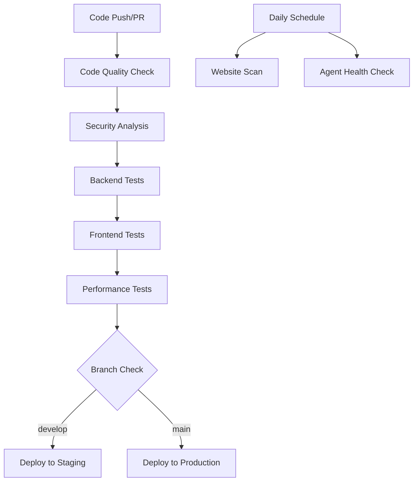

# DevSkyy Enhanced Platform - CI/CD Pipeline Documentation

## Overview

The DevSkyy Enhanced Platform uses a comprehensive GitHub Actions-based CI/CD pipeline that automates testing, quality assurance, security scanning, and deployment processes. The pipeline ensures code quality, security, and performance while providing automated daily scans and monitoring.

## Pipeline Architecture

### Workflow Files
- **Main Pipeline**: `.github/workflows/ci-cd-pipeline.yml`
- **Jekyll Docs**: `.github/workflows/jekyll-gh-pages.yml`

### Pipeline Stages



## Trigger Events

### Automatic Triggers
- **Push Events**: `main`, `develop` branches
- **Pull Requests**: Targeting `main` branch
- **Daily Schedule**: 2 AM UTC for automated scans
- **Manual Dispatch**: On-demand execution

### Configuration
```yaml
on:
  push:
    branches: [ main, develop ]
  pull_request:
    branches: [ main ]
  schedule:
    - cron: '0 2 * * *'  # Daily at 2 AM UTC
  workflow_dispatch:
```

## Jobs Overview

### 1. Code Quality & Security Analysis

#### Purpose
Ensures code quality, formatting consistency, and security compliance.

#### Steps
1. **Black Formatting Check**
   ```bash
   black --check --diff .
   ```

2. **Import Sorting (isort)**
   ```bash
   isort --check-only --diff .
   ```

3. **Linting (flake8)**
   ```bash
   flake8 . --count --select=E9,F63,F7,F82 --show-source --statistics
   ```

4. **Security Analysis (Bandit)**
   ```bash
   bandit -r . --severity-level medium
   ```

5. **Dependency Vulnerability Check**
   ```bash
   safety check
   ```

#### Artifacts
- Security report (JSON format)
- Code quality metrics

### 2. Backend Testing

#### Purpose
Comprehensive testing of Python backend components with MongoDB integration.

#### Services
```yaml
services:
  mongodb:
    image: mongo:7.0
    ports:
      - 27017:27017
```

#### Test Execution
```bash
python -m pytest tests/ -v --cov=. --cov-report=xml --cov-report=html
```

#### Coverage Reporting
- **Codecov Integration**: Automatic coverage reporting
- **HTML Reports**: Stored as artifacts
- **XML Reports**: For CI/CD integration

#### Environment Variables
```yaml
env:
  MONGODB_URL: mongodb://localhost:27017
  ENVIRONMENT: testing
```

### 3. Frontend Testing

#### Purpose
Test React frontend components and build artifacts.

#### Steps
1. **Dependency Installation**
   ```bash
   npm ci
   ```

2. **Test Execution**
   ```bash
   npm test
   ```

3. **Production Build**
   ```bash
   npm run build
   ```

#### Artifacts
- Frontend build artifacts
- Test reports

### 4. Performance Testing

#### Purpose
Validate application performance and load capacity.

#### Load Testing
```python
# Locust configuration
from locust import HttpUser, task, between

class DevSkyyUser(HttpUser):
    wait_time = between(1, 3)
    
    @task
    def test_health_endpoint(self):
        self.client.get('/health')
        
    @task
    def test_agents_status(self):
        self.client.get('/agents/status')
```

#### Performance Metrics
- Response time analysis
- Throughput testing
- Resource utilization
- Error rate monitoring

### 5. Daily Website Scan

#### Purpose
Automated daily scanning of the SkyyRose website for issues and optimizations.

#### Scan Components
```python
# Comprehensive scanning
scan_results = scan_site()
perf_results = perf_agent.analyze_site_performance()
sec_results = sec_agent.security_assessment()

report = {
    'timestamp': datetime.now().isoformat(),
    'scan_results': scan_results,
    'performance_analysis': perf_results,
    'security_assessment': sec_results
}
```

#### Alert System
- **Issue Detection**: Creates GitHub issues for problems
- **Report Generation**: Daily scan reports stored as artifacts
- **Notification System**: Automated alerts for critical issues

### 6. Agent Health Check

#### Purpose
Monitor the health and performance of AI agents.

#### Health Metrics
- Agent availability
- Response times
- Error rates
- Resource utilization
- Task completion rates

#### Monitoring
```python
from agent.modules.agent_assignment_manager import AgentAssignmentManager

manager = AgentAssignmentManager()
agents_status = {
    'timestamp': datetime.now().isoformat(),
    'agents_checked': 0,
    'healthy_agents': 0,
    'agents_with_issues': []
}
```

## Deployment Environments

### Staging Environment

#### Trigger
- Pushes to `develop` branch
- After successful tests

#### Configuration
```yaml
environment: staging
needs: [code-quality, backend-tests, frontend-tests]
if: github.ref == 'refs/heads/develop'
```

#### Deployment Steps
1. Environment validation
2. Database migration (if needed)
3. Application deployment
4. Health checks
5. Integration tests

### Production Environment

#### Trigger
- Pushes to `main` branch
- After all tests pass including performance tests

#### Configuration
```yaml
environment: production
needs: [code-quality, backend-tests, frontend-tests, performance-tests]
if: github.ref == 'refs/heads/main'
```

#### Deployment Steps
1. Pre-deployment backup
2. Blue-green deployment
3. Database migration
4. Application deployment
5. Health verification
6. Traffic switching
7. Post-deployment monitoring

#### Rollback Strategy
```yaml
# Automatic rollback on failure
- name: Rollback on failure
  if: failure()
  run: |
    echo "Deployment failed, initiating rollback"
    # Rollback commands here
```

## Environment Variables and Secrets

### Required Secrets
```yaml
secrets:
  OPENAI_API_KEY: ${{ secrets.OPENAI_API_KEY }}
  WORDPRESS_CLIENT_ID: ${{ secrets.WORDPRESS_CLIENT_ID }}
  WORDPRESS_CLIENT_SECRET: ${{ secrets.WORDPRESS_CLIENT_SECRET }}
  DATABASE_URL: ${{ secrets.DATABASE_URL }}
  DEPLOYMENT_KEY: ${{ secrets.DEPLOYMENT_KEY }}
```

### Environment Configuration
```yaml
env:
  PYTHON_VERSION: '3.12'
  NODE_VERSION: '18'
  ENVIRONMENT: production
```

## Artifacts and Reports

### Generated Artifacts

1. **Security Reports**
   - Bandit security analysis
   - Dependency vulnerability scans
   - Compliance reports

2. **Test Reports**
   - Backend test coverage
   - Frontend test results
   - Performance test reports

3. **Build Artifacts**
   - Frontend build files
   - Docker images (if applicable)
   - Deployment packages

4. **Monitoring Reports**
   - Daily scan results
   - Agent health reports
   - Performance metrics

### Artifact Retention
```yaml
uses: actions/upload-artifact@v3
with:
  name: coverage-report
  path: htmlcov/
  retention-days: 30
```

## Monitoring and Alerting

### GitHub Issues Integration
```yaml
- name: Create issue if problems found
  uses: actions/github-script@v6
  if: failure()
  with:
    script: |
      github.rest.issues.create({
        owner: context.repo.owner,
        repo: context.repo.repo,
        title: '🚨 Daily Scan Alert - Issues Detected',
        body: `Issues detected in automated scan...`,
        labels: ['automated-scan', 'needs-attention']
      })
```

### Status Reporting
```yaml
- name: Notify deployment success
  uses: actions/github-script@v6
  with:
    script: |
      github.rest.repos.createCommitStatus({
        owner: context.repo.owner,
        repo: context.repo.repo,
        sha: context.sha,
        state: 'success',
        description: 'Successfully deployed to production',
        context: 'deployment/production'
      })
```

## Quality Gates

### Code Quality Requirements
- **Black formatting**: Must pass
- **flake8 linting**: No critical issues
- **Security scan**: No high-severity vulnerabilities
- **Test coverage**: Minimum 80%

### Performance Requirements
- **Response time**: < 2 seconds for critical endpoints
- **Load capacity**: Handle 100 concurrent users
- **Error rate**: < 1% under normal load

### Security Requirements
- **Vulnerability scan**: No critical vulnerabilities
- **Dependency check**: All dependencies up to date
- **Secret detection**: No exposed secrets

## Local Development

### Pre-commit Hooks
```bash
# Install pre-commit hooks
pip install pre-commit
pre-commit install

# Run hooks manually
pre-commit run --all-files
```

### Local Testing
```bash
# Run the same checks locally
black --check .
isort --check-only .
flake8 .
bandit -r .
safety check
pytest tests/ -v --cov=.
```

### Environment Setup
```bash
# Create virtual environment
python -m venv venv
source venv/bin/activate  # Linux/Mac
# or
venv\Scripts\activate     # Windows

# Install dependencies
pip install -r requirements.txt

# Run development server
uvicorn main:app --reload --host 0.0.0.0 --port 8000
```

## Configuration Files

### pyproject.toml
```toml
[tool.black]
line-length = 88
target-version = ['py312']
include = '\.pyi?$'

[tool.isort]
profile = "black"
multi_line_output = 3

[tool.pytest.ini_options]
testpaths = ["tests"]
addopts = "--cov=. --cov-report=html --cov-report=xml"
```

### .flake8
```ini
[flake8]
max-line-length = 88
extend-ignore = E203, W503
exclude = .git,__pycache__,venv,.venv
```

## Troubleshooting

### Common Issues

#### Test Failures
1. **Import Errors**: Check dependencies in requirements.txt
2. **Database Connection**: Verify MongoDB service is running
3. **Environment Variables**: Ensure all required variables are set

#### Deployment Issues
1. **Permission Errors**: Check deployment credentials
2. **Resource Limits**: Verify sufficient resources in target environment
3. **Health Check Failures**: Review application logs

#### Performance Issues
1. **Slow Tests**: Optimize test database setup
2. **Build Timeouts**: Increase timeout values
3. **Resource Constraints**: Use more powerful runners

### Debug Commands
```bash
# Check pipeline status
gh workflow list
gh workflow view ci-cd-pipeline

# View logs
gh run list
gh run view <run-id>

# Re-run failed jobs
gh run rerun <run-id> --failed
```

## Best Practices

### Security
1. **Secret Management**: Use GitHub secrets for sensitive data
2. **Least Privilege**: Limit permissions to minimum required
3. **Regular Updates**: Keep actions and dependencies updated
4. **Audit Logs**: Review pipeline logs regularly

### Performance
1. **Caching**: Use caching for dependencies and build artifacts
2. **Parallel Jobs**: Run independent jobs in parallel
3. **Resource Optimization**: Use appropriate runner sizes
4. **Artifact Management**: Clean up old artifacts regularly

### Reliability
1. **Error Handling**: Implement proper error handling and retries
2. **Monitoring**: Set up comprehensive monitoring and alerting
3. **Documentation**: Keep pipeline documentation updated
4. **Testing**: Test pipeline changes in non-production environments

## Future Enhancements

### Planned Improvements
1. **Container Registry**: Add Docker image building and storage
2. **Multi-Environment**: Support for additional environments (QA, UAT)
3. **Blue-Green Deployment**: Implement zero-downtime deployments
4. **Auto-scaling**: Dynamic scaling based on load
5. **Advanced Monitoring**: Enhanced metrics and alerting

### Integration Opportunities
1. **Slack Notifications**: Real-time notifications to Slack channels
2. **Jira Integration**: Automatic ticket creation for issues
3. **Datadog/NewRelic**: Advanced performance monitoring
4. **SonarQube**: Enhanced code quality analysis

This CI/CD pipeline provides a robust foundation for maintaining code quality, security, and reliability while enabling rapid development and deployment cycles.