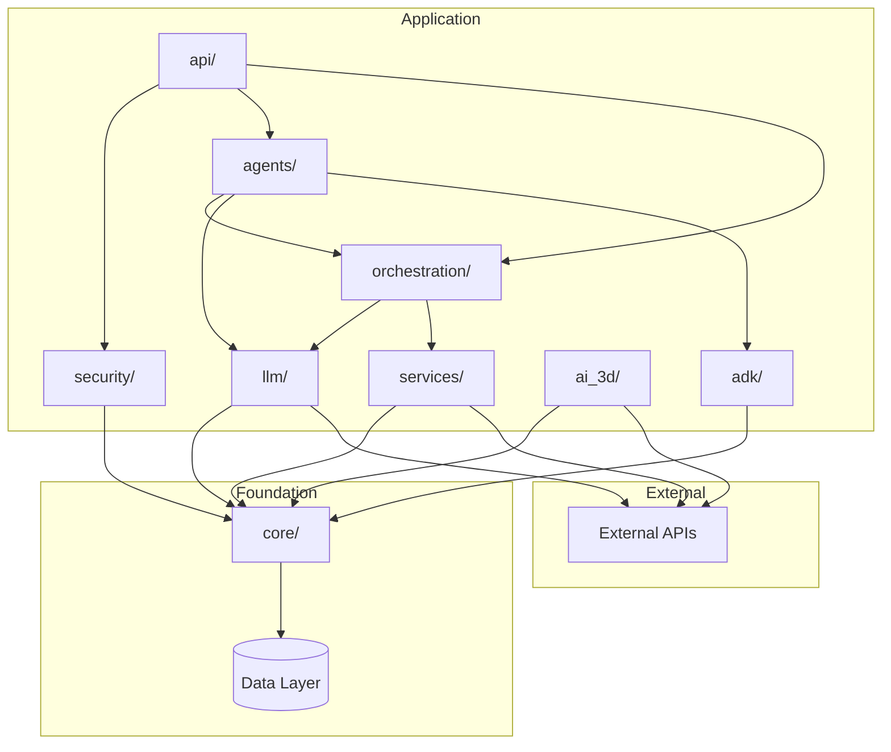

# DevSkyy Components Documentation

**Version**: 1.3.0
**Last Updated**: 2026-01-30
**Status**: Production

This document provides detailed breakdowns of each major component in the DevSkyy platform.

---

## Table of Contents

1. [Core Module](#core-module)
2. [ADK Module](#adk-module)
3. [Security Module](#security-module)
4. [Agents Module](#agents-module)
5. [API Module](#api-module)
6. [LLM Module](#llm-module)
7. [Orchestration Module](#orchestration-module)
8. [Services Module](#services-module)

---

## Core Module

**Location**: `/core/`
**Dependencies**: Zero external dependencies on other DevSkyy modules
**Philosophy**: "The core serves everyone. It depends on no one."

### Directory Structure

```
core/
  auth/
    __init__.py            # Public exports
    types.py               # Enums: UserRole, TokenType, AuthStatus, Permission
    models.py              # Pydantic: TokenResponse, UserCreate, UserInDB
    interfaces.py          # ABCs: IAuthProvider, ITokenValidator, IRateLimiter
    token_payload.py       # TokenPayload dataclass
    role_hierarchy.py      # ROLE_HIERARCHY dict and utilities
  registry/
    __init__.py            # Component registration utilities
  runtime/
    __init__.py
    input_validator.py     # Pydantic-based input validation
    tools.py               # ToolSpec, BaseTool, ToolRegistry
  llm/
    domain/
      models.py            # LLM request/response models
      ports.py             # LLM provider interfaces
    infrastructure/
      provider_factory.py  # Provider instantiation
  performance.py           # Performance tracking utilities
  redis_cache.py           # Redis cache wrapper
  structured_logging.py    # Structlog configuration
  token_tracker.py         # Token usage tracking
  task_status_store.py     # Async task status storage
```

### Auth Types (Zero Dependencies)

```python
# core/auth/types.py
class UserRole(str, Enum):
    SUPER_ADMIN = "super_admin"  # Full system access
    ADMIN = "admin"              # User/settings management
    DEVELOPER = "developer"      # API access, dev tools
    API_USER = "api_user"        # Standard API access
    READ_ONLY = "read_only"      # View only
    GUEST = "guest"              # Minimal access

class TokenType(str, Enum):
    ACCESS = "access"           # Short-lived (15 min)
    REFRESH = "refresh"         # Long-lived (7 days)
    RESET_PASSWORD = "reset_password"
    VERIFY_EMAIL = "verify_email"
    API_KEY = "api_key"         # Machine-to-machine

class Permission(str, Enum):
    USER_READ = "user:read"
    USER_CREATE = "user:create"
    PRODUCT_UPDATE = "product:update"
    AGENT_EXECUTE = "agent:execute"
    # ... 20+ permissions
```

### Auth Interfaces

```python
# core/auth/interfaces.py
class ITokenValidator(ABC):
    @abstractmethod
    def validate_token(self, token: str, expected_type: TokenType | None = None) -> TokenPayload:
        """Validate JWT and return payload"""
        ...

    @abstractmethod
    def is_token_revoked(self, jti: str) -> bool:
        """Check token blacklist"""
        ...

class IAuthProvider(ABC):
    @abstractmethod
    async def authenticate(self, credentials: AuthCredentials) -> AuthResult:
        """Authenticate with username/password"""
        ...

    @abstractmethod
    async def refresh_tokens(self, refresh_token: str) -> TokenResponse:
        """Get new tokens with refresh token"""
        ...

class IPasswordHasher(ABC):
    @abstractmethod
    def hash_password(self, password: str) -> str:
        """Argon2id password hashing"""
        ...
```

### Tool Registry

```python
# core/runtime/tools.py
class ToolSpec(BaseModel, Generic[T, R]):
    name: str
    description: str
    input_schema: type[T]
    output_schema: type[R]
    category: ToolCategory
    requires_auth: bool = True

class BaseTool(ABC, Generic[T, R]):
    spec: ToolSpec[T, R]

    @abstractmethod
    async def execute(self, input: T, *, correlation_id: str | None = None) -> R:
        ...

class ToolRegistry:
    def register(self, tool: BaseTool) -> None:
        self._tools[tool.spec.name] = tool

    async def execute(self, name: str, input: dict, context: ToolCallContext) -> Any:
        tool = self._tools.get(name)
        validated_input = tool.spec.input_schema.model_validate(input)
        return await tool.execute(validated_input, correlation_id=context.correlation_id)
```

---

## ADK Module

**Location**: `/adk/`
**Purpose**: Agent Development Kit - multi-framework agent abstraction
**Philosophy**: "One interface, many frameworks"

### Directory Structure

```
adk/
  __init__.py              # Public exports
  base.py                  # ADKAgent ABC, AgentConfig, AgentResult
  google_adk.py            # Google Agent Development Kit adapter
  pydantic_adk.py          # PydanticAI adapter
  crewai_adk.py            # CrewAI adapter
  autogen_adk.py           # Microsoft AutoGen adapter
  agno_adk.py              # Agno (ultra-fast) adapter
  super_agents.py          # Multi-ADK orchestration
```

### Supported Frameworks

| Framework | Adapter | Strengths |
|-----------|---------|-----------|
| Google ADK | `google_adk.py` | Native Gemini, tool calling |
| PydanticAI | `pydantic_adk.py` | Type safety, validation |
| CrewAI | `crewai_adk.py` | Multi-agent collaboration |
| AutoGen | `autogen_adk.py` | Conversation patterns |
| Agno | `agno_adk.py` | Ultra-low latency |
| LangGraph | via orchestration | Complex workflows |

### Base Agent Interface

```python
# adk/base.py
class ADKProvider(str, Enum):
    GOOGLE = "google_adk"
    PYDANTIC = "pydantic_ai"
    CREWAI = "crewai"
    AUTOGEN = "autogen"
    AGNO = "agno"

@dataclass
class AgentConfig:
    name: str
    provider: ADKProvider
    model: str
    capabilities: list[AgentCapability]
    tools: list[str] = field(default_factory=list)
    max_tokens: int = 4096
    temperature: float = 0.7

@dataclass
class AgentResult:
    content: str
    status: AgentStatus
    tool_calls: list[ToolCall]
    tokens_used: int
    execution_time: float
    metadata: dict[str, Any]

class ADKAgent(ABC):
    config: AgentConfig

    @abstractmethod
    async def run(self, prompt: str, context: dict | None = None) -> AgentResult:
        """Execute agent with prompt"""
        ...

    @abstractmethod
    async def run_with_tools(self, prompt: str, tools: list[BaseTool]) -> AgentResult:
        """Execute with tool access"""
        ...
```

---

## Security Module

**Location**: `/security/`
**Dependencies**: `core/auth/` interfaces
**Philosophy**: "Security is not a feature. It's the foundation."

### Directory Structure

```
security/
  __init__.py                    # Public exports
  # Authentication
  jwt_oauth2_auth.py             # JWT generation, validation, OAuth2
  advanced_auth.py               # MFA, session management
  mfa.py                         # TOTP implementation
  # Encryption
  aes256_gcm_encryption.py       # Field-level encryption
  key_management.py              # Key rotation, storage
  secrets_manager.py             # AWS Secrets / HashiCorp Vault
  # Validation
  input_validation.py            # XSS, SQLi prevention
  file_upload.py                 # File type validation
  ssrf_protection.py             # SSRF mitigation
  # Monitoring
  audit_log.py                   # Immutable audit trail
  security_monitoring.py         # Threat detection
  alerting.py                    # Security alerts
  prometheus_exporter.py         # Metrics export
  # Rate Limiting
  rate_limiting.py               # Tier-based throttling
  # Compliance
  pii_protection.py              # PII detection/masking
  # Infrastructure
  csp_middleware.py              # Content Security Policy
  security_middleware.py         # Security headers
  zero_trust_config.py           # Zero-trust policies
  mtls_handler.py                # Mutual TLS
  certificate_authority.py       # CA management
```

### JWT/OAuth2 Implementation

```python
# security/jwt_oauth2_auth.py
class JWTAuthProvider(IAuthProvider):
    """Implements core.auth.IAuthProvider"""

    async def authenticate(self, credentials: AuthCredentials) -> AuthResult:
        user = await self._get_user(credentials.username)
        if not user or not self._hasher.verify_password(credentials.password, user.hashed_password):
            return AuthResult(status=AuthStatus.INVALID_CREDENTIALS)

        access_token = self._create_token(user, TokenType.ACCESS, expires_delta=timedelta(minutes=15))
        refresh_token = self._create_token(user, TokenType.REFRESH, expires_delta=timedelta(days=7))

        return AuthResult(
            status=AuthStatus.SUCCESS,
            tokens=TokenResponse(
                access_token=access_token,
                refresh_token=refresh_token,
                token_type="bearer",
                expires_in=900,
            )
        )

class JWTTokenValidator(ITokenValidator):
    """Implements core.auth.ITokenValidator"""

    def validate_token(self, token: str, expected_type: TokenType | None = None) -> TokenPayload:
        try:
            payload = jwt.decode(token, self._secret_key, algorithms=["HS512"])
            token_payload = TokenPayload(**payload)

            if expected_type and token_payload.type != expected_type:
                raise InvalidTokenError("Unexpected token type")

            if self.is_token_revoked(token_payload.jti):
                raise RevokedTokenError("Token has been revoked")

            return token_payload
        except jwt.ExpiredSignatureError:
            raise ExpiredTokenError("Token has expired")
```

### AES-256-GCM Encryption

```python
# security/aes256_gcm_encryption.py
class FieldEncryption:
    """NIST SP 800-38D compliant encryption"""

    def __init__(self, master_key: bytes):
        self._master_key = master_key

    def encrypt(self, plaintext: str) -> str:
        """Encrypt with unique IV per operation"""
        iv = secrets.token_bytes(12)  # 96-bit IV
        cipher = Cipher(algorithms.AES(self._master_key), modes.GCM(iv))
        encryptor = cipher.encryptor()
        ciphertext = encryptor.update(plaintext.encode()) + encryptor.finalize()
        return base64.b64encode(iv + encryptor.tag + ciphertext).decode()

    def decrypt(self, ciphertext: str) -> str:
        """Decrypt and verify authentication tag"""
        data = base64.b64decode(ciphertext)
        iv, tag, encrypted = data[:12], data[12:28], data[28:]
        cipher = Cipher(algorithms.AES(self._master_key), modes.GCM(iv, tag))
        decryptor = cipher.decryptor()
        return (decryptor.update(encrypted) + decryptor.finalize()).decode()
```

### Security Components Summary

| Component | Standard | Purpose |
|-----------|----------|---------|
| JWT | RFC 7519 | Token-based auth |
| OAuth2 | RFC 6749 | Authorization flows |
| AES-256-GCM | NIST SP 800-38D | Encryption at rest |
| Argon2id | OWASP | Password hashing |
| TOTP | RFC 6238 | Multi-factor auth |
| HMAC | RFC 2104 | Webhook signatures |

---

## Agents Module

**Location**: `/agents/`
**Dependencies**: `core/`, `orchestration/`, `llm/`
**Philosophy**: "Agents don't guess. They plan, execute, and verify."

### Directory Structure

```
agents/
  __init__.py                    # Agent registry
  # Base Classes
  base_super_agent.py            # EnhancedSuperAgent (17 techniques)
  base_legacy.py                 # Legacy SuperAgent
  enhanced_base.py               # Enhanced base with RAG
  errors.py                      # Agent error hierarchy
  models.py                      # Pydantic models
  # Domain Agents
  commerce_agent.py              # E-commerce operations
  creative_agent.py              # Content generation
  marketing_agent.py             # Campaign automation
  support_agent.py               # Customer service
  analytics_agent.py             # Data analysis
  operations_agent.py            # Infrastructure ops
  # Specialized Agents
  tripo_agent.py                 # 3D generation (Tripo3D)
  fashn_agent.py                 # Virtual try-on (FASHN)
  wordpress_asset_agent.py       # WordPress media
  skyyrose_content_agent.py      # Brand content
  skyyrose_imagery_agent.py      # Brand imagery
  skyyrose_product_agent.py      # Product management
  skyyrose_spaces_orchestrator.py# HuggingFace Spaces
  coding_doctor_agent.py         # Code assistance
  coding_doctor_toolkits.py      # Code tools
  # Visual Generation
  visual_generation/
    gemini_native.py             # Gemini vision
    prompt_optimizer.py          # Prompt enhancement
    reference_manager.py         # Reference image handling
```

### SuperAgent Architecture

```python
# agents/base_super_agent.py
class EnhancedSuperAgent(ABC):
    """
    Base class for all DevSkyy agents.
    Implements Plan -> Retrieve -> Execute -> Validate -> Emit pattern.
    """

    # 17 Prompt Techniques
    TECHNIQUES = [
        "chain_of_thought",
        "few_shot",
        "tree_of_thought",
        "react",
        "self_consistency",
        "persona",
        "structured_output",
        "multi_step_reasoning",
        "analogical_reasoning",
        "socratic_method",
        "constraint_satisfaction",
        "recursive_decomposition",
        "meta_prompting",
        "adversarial_prompting",
        "iterative_refinement",
        "ensemble_prompting",
        "tool_augmented",
    ]

    async def execute_auto(
        self,
        prompt: str,
        *,
        correlation_id: str | None = None,
    ) -> AgentResult:
        """Full agent execution with automatic technique selection"""

        # 1. PLAN: Select technique and generate steps
        technique = await self._select_technique(prompt)
        plan = await self._plan(prompt, technique)

        # 2. RETRIEVE: Get RAG context and brand context
        context = await self._retrieve(prompt, plan)

        # 3. EXECUTE: Run plan steps with tool calling
        results = await self._execute(plan, context)

        # 4. VALIDATE: Schema validation, quality checks
        validation = await self._validate(results)

        # 5. EMIT: Format and return response
        return await self._emit(results, validation)

    @abstractmethod
    async def _plan(self, prompt: str, technique: str) -> list[PlanStep]:
        """Generate execution plan"""
        ...

    @abstractmethod
    async def _retrieve(self, prompt: str, plan: list[PlanStep]) -> RetrievalContext:
        """Retrieve relevant context"""
        ...

    @abstractmethod
    async def _execute(self, plan: list[PlanStep], context: RetrievalContext) -> list[StepResult]:
        """Execute plan steps"""
        ...
```

### Agent Capabilities

| Agent | Capabilities | Primary Use |
|-------|--------------|-------------|
| CommerceAgent | ECOMMERCE, TOOL_CALLING | Order management, inventory |
| CreativeAgent | TEXT_GENERATION, IMAGE_GENERATION | Content creation |
| MarketingAgent | MARKETING, ANALYTICS | Campaign automation |
| SupportAgent | CUSTOMER_SUPPORT, REASONING | Customer service |
| TripoAgent | THREE_D_GENERATION | 3D model generation |
| FASHNAgent | VIRTUAL_TRYON, VISION | Virtual try-on |

---

## API Module

**Location**: `/api/`
**Dependencies**: `security/`, `agents/`, `orchestration/`
**Philosophy**: "Document every endpoint. Type every response."

### Directory Structure

```
api/
  __init__.py                    # Router aggregation
  # Core Endpoints
  index.py                       # Health checks
  versioning.py                  # API versioning
  # Agent Endpoints
  agents.py                      # Agent execution
  tools.py                       # Tool registry API
  round_table.py                 # Multi-LLM consensus
  # Feature Endpoints
  brand.py                       # Brand context
  dashboard.py                   # Dashboard API
  admin_dashboard.py             # Admin panel
  tasks.py                       # Async task management
  # 3D & Visual
  three_d.py                     # 3D generation
  visual.py                      # Image generation
  virtual_tryon.py               # FASHN integration
  ar_sessions.py                 # AR session management
  elementor_3d.py                # Elementor 3D widgets
  # Integration
  sync_endpoints.py              # Data sync
  webhooks.py                    # Webhook management
  websocket.py                   # WebSocket handlers
  websocket_integration.py       # WS integration
  gdpr.py                        # GDPR compliance
  # Versioned API
  v1/
    __init__.py                  # v1 router exports
    analytics/                   # Analytics endpoints
    assets.py                    # Asset management
    brand_assets.py              # Brand asset CRUD
    approval.py                  # Approval workflows
    code.py                      # Code generation
    commerce.py                  # E-commerce API
    competitors.py               # Competitive analysis
    descriptions.py              # AI descriptions
    hf_spaces.py                 # HuggingFace Spaces
    marketing.py                 # Marketing automation
    media.py                     # Media management
    ml.py                        # ML model endpoints
    monitoring.py                # System monitoring
    orchestration.py             # LLM orchestration
    pipeline.py                  # Pipeline management
    sync.py                      # Data sync v1
    training_status.py           # ML training status
    wordpress_integration.py     # WordPress API
    wordpress_theme.py           # Theme management
    wordpress.py                 # WP core integration
    woocommerce_webhooks.py      # WC webhooks
```

### API Versioning

```python
# api/versioning.py
class VersionedAPIRouter:
    """Manages API versioning with deprecation support"""

    def __init__(self, prefix: str, version: str):
        self.prefix = f"/api/{version}{prefix}"
        self.version = version

    def get_router(self) -> APIRouter:
        return APIRouter(
            prefix=self.prefix,
            tags=[f"v{self.version}"],
        )

# Usage in main_enterprise.py
app.include_router(agents_router, prefix="/api/v1")
app.include_router(commerce_router, prefix="/api/v1")
```

### Endpoint Patterns

```python
# Standard endpoint pattern
@router.post("/products", response_model=ProductResponse)
async def create_product(
    request: ProductCreate,
    current_user: TokenPayload = Depends(get_current_user),
    db: AsyncSession = Depends(get_db),
) -> ProductResponse:
    """
    Create a new product.

    - Requires: API_USER role or higher
    - Rate limit: 100/minute
    """
    # Input validation (automatic via Pydantic)
    # Sanitization
    sanitized = security_validator.sanitize_html(request.description)

    # Business logic
    product = await ProductService.create(db, request, sanitized)

    # Response
    return ProductResponse.model_validate(product)
```

### Health Endpoints

| Endpoint | Purpose | Response |
|----------|---------|----------|
| `/health` | Basic health | `{"status": "healthy"}` |
| `/health/ready` | Readiness probe | Checks DB, Redis |
| `/health/live` | Liveness probe | Process alive |
| `/metrics` | Prometheus metrics | OpenMetrics format |

---

## LLM Module

**Location**: `/llm/`
**Dependencies**: `core/`
**Philosophy**: "One prompt. Many models. Best answer wins."

### Directory Structure

```
llm/
  __init__.py                    # Public exports
  # Core
  base.py                        # LLMProvider ABC
  router.py                      # Smart routing
  round_table.py                 # Multi-LLM consensus
  tournament.py                  # Tournament-style selection
  unified_llm_client.py          # Unified client interface
  # Classification
  classification.py              # Task classification
  task_classifier.py             # Detailed task analysis
  # Experimentation
  ab_testing.py                  # A/B experiment framework
  adaptive_learning.py           # Model performance learning
  # Quality
  evaluation_metrics.py          # Response quality metrics
  verification.py                # Output verification
  creative_judge.py              # Creative content scoring
  statistics.py                  # Usage statistics
  round_table_metrics.py         # RT performance tracking
  # Errors
  exceptions.py                  # LLM-specific exceptions
  # Providers
  providers/
    __init__.py
    anthropic.py                 # Claude
    openai.py                    # GPT-4
    google.py                    # Gemini
    mistral.py                   # Mistral
    groq.py                      # LLaMA (fast)
    cohere.py                    # Command R+
    deepseek.py                  # DeepSeek
    replicate.py                 # Replicate models
    stability.py                 # Stable Diffusion
    vertex_imagen.py             # Google Imagen
```

### LLM Router

```python
# llm/router.py
class LLMRouter:
    """Intelligent provider selection based on task type"""

    PROVIDER_STRENGTHS = {
        TaskType.CODING: ["anthropic", "openai"],
        TaskType.CREATIVE: ["anthropic", "google"],
        TaskType.ANALYSIS: ["anthropic", "openai", "mistral"],
        TaskType.CLASSIFICATION: ["groq", "mistral"],  # Fast
        TaskType.EMBEDDINGS: ["cohere", "openai"],
        TaskType.VISION: ["google", "anthropic"],
    }

    async def route(
        self,
        prompt: str,
        task_type: TaskType | None = None,
        *,
        correlation_id: str | None = None,
    ) -> LLMResponse:
        # Auto-classify if no task type provided
        if task_type is None:
            task_type = await self._classify_task(prompt)

        # Score providers for this task
        scores = await self._score_providers(task_type)

        # Select best available provider
        provider = self._select_provider(scores)

        # Execute with automatic fallback
        return await self._execute_with_fallback(provider, prompt, correlation_id)
```

### Round Table (Multi-LLM Consensus)

```python
# llm/round_table.py
class RoundTable:
    """
    Multi-LLM deliberation for high-stakes decisions.
    Each model provides a response, then votes on the best.
    """

    async def deliberate(
        self,
        topic: str,
        providers: list[str] | None = None,
    ) -> Consensus:
        providers = providers or ["anthropic", "openai", "google"]

        # Phase 1: Individual responses
        responses = await asyncio.gather(*[
            self._get_response(p, topic) for p in providers
        ])

        # Phase 2: Cross-evaluation
        evaluations = await asyncio.gather(*[
            self._evaluate_responses(p, responses) for p in providers
        ])

        # Phase 3: Consensus synthesis
        return self._synthesize_consensus(responses, evaluations)
```

### Provider Summary

| Provider | Models | Latency | Strengths |
|----------|--------|---------|-----------|
| Anthropic | Claude 3.5, Opus 4 | Medium | Reasoning, code |
| OpenAI | GPT-4o, GPT-4 Turbo | Medium | General purpose |
| Google | Gemini 2.0 Flash | Fast | Vision, multimodal |
| Mistral | Mistral Large | Medium | European compliance |
| Groq | LLaMA 70B | Ultra-fast | Classification |
| Cohere | Command R+ | Medium | RAG, embeddings |

---

## Orchestration Module

**Location**: `/orchestration/`
**Dependencies**: `core/`, `llm/`
**Philosophy**: "Context is king. RAG is the kingmaker."

### Directory Structure

```
orchestration/
  __init__.py                    # Public exports
  # RAG Pipeline
  rag_context_manager.py         # Main RAG orchestrator
  query_rewriter.py              # Query expansion
  vector_store.py                # ChromaDB/FAISS
  embedding_engine.py            # Embedding generation
  reranker.py                    # Cross-encoder reranking
  document_ingestion.py          # Document processing
  auto_ingestion.py              # Automatic doc ingestion
  # LLM Orchestration
  llm_clients.py                 # Official SDK clients
  llm_orchestrator.py            # Multi-LLM coordination
  llm_registry.py                # Provider registry
  domain_router.py               # Domain-based routing
  model_config.py                # Model configurations
  # Context
  brand_context.py               # SkyyRose brand DNA
  prompt_engineering.py          # Prompt templates
  # 3D Integration
  huggingface_3d_client.py       # HF 3D model client
  huggingface_asset_enhancer.py  # Asset enhancement
  threed_round_table.py          # 3D-specific RT
  # Workflows
  asset_pipeline.py              # Asset processing
  sync_pipeline.py               # Data synchronization
  langgraph_integration.py       # LangGraph workflows
  semantic_analyzer.py           # Semantic analysis
  # Utilities
  tasks.py                       # Celery tasks
  feedback_tracker.py            # User feedback
  agent_counter.py               # Agent usage tracking
```

### RAG Context Manager

```python
# orchestration/rag_context_manager.py
class RAGContextManager:
    """Orchestrates the full RAG pipeline"""

    def __init__(
        self,
        vector_store: VectorStore,
        query_rewriter: QueryRewriter | None = None,
        reranker: Reranker | None = None,
    ):
        self.vector_store = vector_store
        self.query_rewriter = query_rewriter
        self.reranker = reranker

    async def get_context(
        self,
        query: str,
        *,
        top_k: int = 5,
        include_brand: bool = True,
    ) -> RAGContext:
        # 1. Query expansion (optional)
        if self.query_rewriter:
            expanded_queries = await self.query_rewriter.expand(query)
        else:
            expanded_queries = [query]

        # 2. Vector search
        candidates = await self.vector_store.search(
            queries=expanded_queries,
            top_k=top_k * 3,  # Over-fetch for reranking
        )

        # 3. Reranking (optional)
        if self.reranker:
            documents = await self.reranker.rerank(query, candidates, top_k)
        else:
            documents = candidates[:top_k]

        # 4. Brand context injection
        if include_brand:
            brand_context = await self._get_brand_context()
        else:
            brand_context = None

        return RAGContext(
            query=query,
            documents=documents,
            brand_context=brand_context,
        )
```

### Brand Context

```python
# orchestration/brand_context.py
SKYYROSE_BRAND_DNA = {
    "name": "SkyyRose",
    "tagline": "Where Love Meets Luxury",
    "colors": {
        "primary": "#B76E79",  # Rose gold
        "secondary": "#0d0d0d",  # Obsidian
        "accent": "#d4af37",  # Gold
    },
    "typography": {
        "heading": "Playfair Display",
        "body": "Montserrat",
    },
    "collections": [
        "BLACK ROSE",
        "SIGNATURE",
        "LOVE HURTS",
    ],
    "tone": "Luxurious yet approachable, romantic but edgy",
    "values": ["Love", "Craftsmanship", "Self-Expression", "Authenticity"],
}
```

---

## Services Module

**Location**: `/services/`
**Dependencies**: `core/`
**Philosophy**: Domain-specific business logic and external integrations

### Directory Structure

```
services/
  __init__.py
  approval_queue_manager.py      # Approval workflows
  # Sub-modules
  analytics/
    __init__.py
    metrics.py                   # Usage metrics
    dashboards.py                # Dashboard data
  competitive/
    __init__.py
    analysis.py                  # Market analysis
  ml/
    __init__.py
    inference.py                 # Model inference
    training.py                  # Model training
    embeddings.py                # Embedding generation
  notifications/
    __init__.py
    email.py                     # Email notifications
  storage/
    __init__.py
    r2_client.py                 # Cloudflare R2
    local.py                     # Local storage
  three_d/
    __init__.py
    pipeline.py                  # 3D processing
    optimization.py              # Mesh optimization
```

### AI 3D Module (`/ai_3d/`)

```
ai_3d/
  __init__.py
  generation_pipeline.py         # Main generation pipeline
  model_generator.py             # Tripo3D integration
  quality_enhancer.py            # Quality improvements
  resilience.py                  # Retry/fallback logic
  virtual_photoshoot.py          # Virtual photography
  providers/
    __init__.py
    huggingface.py               # HF model providers
```

```python
# ai_3d/generation_pipeline.py
class GenerationPipeline:
    """End-to-end 3D generation with quality gates"""

    async def generate(
        self,
        prompt: str,
        reference_image: str | None = None,
        *,
        quality_threshold: float = 0.95,
    ) -> Model3DResult:
        # Generate via Tripo3D
        raw_model = await self.generator.generate(prompt, reference_image)

        # Quality enhancement
        enhanced = await self.enhancer.enhance(raw_model)

        # Fidelity check
        score = await self._calculate_fidelity(enhanced, reference_image)
        if score < quality_threshold:
            raise QualityGateError(f"Fidelity {score} below threshold {quality_threshold}")

        # Export to glTF
        return await self._export_gltf(enhanced, score)
```

---

## Module Dependencies Summary



---

## See Also

- [SYSTEM_ARCHITECTURE.md](./SYSTEM_ARCHITECTURE.md) - High-level architecture
- [DATA_FLOW.md](./DATA_FLOW.md) - Request flows
- [../testing/COVERAGE_MATRIX.md](../testing/COVERAGE_MATRIX.md) - Test coverage
