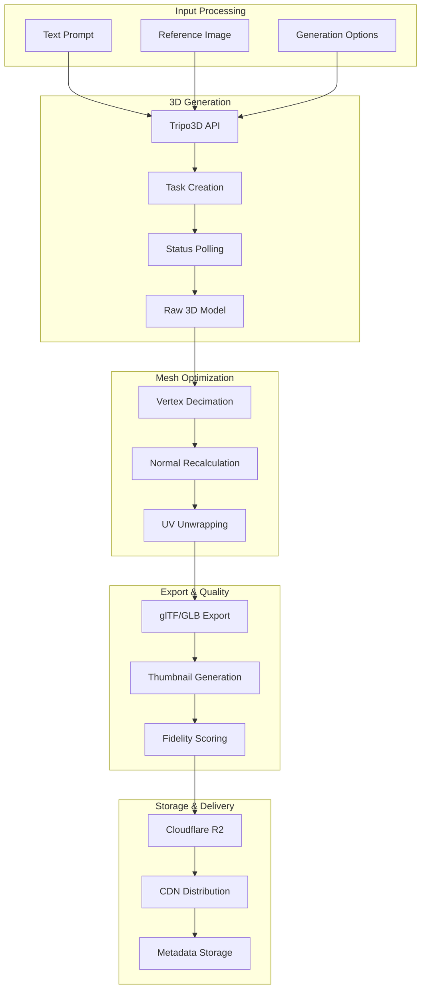

# DevSkyy Data Flow Documentation

**Version**: 1.3.0
**Last Updated**: 2026-01-30
**Status**: Production

This document describes how data flows through the DevSkyy platform for key operations.

---

## Table of Contents

1. [HTTP Request Flow](#http-request-flow)
2. [Authentication Flow](#authentication-flow)
3. [Agent Execution Flow](#agent-execution-flow)
4. [RAG Pipeline Flow](#rag-pipeline-flow)
5. [WordPress Sync Workflow](#wordpress-sync-workflow)
6. [3D Generation Pipeline](#3d-generation-pipeline)
7. [Virtual Try-On Flow](#virtual-try-on-flow)

---

## HTTP Request Flow

Every HTTP request follows this path through the system:


### Request Processing Steps

| Step | Component | Actions |
|------|-----------|---------|
| 1 | CORS Middleware | Validate `Origin` header, add CORS headers |
| 2 | Correlation ID | Generate/extract `X-Correlation-ID` |
| 3 | JWT Validation | Decode token, verify signature, check expiry |
| 4 | Rate Limiting | Check request count against tier limits |
| 5 | Input Sanitization | XSS/SQLi prevention, HTML cleaning |
| 6 | Audit Logging | Log request details (sanitized) |
| 7 | Route Dispatch | Match URL to handler function |
| 8 | Business Logic | Execute handler with validated input |
| 9 | Response Masking | Redact sensitive fields in response |
| 10 | Response | Return JSON with correlation ID |

---

## Authentication Flow

### Login Flow


### Token Refresh Flow


---

## Agent Execution Flow

### SuperAgent Plan-Execute-Validate Pattern


### Prompt Technique Selection

The SuperAgent selects from 17 prompt techniques based on task classification:

| Technique | Use Case | Task Types |
|-----------|----------|------------|
| Chain of Thought | Complex reasoning | Analysis, planning |
| Few-Shot | Pattern matching | Classification |
| Tree of Thought | Multi-path exploration | Creative, research |
| ReAct | Tool-using tasks | Actions, integrations |
| Self-Consistency | High-stakes decisions | Validation |
| Persona | Role-based responses | Customer service |
| Structured Output | Data extraction | Forms, APIs |

---

## RAG Pipeline Flow

### Document Retrieval Flow


### RAG Pipeline Components

```
orchestration/
  rag_context_manager.py    # Orchestrates retrieval
      |
      +-- query_rewriter.py      # Expands user queries
      +-- embedding_engine.py    # Text to vectors
      +-- vector_store.py        # ChromaDB/FAISS
      +-- reranker.py            # Cross-encoder scoring
      +-- brand_context.py       # SkyyRose DNA
```

### Query Expansion Example

```python
# Input Query
"What rose gold accessories do you have?"

# Expanded Queries (via QueryRewriter)
[
    "rose gold accessories jewelry fashion",
    "gold-toned accessories SkyyRose collection",
    "metallic rose accessories luxury fashion",
]

# Retrieved Documents (Top 5 after reranking)
1. "Rose Gold Heart Earrings - Signature Collection" (score: 0.94)
2. "Rose Gold Charm Bracelet - Love Hurts" (score: 0.91)
3. "SkyyRose Rose Gold Design Philosophy" (score: 0.87)
...
```

---

## WordPress Sync Workflow

### Product Sync Flow


### WordPress API Integration

```
DevSkyy                          WordPress
   |                                 |
   |  POST /index.php?rest_route=   |
   |  /wc/v3/products               |
   |------------------------------->|
   |                                 |
   |  WooCommerce Product ID        |
   |<-------------------------------|
   |                                 |
   |  POST /wp-json/wp/v2/media     |
   |------------------------------->|
   |                                 |
   |  Media Attachment ID           |
   |<-------------------------------|
```

**Important**: WordPress.com uses `index.php?rest_route=` prefix, NOT `/wp-json/`.

---

## 3D Generation Pipeline

### Tripo3D Generation Flow



### Quality Targets

| Metric | Target | Enforcement |
|--------|--------|-------------|
| Fidelity Score | > 0.95 | Quality gate blocks low-quality assets |
| Generation Time | < 30s | Timeout with retry |
| Vertex Count | < 100k | Automatic decimation |
| File Size | < 10MB | Compression applied |

### Pipeline Error Handling

```python
async def generate_3d_model(prompt: str, reference_image: str | None = None):
    """3D generation with retry and fallback"""
    max_retries = 3
    base_delay = 2.0

    for attempt in range(max_retries):
        try:
            task = await tripo_client.create_task(
                prompt=prompt,
                image_url=reference_image,
            )
            result = await wait_for_task(task.id, timeout=60)

            if result.fidelity_score < 0.95:
                raise QualityGateError("Fidelity below threshold")

            return result

        except (TimeoutError, QualityGateError) as e:
            if attempt < max_retries - 1:
                await asyncio.sleep(base_delay * (2 ** attempt))
                continue
            raise

    raise MaxRetriesExceededError("3D generation failed after retries")
```

---

## Virtual Try-On Flow

### FASHN API Integration


### Try-On Categories

| Category | Description | Garment Types |
|----------|-------------|---------------|
| tops | Upper body | Shirts, blouses, jackets |
| bottoms | Lower body | Pants, skirts, shorts |
| dresses | Full body | Dresses, jumpsuits |
| outerwear | Outer layer | Coats, blazers |

---

## Data Flow Summary

### Request Types and Paths

| Request Type | Entry Point | Key Components | Data Stores |
|--------------|-------------|----------------|-------------|
| Auth | `/auth/*` | Security Layer | PostgreSQL, Redis |
| Agent Task | `/api/v1/agents/*` | SuperAgent, LLM Router | Vector Store, LLM APIs |
| RAG Query | `/api/v1/rag/*` | RAG Pipeline | ChromaDB, Embeddings |
| WordPress Sync | `/api/v1/wordpress/*` | Sync Pipeline | WooCommerce API, R2 |
| 3D Generation | `/api/v1/3d/*` | Tripo Pipeline | Tripo API, R2, PostgreSQL |
| Virtual Try-On | `/api/v1/tryon/*` | FASHN Agent | FASHN API, R2 |

---

## See Also

- [SYSTEM_ARCHITECTURE.md](./SYSTEM_ARCHITECTURE.md) - Layer responsibilities
- [COMPONENTS.md](./COMPONENTS.md) - Component details
- [../RAG_INTEGRATION.md](../RAG_INTEGRATION.md) - RAG setup guide
- [../3D_GENERATION_PIPELINE.md](../3D_GENERATION_PIPELINE.md) - 3D pipeline details
