# DevSkyy System Architecture

**Version**: 1.3.0
**Last Updated**: 2026-01-30
**Status**: Production

This document describes the layered architecture of the DevSkyy Enterprise Platform.

---

## Table of Contents

1. [Architecture Overview](#architecture-overview)
2. [Component Layer Diagram](#component-layer-diagram)
3. [Dependency Flow Rules](#dependency-flow-rules)
4. [Layer Responsibilities](#layer-responsibilities)
5. [Key Technologies](#key-technologies)
6. [Architectural Principles](#architectural-principles)

---

## Architecture Overview

DevSkyy follows a strict layered architecture with one-way dependencies. The design ensures:

- **Modularity**: Each layer has a single responsibility
- **Testability**: Lower layers can be tested in isolation
- **Maintainability**: Changes in upper layers do not affect lower layers
- **Security**: Security layer wraps all incoming requests

```
                            External Clients
                                  |
                                  v
    +------------------------------------------------------------------+
    |                        HTTP/WebSocket                             |
    +------------------------------------------------------------------+
                                  |
                                  v
    +------------------------------------------------------------------+
    |                      SECURITY LAYER                               |
    |  JWT/OAuth2 | Rate Limiting | Input Validation | Audit Logging   |
    +------------------------------------------------------------------+
                                  |
                                  v
    +------------------------------------------------------------------+
    |                         API LAYER                                 |
    |    FastAPI Routers | Versioning | WebSocket | REST Endpoints      |
    +------------------------------------------------------------------+
                                  |
                                  v
    +------------------------------------------------------------------+
    |                       AGENTS LAYER                                |
    |  SuperAgents | ADK Adapters | Tool Registry | Prompt Techniques   |
    +------------------------------------------------------------------+
                                  |
                                  v
    +------------------------------------------------------------------+
    |                    ORCHESTRATION LAYER                            |
    |    RAG Pipeline | LLM Router | Brand Context | Query Rewriting    |
    +------------------------------------------------------------------+
                                  |
                                  v
    +------------------------------------------------------------------+
    |                      SERVICES LAYER                               |
    |  3D Generation | ML Pipeline | WordPress Sync | Storage | Analytics|
    +------------------------------------------------------------------+
                                  |
                                  v
    +------------------------------------------------------------------+
    |                        CORE LAYER                                 |
    |   Auth Types | Interfaces | Tool Specs | Error Hierarchy          |
    +------------------------------------------------------------------+
                                  |
                                  v
    +------------------------------------------------------------------+
    |                       DATA LAYER                                  |
    |     PostgreSQL | Redis | ChromaDB/FAISS | Cloudflare R2           |
    +------------------------------------------------------------------+
```

---

## Component Layer Diagram

```mermaid
graph TB
    subgraph External["External Clients"]
        Web["Web Dashboard"]
        Mobile["Mobile App"]
        WP["WordPress/WooCommerce"]
        HF["HuggingFace Spaces"]
    end

    subgraph HTTP["HTTP Layer"]
        LB["Load Balancer"]
        CORS["CORS Middleware"]
    end

    subgraph Security["Security Layer"]
        JWT["JWT/OAuth2 Auth"]
        RL["Rate Limiting"]
        IV["Input Validation"]
        AL["Audit Logging"]
        ENCRYPT["AES-256-GCM"]
    end

    subgraph API["API Layer"]
        REST["REST Endpoints"]
        WS["WebSocket"]
        VER["API Versioning"]
        GDPR["GDPR Endpoints"]
    end

    subgraph Agents["Agents Layer"]
        SA["SuperAgents"]
        ADK["ADK Adapters"]
        TR["Tool Registry"]
        PT["Prompt Techniques"]
    end

    subgraph Orchestration["Orchestration Layer"]
        RAG["RAG Pipeline"]
        LLM["LLM Router"]
        BC["Brand Context"]
        RT["Round Table"]
    end

    subgraph Services["Services Layer"]
        ML["ML Services"]
        TD["3D Generation"]
        WPS["WordPress Sync"]
        AN["Analytics"]
    end

    subgraph Core["Core Layer"]
        AUTH["Auth Types"]
        INT["Interfaces"]
        TS["Tool Specs"]
        ERR["Error Hierarchy"]
    end

    subgraph Data["Data Layer"]
        PG["PostgreSQL"]
        RD["Redis"]
        VS["Vector Store"]
        R2["Cloudflare R2"]
    end

    External --> HTTP
    HTTP --> Security
    Security --> API
    API --> Agents
    Agents --> Orchestration
    Orchestration --> Services
    Services --> Core
    Core --> Data
```



---

## Dependency Flow Rules

### Rule 1: One-Way Dependencies

Dependencies MUST flow downward only. Lower layers NEVER import from upper layers.

```
ALLOWED:
  api/        --> security/
  agents/     --> orchestration/
  security/   --> core/auth/

FORBIDDEN:
  core/       --> security/
  security/   --> api/
  services/   --> agents/
```

### Rule 2: Core Has Zero Dependencies

The `core/` module is the foundation. It defines:
- Authentication types and enums
- Abstract interfaces for implementations
- Tool specifications and registry base
- Error hierarchy

```python
# CORRECT: security/ implements core/ interfaces
from core.auth import IAuthProvider, TokenPayload

class JWTAuthProvider(IAuthProvider):
    def validate_token(self, token: str) -> TokenPayload:
        ...

# FORBIDDEN: core/ importing from security/
# from security.jwt_oauth2_auth import JWTAuthProvider  # NO!
```

### Rule 3: Dependency Inversion

Upper layers depend on abstractions (interfaces in `core/`), not concrete implementations.

```python
# api/ depends on interface, not implementation
from core.auth import ITokenValidator

async def get_current_user(
    token_validator: ITokenValidator = Depends(get_token_validator)
) -> TokenPayload:
    return token_validator.validate_token(token)
```

### Rule 4: No Circular Dependencies

Use forward references and `TYPE_CHECKING` blocks to break cycles:

```python
from typing import TYPE_CHECKING

if TYPE_CHECKING:
    from .models import AuthResult  # Only for type hints
```

---

## Layer Responsibilities

### HTTP Layer

| Component | Responsibility |
|-----------|----------------|
| Load Balancer | Traffic distribution, SSL termination |
| CORS Middleware | Cross-origin request handling |
| Request Routing | URL to handler mapping |

### Security Layer

| Component | File | Responsibility |
|-----------|------|----------------|
| JWT/OAuth2 | `security/jwt_oauth2_auth.py` | Token generation, validation, refresh |
| Rate Limiting | `security/rate_limiting.py` | Tier-based request throttling |
| Input Validation | `security/input_validation.py` | XSS, SQLi prevention |
| Audit Logging | `security/audit_log.py` | Immutable security event trail |
| Encryption | `security/aes256_gcm_encryption.py` | Field-level encryption |
| MFA | `security/mfa.py` | TOTP-based multi-factor auth |

### API Layer

| Component | Directory | Responsibility |
|-----------|-----------|----------------|
| REST Endpoints | `api/v1/` | CRUD operations, business endpoints |
| WebSocket | `api/websocket.py` | Real-time communication |
| Versioning | `api/versioning.py` | API version management |
| GDPR | `api/gdpr.py` | Privacy compliance endpoints |
| Webhooks | `api/webhooks.py` | External event notifications |

### Agents Layer

| Component | File | Responsibility |
|-----------|------|----------------|
| SuperAgent Base | `agents/base_super_agent.py` | 17 prompt techniques, Plan-Execute-Validate |
| Commerce Agent | `agents/commerce_agent.py` | E-commerce operations |
| Creative Agent | `agents/creative_agent.py` | Content generation |
| Tripo Agent | `agents/tripo_agent.py` | 3D model generation |
| FASHN Agent | `agents/fashn_agent.py` | Virtual try-on |
| Visual Generation | `agents/visual_generation/` | Image generation, prompt optimization |

### Orchestration Layer

| Component | File | Responsibility |
|-----------|------|----------------|
| RAG Pipeline | `orchestration/rag_context_manager.py` | Context retrieval |
| LLM Router | `orchestration/llm_orchestrator.py` | Provider selection |
| Brand Context | `orchestration/brand_context.py` | SkyyRose brand DNA injection |
| Round Table | `llm/round_table.py` | Multi-LLM consensus |
| Query Rewriter | `orchestration/query_rewriter.py` | Query expansion |

### Services Layer

| Component | Directory | Responsibility |
|-----------|-----------|----------------|
| 3D Generation | `ai_3d/` | Tripo3D integration, mesh optimization |
| ML Services | `services/ml/` | Model inference, training |
| Storage | `services/storage/` | Cloudflare R2, local storage |
| Analytics | `services/analytics/` | Usage metrics, business intelligence |
| Competitive | `services/competitive/` | Market analysis |

### Core Layer

| Component | Directory | Responsibility |
|-----------|-----------|----------------|
| Auth Types | `core/auth/types.py` | UserRole, TokenType, Permission enums |
| Auth Models | `core/auth/models.py` | TokenResponse, UserCreate models |
| Interfaces | `core/auth/interfaces.py` | IAuthProvider, ITokenValidator ABCs |
| Runtime | `core/runtime/` | Tool specs, input validation |
| Registry | `core/registry/` | Component registration |

### Data Layer

| Component | Technology | Purpose |
|-----------|------------|---------|
| PostgreSQL | SQLAlchemy Async | Primary data store |
| Redis | aioredis | Caching, session storage |
| ChromaDB/FAISS | Vector embeddings | RAG document retrieval |
| Cloudflare R2 | S3-compatible | Asset storage |

---

## Key Technologies

### Per Layer

| Layer | Technologies |
|-------|--------------|
| HTTP | uvicorn, nginx, HTTPS/TLS 1.3 |
| Security | PyJWT, Argon2, cryptography, bleach |
| API | FastAPI, Pydantic v2, WebSocket |
| Agents | LangChain, PydanticAI, CrewAI, Google ADK |
| Orchestration | LlamaIndex, ChromaDB, FAISS |
| Services | PyTorch, Transformers, Diffusers |
| Core | Python 3.11+, Pydantic, ABC |
| Data | PostgreSQL 15, Redis 7, SQLAlchemy 2.0 |

### LLM Providers

| Provider | Models | Use Case |
|----------|--------|----------|
| Anthropic | Claude 3.5/Opus 4 | Complex reasoning, code |
| OpenAI | GPT-4o, GPT-4 Turbo | General purpose |
| Google | Gemini 2.0 Flash | Vision, multimodal |
| Mistral | Mistral Large | European compliance |
| Groq | LLaMA 70B | Fast classification |
| Cohere | Command R+ | RAG, embeddings |

---

## Architectural Principles

### 1. Correctness > Elegance > Performance

Prioritize working, correct code over clever optimizations.

### 2. Pydantic In, Typed Out

All API inputs use Pydantic models. All outputs are typed.

```python
@router.post("/products", response_model=ProductResponse)
async def create_product(request: ProductCreate) -> ProductResponse:
    ...
```

### 3. Correlation IDs Everywhere

Every request gets a correlation ID for tracing across layers.

```python
async def process(data: InputModel, *, correlation_id: str | None = None) -> OutputModel:
    log.info("processing", correlation_id=correlation_id)
    ...
```

### 4. Fail Fast, Recover Gracefully

Validate inputs immediately. Handle failures with retries and fallbacks.

### 5. Security by Default

- All endpoints require authentication unless explicitly public
- All user input is sanitized
- All sensitive data is encrypted at rest
- All API calls are rate limited

---

## See Also

- [DATA_FLOW.md](./DATA_FLOW.md) - Request and pipeline data flows
- [COMPONENTS.md](./COMPONENTS.md) - Detailed component breakdown
- [DEVSKYY_MASTER_PLAN.md](./DEVSKYY_MASTER_PLAN.md) - Strategic roadmap
