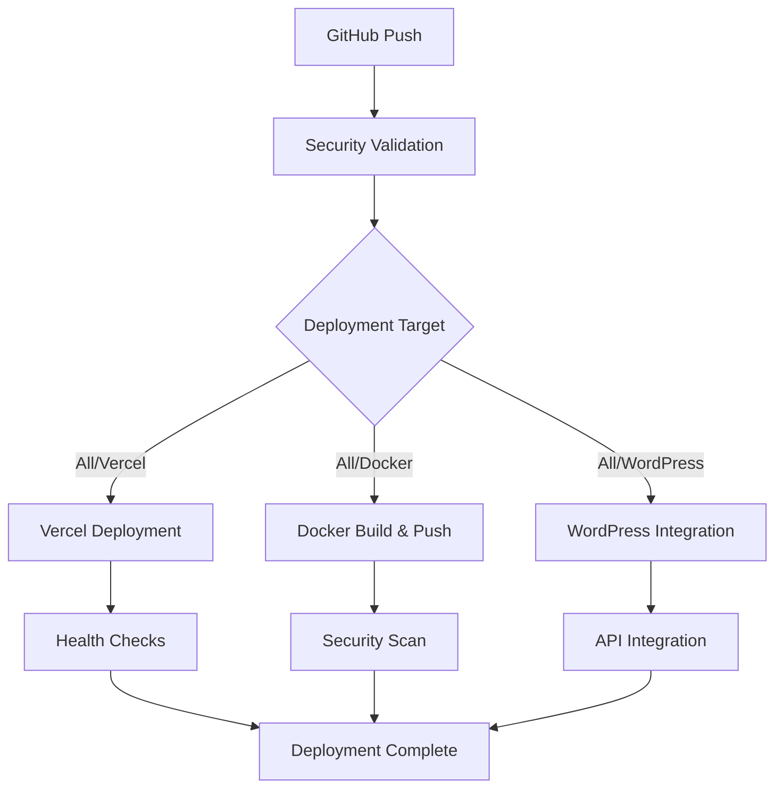

# DevSkyy Deployment Security Guide

## 🔐 **CRITICAL SECURITY NOTICE**

**⚠️ IMMEDIATE ACTION REQUIRED**: The credentials shared in your message should be rotated immediately as they are now exposed. This guide provides secure alternatives.

---

## 🛡️ **Secure Credential Management Strategy**

### **1. GitHub Secrets Configuration**

Navigate to your GitHub repository → Settings → Secrets and variables → Actions, and add these secrets:

#### **Docker Hub Credentials**
```bash
# Required Docker Hub secrets
DOCKER_REGISTRY=docker.io
DOCKER_REGISTRY_USERNAME=skyyrosellc
DOCKER_REGISTRY_TOKEN=<NEW_DOCKER_TOKEN>  # Generate new token
```

#### **Vercel Deployment Secrets**
```bash
# Required Vercel secrets
VERCEL_TOKEN=<YOUR_VERCEL_TOKEN>
VERCEL_ORG_ID=<YOUR_VERCEL_ORG_ID>
VERCEL_PROJECT_ID=<YOUR_VERCEL_PROJECT_ID>
```

#### **WordPress Hosting Secrets**
```bash
# WordPress hosting credentials
WP_SSH_HOST=sftp.wp.com
WP_SSH_USER=skyyrose.wordpress.com
WP_SSH_PRIVATE_KEY=<SSH_PRIVATE_KEY_CONTENT>
WP_SSH_PASSPHRASE=<SSH_KEY_PASSPHRASE>  # If applicable
```

#### **GitHub Access Token**
```bash
# GitHub token for automated operations
GITHUB_TOKEN=<NEW_GITHUB_TOKEN>  # Generate new token with appropriate scopes
```

---

## 🔄 **Immediate Security Actions Required**

### **1. Rotate Docker Hub Token**
```bash
# Steps to rotate Docker Hub token:
1. Login to Docker Hub (https://hub.docker.com)
2. Go to Account Settings → Security
3. Delete the exposed token: dckr_pat_[REDACTED_FOR_SECURITY]
4. Generate new Personal Access Token
5. Update GitHub secret: DOCKER_REGISTRY_TOKEN
```

### **2. Rotate GitHub Access Token**
```bash
# Steps to rotate GitHub token:
1. Go to GitHub Settings → Developer settings → Personal access tokens
2. Delete the exposed token: ghp_[REDACTED_FOR_SECURITY]
3. Generate new token with scopes:
   - repo (full repository access)
   - workflow (update GitHub Actions workflows)
   - write:packages (if using GitHub Packages)
4. Update GitHub secret: GITHUB_TOKEN
```

### **3. Secure SSH Configuration**
```bash
# Generate new SSH key pair for WordPress hosting:
ssh-keygen -t ed25519 -C "devskyy-deployment@skyyrose.com" -f ~/.ssh/devskyy_wp_deploy

# Add public key to WordPress hosting account
# Store private key content in GitHub secret: WP_SSH_PRIVATE_KEY
```

---

## 🏗️ **Multi-Platform Deployment Strategy**

### **1. Vercel + Docker + WordPress Integration**

This approach provides:
- **Vercel**: Primary production deployment (serverless)
- **Docker**: Containerized deployment for flexibility
- **WordPress**: Integration with existing WordPress infrastructure

### **2. Deployment Flow Architecture**



---

## ⚙️ **Updated Vercel Configuration**

### **Enhanced vercel.json**
```json
{
  "version": 2,
  "name": "devskyy-enterprise-platform",
  "framework": "other",
  "buildCommand": "pip install -r requirements.txt",
  "outputDirectory": ".",
  "installCommand": "pip install --upgrade pip && pip install -r requirements.txt",
  "devCommand": "uvicorn main:app --host 0.0.0.0 --port $PORT --reload",
  "builds": [
    {
      "src": "main.py",
      "use": "@vercel/python",
      "config": {
        "maxLambdaSize": "50mb",
        "runtime": "python3.11"
      }
    }
  ],
  "routes": [
    {
      "src": "/api/(.*)",
      "dest": "main.py"
    },
    {
      "src": "/health",
      "dest": "main.py"
    },
    {
      "src": "/(.*)",
      "dest": "main.py"
    }
  ],
  "env": {
    "PYTHONPATH": ".",
    "ENVIRONMENT": "production",
    "LOG_LEVEL": "INFO",
    "PYTHONDONTWRITEBYTECODE": "1",
    "PYTHONUNBUFFERED": "1",
    "DEPLOYMENT_PLATFORM": "vercel"
  },
  "functions": {
    "main.py": {
      "maxDuration": 30,
      "memory": 1024,
      "runtime": "python3.11"
    }
  },
  "regions": ["iad1"],
  "github": {
    "autoDeployment": true,
    "autoJobCancelation": true
  },
  "headers": [
    {
      "source": "/api/(.*)",
      "headers": [
        {
          "key": "X-Deployment-Platform",
          "value": "vercel"
        },
        {
          "key": "X-Content-Type-Options",
          "value": "nosniff"
        },
        {
          "key": "X-Frame-Options",
          "value": "DENY"
        },
        {
          "key": "X-XSS-Protection",
          "value": "1; mode=block"
        }
      ]
    }
  ]
}
```

---

## 🔒 **Security Best Practices**

### **1. Credential Rotation Schedule**
```bash
# Recommended rotation schedule:
- Docker Hub tokens: Every 90 days
- GitHub tokens: Every 90 days
- SSH keys: Every 180 days
- API keys: Every 30-60 days
- Database passwords: Every 90 days
```

### **2. Access Control**
```bash
# GitHub token scopes (minimal required):
- repo: Full repository access
- workflow: Update workflows
- read:org: Read organization membership

# Docker Hub token permissions:
- Read, Write, Delete for skyyrosellc/devskyy repository only
```

### **3. Environment Separation**
```bash
# Use different credentials for different environments:
- Production: Full access tokens
- Staging: Limited access tokens
- Development: Read-only tokens where possible
```

---

## 📊 **Monitoring and Alerting**

### **1. Deployment Monitoring**
```yaml
# GitHub Actions monitoring
- Deployment success/failure notifications
- Security scan results
- Performance metrics
- Health check status
```

### **2. Security Monitoring**
```yaml
# Security alerts for:
- Failed authentication attempts
- Unusual deployment patterns
- Credential usage anomalies
- Unauthorized access attempts
```

---

## 🚀 **Deployment Commands**

### **1. Manual Deployment**
```bash
# Trigger specific platform deployment
gh workflow run multi-platform-deployment.yml \
  -f deployment_target=vercel \
  -f environment=production

# Trigger all platforms
gh workflow run multi-platform-deployment.yml \
  -f deployment_target=all \
  -f environment=production
```

### **2. Emergency Procedures**
```bash
# Emergency credential rotation
1. Immediately revoke exposed credentials
2. Generate new credentials
3. Update GitHub secrets
4. Trigger new deployment
5. Verify all platforms are operational
```

---

## 🔍 **Verification Steps**

### **1. Post-Deployment Verification**
```bash
# Verify Vercel deployment
curl -f https://devskyy.vercel.app/health

# Verify Docker image
docker run --rm skyyrosellc/devskyy:latest curl -f http://localhost:8000/health

# Verify WordPress integration
curl -f https://skyyrose.wordpress.com/devskyy-api/health
```

### **2. Security Validation**
```bash
# Check for exposed credentials
git log --all --full-history -- "*" | grep -E "(token|key|password|secret)"

# Validate SSL certificates
openssl s_client -connect devskyy.vercel.app:443 -servername devskyy.vercel.app

# Test API security headers
curl -I https://devskyy.vercel.app/api/health
```

---

## 📞 **Incident Response**

### **1. Credential Compromise**
```bash
1. Immediately revoke compromised credentials
2. Generate new credentials
3. Update all deployment configurations
4. Audit access logs
5. Deploy with new credentials
6. Monitor for unauthorized access
```

### **2. Deployment Failure**
```bash
1. Check GitHub Actions logs
2. Verify credential validity
3. Test connectivity to deployment targets
4. Rollback if necessary
5. Fix issues and redeploy
```

---

**🛡️ Remember: Security is an ongoing process, not a one-time setup. Regularly review and update your security practices.**
