# CI/CD Diagnostic Report - Documentation PR

## 📋 Executive Summary

This report analyzes the CI/CD workflow status for PR adding `code_repair.md` and `code_review.md` documentation files.

**Date:** November 11, 2024  
**Branch:** `copilot/add-code-repair-and-review-files`  
**Commits:** 2 commits (46785be → 1e169e7)  
**Files Changed:** 2 new markdown files (code_repair.md, code_review.md)

---

## ✅ What Changed

### Commit 1: Initial Plan (46785be)
- Empty commit establishing the plan
- No code changes

### Commit 2: Documentation Files (1e169e7)
- **Added:** `code_repair.md` (23KB, 992 lines)
- **Added:** `code_review.md` (25KB, 1,020 lines)
- **Total:** 2,012 lines of documentation

### Files Analysis

Both files are pure markdown documentation with:
- ✅ Valid markdown syntax
- ✅ No broken internal anchor links
- ✅ Proper cross-references to existing docs
- ✅ No executable code (only examples in code blocks)

---

## 🔍 CI/CD Workflow Analysis

### Active Workflows

The repository has 8 GitHub Actions workflows:

1. **ci-cd.yml** - Main CI/CD pipeline
   - Triggers: Push to all branches, PRs to main/develop
   - Jobs: lint, test, security-scan, build

2. **test.yml** - Comprehensive test suite
   - Triggers: Push to all branches, PRs to main/develop
   - Jobs: unit-tests (5 test groups), integration-tests, e2e-tests

3. **python-package.yml** - Python package testing
   - Triggers: Push/PR to main only
   - Matrix: Python 3.9, 3.10, 3.11

4. **security-scan.yml** - Security scanning
5. **codeql.yml** - CodeQL analysis
6. **performance.yml** - Performance testing
7. **main.yml** - Additional checks
8. **neon_workflow.yml** - Neon-specific workflow

### Expected Workflow Behavior

For this documentation-only PR:

#### ✅ Should Pass
- **Lint job**: Markdown files don't affect Python linting
- **Build job**: No code changes to build
- **Security scan**: No code changes to scan

#### ⚠️ May Run Unnecessarily
- **Test jobs**: Full test suite runs despite no code changes
  - 5 test groups (agents, api, security, ml, infrastructure)
  - Integration tests
  - E2E tests
- **Python package**: Runs for all Python versions (3.9, 3.10, 3.11)

---

## 🐛 Potential Issues Identified

### Issue 1: Pre-existing Code Quality Issues

**Severity:** Medium  
**Impact:** Blocks CI/CD even for documentation changes

Found syntax errors in existing codebase (unrelated to this PR):

```
./agent/modules/development/code_recovery_cursor_agent.py:495:19: F821 undefined name 'HTTPException'
./agent/modules/development/code_recovery_cursor_agent.py:533:19: F821 undefined name 'HTTPException'
./agent/modules/enhanced_learning_scheduler.py:527:5: F824 global _global_scheduler is unused
./agent/upgrade_agents.py:257-278: F821 undefined name 'logger' (multiple occurrences)
```

**Root Cause:** Missing imports in existing Python files

**Fix Required:**
```python
# In code_recovery_cursor_agent.py
from fastapi import HTTPException  # Add this import

# In upgrade_agents.py
import logging
logger = logging.getLogger(__name__)  # Add this
```

### Issue 2: Test Dependencies Not Installed

**Severity:** Low  
**Impact:** Local test execution fails

```
ModuleNotFoundError: No module named 'fastapi'
```

**Root Cause:** Test suite requires `requirements.txt` dependencies

**Fix:** Ensure CI/CD workflows install dependencies:
```yaml
- name: Install dependencies
  run: |
    pip install -r requirements.txt
    pip install -r requirements-test.txt
```

### Issue 3: Over-Triggering of Workflows

**Severity:** Low  
**Impact:** Wastes CI/CD resources

**Problem:** All workflows trigger on every push, even for documentation-only changes

**Recommendation:** Add path filters to workflows:

```yaml
on:
  push:
    branches: ['**']
    paths:
      - '**.py'
      - 'requirements*.txt'
      - '.github/workflows/**'
  pull_request:
    paths:
      - '**.py'
      - 'requirements*.txt'
```

---

## 📊 Workflow Execution Diagram

```mermaid
graph TB
    A[PR Created: Add Documentation] --> B{Trigger Workflows}
    
    B --> C1[ci-cd.yml]
    B --> C2[test.yml]
    B --> C3[python-package.yml]
    B --> C4[security-scan.yml]
    B --> C5[codeql.yml]
    
    C1 --> D1[Lint Job]
    C1 --> D2[Test Job]
    C1 --> D3[Security Job]
    C1 --> D4[Build Job]
    
    D1 --> E1{Ruff Check}
    E1 --> |Pre-existing errors| F1[❌ FAIL]
    E1 --> |No errors| G1[✅ PASS]
    
    D2 --> E2{Run Tests}
    E2 --> |Missing deps| F2[❌ FAIL]
    E2 --> |Deps OK| G2[✅ PASS]
    
    C2 --> H1[Unit Tests Matrix]
    C2 --> H2[Integration Tests]
    C2 --> H3[E2E Tests]
    
    H1 --> I1{5 Test Groups}
    I1 --> |agents| J1[Run Tests]
    I1 --> |api| J2[Run Tests]
    I1 --> |security| J3[Run Tests]
    I1 --> |ml| J4[Run Tests]
    I1 --> |infrastructure| J5[Run Tests]
    
    C3 --> K1{Python Matrix}
    K1 --> |3.9| L1[Test Python 3.9]
    K1 --> |3.10| L2[Test Python 3.10]
    K1 --> |3.11| L3[Test Python 3.11]
    
    style F1 fill:#ffcccc
    style F2 fill:#ffcccc
    style G1 fill:#ccffcc
    style G2 fill:#ccffcc
```



---

## 🔧 Impact Analysis

### What This PR Actually Changes

**Code Changes:** NONE  
**Python Files Modified:** 0  
**Dependencies Changed:** NONE  
**Test Files Modified:** 0  

**Documentation Changes:**
- ✅ Added comprehensive code repair guide
- ✅ Added comprehensive code review guide
- ✅ Cross-referenced with existing docs

### Why CI/CD Runs Anyway

1. **Workflow Triggers:** Set to run on all branch pushes
2. **No Path Filters:** Workflows don't exclude documentation-only changes
3. **Conservative Approach:** Safer to run all checks than miss issues

### Actual Risk Assessment

**Risk Level:** 🟢 MINIMAL

- **Breaking Changes:** ZERO (no code modified)
- **API Changes:** ZERO (no code modified)
- **Security Impact:** ZERO (documentation only)
- **Performance Impact:** ZERO (no runtime code)
- **Test Coverage Impact:** ZERO (no code modified)

---

## ✅ Validation Results

### Markdown Quality Checks

```bash
# Link validation
✓ code_repair.md: All internal anchor links valid
✓ code_review.md: All internal anchor links valid

# Cross-references
✓ code_repair.md → code_review.md ✓
✓ code_review.md → code_repair.md ✓
✓ Both → SECURITY.md ✓
✓ Both → CONTRIBUTING.md ✓

# File integrity
✓ code_repair.md: 74 sections, 992 lines, 23KB
✓ code_review.md: 71 sections, 1,020 lines, 25KB
```

### Code Quality (Pre-existing Issues)

```bash
# Syntax errors (UNRELATED to this PR)
❌ code_recovery_cursor_agent.py: Missing HTTPException import
❌ upgrade_agents.py: Missing logger definition
⚠️ enhanced_learning_scheduler.py: Unused global variable

# This PR's files
✅ code_repair.md: N/A (markdown)
✅ code_review.md: N/A (markdown)
```

---

## 🚀 Recommendations

### Immediate Actions

1. **Skip CI/CD for Documentation-Only PRs** (Optional)
   - Add `[skip ci]` to commit message for documentation changes
   - OR add path filters to workflows

2. **Fix Pre-existing Code Issues** (Separate PR)
   - Add missing imports in `code_recovery_cursor_agent.py`
   - Add logger initialization in `upgrade_agents.py`
   - Clean up unused globals in `enhanced_learning_scheduler.py`

3. **Optimize Workflow Triggers** (Infrastructure improvement)
   - Add path-based filtering to workflows
   - Skip heavy test suites for documentation changes

### Long-term Improvements

1. **Separate Documentation Workflow**
   ```yaml
   name: Documentation CI
   on:
     pull_request:
       paths:
         - '**.md'
         - 'docs/**'
   jobs:
     markdown-lint:
       runs-on: ubuntu-latest
       steps:
         - uses: actions/checkout@v4
         - uses: DavidAnson/markdownlint-cli2-action@v11
   ```

2. **Smart Test Selection**
   - Use changed files to determine which tests to run
   - Skip tests when only docs change

3. **Pre-commit Hooks**
   - Validate markdown locally before push
   - Check internal links before commit

---

## 📈 Workflow Optimization Analysis

### Current State

**For Documentation-Only PR:**
- Workflows triggered: 8
- Jobs executed: ~15
- Test groups: 5 parallel
- Python versions tested: 3
- Estimated CI/CD time: 20-30 minutes
- Estimated compute cost: Medium

**Efficiency:** ⚠️ LOW (running full test suite for docs)

### Optimized State

**For Documentation-Only PR:**
- Workflows triggered: 1 (markdown-lint)
- Jobs executed: 1
- Test groups: 0
- Python versions tested: 0
- Estimated CI/CD time: 1-2 minutes
- Estimated compute cost: Minimal

**Efficiency:** ✅ HIGH (targeted checks only)

**Savings:** ~90% reduction in CI/CD time and resources

---

## 📝 Summary

### Key Findings

1. ✅ **Documentation PR is clean**
   - No code changes
   - Valid markdown
   - Proper cross-references
   - Zero risk to codebase

2. ❌ **Pre-existing code quality issues**
   - Syntax errors in 3 Python files
   - Unrelated to this PR
   - Should be fixed separately

3. ⚠️ **CI/CD over-execution**
   - Full test suite runs for docs
   - Opportunity for optimization
   - Not blocking, just inefficient

### Recommended Actions

**For This PR:**
- ✅ Merge as-is (documentation is valid)
- ⚠️ Fix pre-existing code issues in separate PR
- 💡 Consider workflow optimizations

**For Future:**
- Implement path-based workflow filtering
- Create dedicated documentation CI/CD
- Add pre-commit hooks for markdown

---

**Generated:** November 11, 2024  
**Status:** Complete  
**Next Steps:** Review and merge documentation PR

