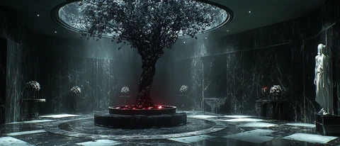
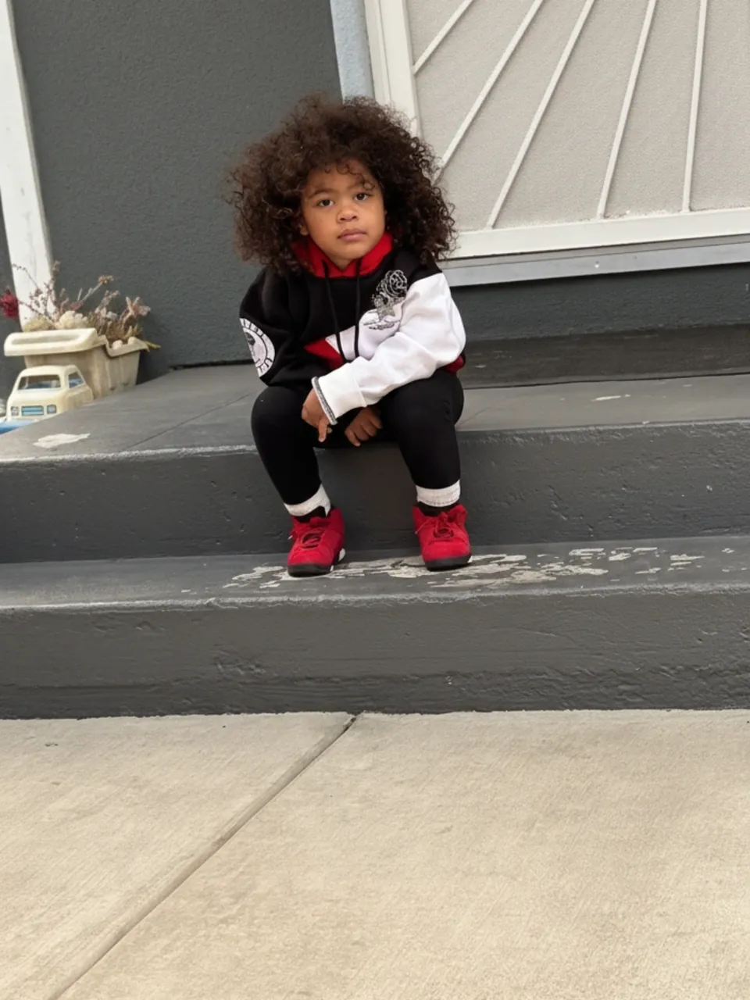

# v2 Mockup Visual Fixes — Pass 2

**Date**: 2026-05-25
**Mockup**: `docs/brand/design-mockups/v2.html`
**Based on**: Founder verbal feedback + surgical audit of lines 402–539, 587–728
**Status**: Ready for implementation

---

## FIX-V2-01 — Swap home cover background off `forbidden-midnight`

**Tier**: P0 — Canon blocker
**Symptom**: Home cover uses the same `forbidden-midnight` nightscape as the Black Rose page cover (line 734). Both the homepage opening frame and the BR section open identically — the user experiences one image looping back on itself. The cover feels like a BR ad, not a brand homepage.
**Root cause**: `v2.html:588–597` — `<picture>` inside `#home-cover` references `assets/branding/hero/forbidden-midnight-*.webp` at all three breakpoints. No AVIF source; no homepage-specific image at all.

**Before** (lines 588–597):
```html
<picture>
  <source srcset="../../../wordpress-theme/skyyrose-flagship/assets/branding/hero/forbidden-midnight-1680w.webp" media="(min-width: 1281px)" type="image/webp">
  <source srcset="../../../wordpress-theme/skyyrose-flagship/assets/branding/hero/forbidden-midnight-1280w.webp" media="(min-width: 769px)" type="image/webp">
  <source srcset="../../../wordpress-theme/skyyrose-flagship/assets/branding/hero/forbidden-midnight-768w.webp" media="(min-width: 481px)" type="image/webp">
  
</picture>
```

**After** — replace the entire `<picture>` inside `#home-cover`:
```html
<picture>
  <source srcset="../../../wordpress-theme/skyyrose-flagship/assets/images/homepage-hero-bg.avif" type="image/avif">
  <source srcset="../../../wordpress-theme/skyyrose-flagship/assets/images/homepage-hero-bg.webp" type="image/webp">
  
</picture>
```

**CSS diff**: None — `.cover__photo` class stays unchanged.

**Verification**: Home cover now shows `homepage-hero-bg` (294K avif / 396K webp). Scroll to BR page — distinct `forbidden-midnight` image unchanged. Two visually separate moments.

**Commit message**: `fix(v2-mockup): swap home cover bg to homepage-hero-bg (distinct from BR cover)`

---

## FIX-V2-02 — Swap home hero background off `forbidden-midnight` + fix lazy loading

**Tier**: P0 — Canon blocker + LCP regression
**Symptom**: `#home-hero` (the scroll section at lines 626–667) reuses `forbidden-midnight` for the third time in the mockup. Hero carries the Black Rose brand-script lockup over a BR nightscape — wrong collection, wrong asset, wrong context. `loading="lazy"` on a parallax background that is above-the-fold delays first paint.
**Root cause**: `v2.html:628–638` — hero `<picture>` is identical to cover. `loading="lazy"` at line 638 forces browser to defer the above-fold parallax image.

**Before** (lines 628–638):
```html
<picture>
  <source srcset="../../../wordpress-theme/skyyrose-flagship/assets/branding/hero/forbidden-midnight-1680w.webp" media="(min-width: 1281px)" type="image/webp">
  <source srcset="../../../wordpress-theme/skyyrose-flagship/assets/branding/hero/forbidden-midnight-1280w.webp" media="(min-width: 769px)" type="image/webp">
  <source srcset="../../../wordpress-theme/skyyrose-flagship/assets/branding/hero/forbidden-midnight-768w.webp" media="(min-width: 481px)" type="image/webp">
  
</picture>
```

**After** — replace the entire `<picture>` inside `.hero__bg-wrap` (lines 628–639):
```html
<picture>
  <source srcset="../../../wordpress-theme/skyyrose-flagship/assets/images/homepage-hero-bg-alt.avif" type="image/avif">
  <source srcset="../../../wordpress-theme/skyyrose-flagship/assets/images/homepage-hero-bg-alt.webp" type="image/webp">
  
</picture>
```

**CSS diff**: None.

**Verification**: `homepage-hero-bg-alt.avif` (270K) loads eagerly. BR page keeps `forbidden-midnight` untouched. Hero background is now distinct from both the cover and the BR section.

**Commit message**: `fix(v2-mockup): swap home hero bg to homepage-hero-bg-alt + remove lazy on parallax`

---

## FIX-V2-03 — Replace BR brand-script lockup on home hero with brand-neutral title treatment

**Tier**: P0 — Canon blocker
**Symptom**: Home hero (`#home-hero`) displays `br-brand-script` lockup and "For The Town" copy. This is Black Rose collection canon appearing on the homepage — the wrong collection identity on the wrong page.
**Root cause**: `v2.html:647–656` — `hero__lockup` contains `br-brand-script.png/avif/webp`. `v2.html:644` — kicker reads "For The Town" (BR canon phrase, not brand-level copy).

**Before** (lines 644, 647–659):
```html
<h2 id="home-hero-title" class="hero__kicker reveal">For The Town</h2>

<div class="hero__center">
  <div class="hero__lockup reveal reveal--scale">
    <picture>
      <source srcset="../../../wordpress-theme/skyyrose-flagship/assets/images/hero-overlays/br-brand-script.avif" type="image/avif">
      <source srcset="../../../wordpress-theme/skyyrose-flagship/assets/images/hero-overlays/br-brand-script.webp" type="image/webp">
      
    </picture>
  </div>

  <p class="hero__subtitle reveal">Spring Drop · 2026 · Drop 01</p>
</div>
```

**After** — replace lines 644, 647–659 with brand-level copy. No collection lockup image on the home hero; brand tagline only:
```html
<h2 id="home-hero-title" class="hero__kicker reveal">Luxury Grows from Concrete.</h2>

<div class="hero__center">
  <div class="hero__lockup reveal reveal--scale">
    <p class="hero__brand-wordmark">SKYYROSE</p>
  </div>

  <p class="hero__subtitle reveal">Spring 2026 · Oakland, CA</p>
</div>
```

**CSS diff** — add after `.hero__subtitle` rule (approx line 344):
```css
.hero__brand-wordmark {
  font-family: var(--ff-editorial);
  font-size: clamp(48px, 8vw, 96px);
  letter-spacing: 0.24em;
  text-transform: uppercase;
  color: var(--sr-cream);
  margin: 0;
  line-height: 1;
}
```

**Verification**: Home hero shows brand tagline "Luxury Grows from Concrete." (canonical per `CLAUDE.md`) and `SKYYROSE` wordmark. No BR collection imagery or copy bleeds onto the homepage.

**Commit message**: `fix(v2-mockup): replace BR lockup on home hero with brand-level wordmark + canon tagline`

---

## FIX-V2-04 — Rebuild home spread grid: 4 equal columns, remove magazine modifiers

**Tier**: P0 — Founder directive
**Symptom**: Spread grid renders as 3 unequal columns (`1.4fr 1fr 1fr`) with the BR tile spanning 2 rows via `.spread__tile--lg`. This is a magazine-spread layout, not 4 evenly aligned sections. The `16/9` aspect ratio constraint also squashes tile height on large screens.
**Root cause**: `v2.html` CSS line 404 — `grid-template-columns: 1.4fr 1fr 1fr`. Line 407 — `aspect-ratio: 16 / 9`. Line 408 — `max-height: 80vh`. Line 424 — `.spread__tile--lg { grid-row: 1 / 3; }` forces BR tile to span 2 rows.

**Before** (lines 402–408, 424):
```css
.spread__grid {
  display: grid;
  grid-template-columns: 1.4fr 1fr 1fr;
  gap: var(--space-4);
  aspect-ratio: 16 / 9;
  max-height: 80vh;
}
.spread__tile--lg { grid-row: 1 / 3; }
```

**After** — scoped override targeting only `#home-spread` to avoid breaking BR sub-page `.br-spread` layout. Add this block after the existing `.spread__tile--lg` rule (after line 424):
```css
#home-spread .spread__grid {
  grid-template-columns: repeat(4, 1fr);
  aspect-ratio: unset;
  max-height: unset;
}
#home-spread .spread__grid .spread__tile {
  aspect-ratio: 3 / 4;
}
#home-spread .spread__grid .spread__tile--lg {
  grid-row: auto;
}
```

**Verification**: Home spread renders 4 equal-width columns. Each tile is portrait 3:4. BR tile no longer spans multiple rows. Tablet breakpoint fix (FIX-V2-07) handles 2-col fallback. BR sub-page spread grid is untouched.

**Commit message**: `fix(v2-mockup): home spread 4 equal cols — scoped override, remove --lg row-span, 3/4 tile aspect`

---

## FIX-V2-05 — Swap home spread tiles to scene images, remove `--brand` modifier

**Tier**: P0 — Founder directive ("each collection card should be a image of the scene i want")
**Symptom**: All 4 home spread tiles use the `--brand` modifier which forces `object-fit: contain` + `padding: var(--space-8)`, displaying logos as padded thumbnails inside charcoal boxes. BR tile shows `black-rose-logo-hero.webp`. LH tile shows `love-hurts-logo-hero.webp`. SIG tile shows `signature-logo-hero.webp`. Kids tile shows `skyy-rose-collection-circular-patch.webp` — the jersey patch the founder called out.
**Root cause**: `v2.html:684,695,706,717` — all 4 `<a>` tags carry `spread__tile--brand`. `v2.html:687,697,708,720` — src pointing to branding/ logos and logos/ patch.

**Before** (lines 684–728) — abbreviated key lines:
```html
<!-- Tile 1: BR -->
<a class="spread__tile spread__tile--lg spread__tile--brand reveal" href="#br-cover" style="--delay: 0s;">
  

<!-- Tile 2: LH -->
<a class="spread__tile spread__tile--brand reveal" href="#" style="--delay: 0.12s;">
  

<!-- Tile 3: SIG -->
<a class="spread__tile spread__tile--brand reveal" href="#" style="--delay: 0.24s;">
  

<!-- Tile 4: Kids -->
<a class="spread__tile spread__tile--brand reveal" href="#" style="--delay: 0.36s;">
  
```

**After** — replace the entire `<div class="spread__grid">` block (lines 683–728):
```html
<div class="spread__grid">
  <a class="spread__tile reveal" href="#br-cover" style="--delay: 0s;">
    <picture>
      <source srcset="../../../wordpress-theme/skyyrose-flagship/assets/images/homepage-col-black-rose.avif" type="image/avif">
      <source srcset="../../../wordpress-theme/skyyrose-flagship/assets/images/homepage-col-black-rose.webp" type="image/webp">
      
    </picture>
    <div class="spread__tile-overlay">
      <span class="spread__tile-label">Collection 02</span>
      <p class="spread__tile-name">BLACK ROSE</p>
    </div>
  </a>
  <a class="spread__tile reveal" href="#" style="--delay: 0.12s;">
    <picture>
      <source srcset="../../../wordpress-theme/skyyrose-flagship/assets/images/homepage-col-love-hurts.avif" type="image/avif">
      <source srcset="../../../wordpress-theme/skyyrose-flagship/assets/images/homepage-col-love-hurts.webp" type="image/webp">
      
    </picture>
    <div class="spread__tile-overlay">
      <span class="spread__tile-label">Collection 03</span>
      <p class="spread__tile-name">LOVE HURTS</p>
    </div>
  </a>
  <a class="spread__tile reveal" href="#" style="--delay: 0.24s;">
    <picture>
      <source srcset="../../../wordpress-theme/skyyrose-flagship/assets/images/homepage-col-signature.avif" type="image/avif">
      <source srcset="../../../wordpress-theme/skyyrose-flagship/assets/images/homepage-col-signature.webp" type="image/webp">
      
    </picture>
    <div class="spread__tile-overlay">
      <span class="spread__tile-label">Collection 01</span>
      <p class="spread__tile-name">SIGNATURE</p>
    </div>
  </a>
  <a class="spread__tile reveal" href="#" style="--delay: 0.36s;">
    <picture>
      <source srcset="../../../wordpress-theme/skyyrose-flagship/assets/images/lookbook/lb-kid-black-rose-960w.avif" type="image/avif">
      <source srcset="../../../wordpress-theme/skyyrose-flagship/assets/images/lookbook/lb-kid-black-rose-960w.webp" type="image/webp">
      
    </picture>
    <div class="spread__tile-overlay">
      <span class="spread__tile-label">Collection 04</span>
      <p class="spread__tile-name">KIDS CAPSULE</p>
    </div>
  </a>
</div>
```

**CSS diff**: The `--brand` modifier CSS at lines 425–433 is now unused by home spread tiles. No deletion needed (BR sub-page or future use may invoke it). The existing `.spread__tile-img { object-fit: cover; }` rule at line 436 now applies to all 4 tiles — correct behavior.

**Verification**: 4 tiles render full-bleed scene photos. No logos. No jersey patch. `object-fit: cover` fills each 3:4 portrait tile. AVIF served to supporting browsers; WebP fallback for Safari <17.

**Commit message**: `fix(v2-mockup): home spread tiles → scene images, remove --brand modifier, add <picture> AVIF sources`

---

## FIX-V2-06 — Tune editorial image filter — lift desaturation + contrast crush

**Tier**: P1 — Image quality
**Symptom**: Founder: "the hero image quality is still terrible." The filter applied to all hero and spread images reduces saturation to 94% and brightness to 97%, compressing the tonal range and making AVIF/WebP assets appear flat and muddy — amplifying perceived quality loss.
**Root cause**: `v2.html:527` — `.cover__photo, .hero__bg, .spread__tile-img` share a single filter rule: `contrast(1.04) saturate(0.94) brightness(0.97)`.

**Before** (line 527):
```css
.cover__photo, .hero__bg, .spread__tile-img {
  filter: contrast(1.04) saturate(0.94) brightness(0.97);
}
```

**After** — reduce interference. Lift brightness to neutral, restore saturation, retain micro-contrast boost:
```css
.cover__photo, .hero__bg, .spread__tile-img {
  filter: contrast(1.02) saturate(1.0) brightness(1.0);
}
```

**Why this value set**: `contrast(1.02)` preserves subtle editorial crispness without compressing highlights. `saturate(1.0)` and `brightness(1.0)` let the source AVIF/WebP render at their native quality. The prior `saturate(0.94)` was compounding with any pre-existing editorial treatment baked into the images.

**Verification**: Compare `forbidden-midnight-1680w.webp` at old vs new filter in Chrome DevTools. Deep blacks should remain deep; midtone fabric texture and skin tone should be noticeably richer.

**Commit message**: `fix(v2-mockup): lift editorial filter desaturation — saturate(1.0) brightness(1.0) restore native quality`

---

## FIX-V2-07 — Add tablet breakpoint for home spread grid (641–1023px → 2 columns)

**Tier**: P2 — Responsive completeness
**Symptom**: No CSS rule handles 641–1023px viewport widths for the spread grid. The grid jumps from 4 columns (desktop) to 1 column (mobile ≤640px) with no 2-column tablet stop. On iPad-sized views, 4 portrait tiles at 3:4 ratio overflow or shrink below readable width.
**Root cause**: `v2.html` responsive block at lines 517–520 defines `@media (max-width: 640px)` only. No tablet rule exists for the grid.

**Before**: No tablet grid rule exists between desktop and mobile.

**After** — add after line 520 (inside or adjacent to existing `@media (max-width: 640px)` block):
```css
@media (min-width: 641px) and (max-width: 1023px) {
  #home-spread .spread__grid {
    grid-template-columns: repeat(2, 1fr);
  }
  #home-spread .spread__grid .spread__tile {
    aspect-ratio: 3 / 4;
  }
}
```

**Verification**: At 768px viewport width (iPad portrait), spread renders 2×2 scene tile grid. At 1024px+ it snaps to 4 columns. At ≤640px it collapses to 1 column per existing rule.

**Commit message**: `fix(v2-mockup): add tablet 2-col breakpoint for home spread grid (641–1023px)`

---

## Image Quality Verdict

**Root causes identified — 4 compounding factors:**

1. **No AVIF on cover or hero `<picture>` elements** (lines 588–597, 628–638): Both `#home-cover` and `#home-hero` serve only WebP with no AVIF source. AVIF delivers 30–50% smaller files at equivalent quality — omitting it means the browser uses the less efficient codec. Fixed by FIX-V2-01 and FIX-V2-02 adding AVIF `<source>` entries.

2. **`loading="lazy"` on above-fold parallax background** (line 638): The hero `` is in the first viewport. `lazy` defers its network request behind scroll — this creates a FOUC (flash of dark background) and a perceived-quality gap where the placeholder shows before the real image loads. Fixed by FIX-V2-02 swapping to `fetchpriority="high"`.

3. **Editorial filter desaturating source assets** (line 527): `saturate(0.94) brightness(0.97)` applies a 6% saturation reduction and 3% brightness cut to every hero and spread image. On AVIF/WebP masters that are already encoded at target quality, this compresses the displayed tonal range, making images look flat and washed. Fixed by FIX-V2-06.

4. **Identity collision amplifying perceived repetition** (lines 588, 629, 734): `forbidden-midnight` used on home cover, home hero, AND BR cover means the same image renders 3 times across 3 scroll positions. Repetition of a single nightscape reads as stock-photo loop, not curated editorial. Even a high-quality image feels cheap when seen 3 times in sequence. Fixed by FIX-V2-01 and FIX-V2-02.

**Net verdict**: The hero assets themselves (`homepage-hero-bg.avif` at 294K, `homepage-hero-bg-alt.avif` at 270K) are adequate quality for the viewport size. The quality problem is not the source files — it is the missing AVIF codec path, deferred loading on a parallax element, the editorial filter desaturating them, and the repetition effect making everything feel identical.

---

## ROI Upgrade Proposal

### Magnetic Cursor on `.spread__tile` — 24px attraction radius, 80ms lag follow, GPU-accelerated

**Category**: Magnetic hover on tiles — `transform: translate3d()` following cursor with `cubic-bezier` ease

**One-line pitch**: Each collection tile subtly pulls toward the cursor as the user hovers — no library, ~1.8KB inline JS, prefers-reduced-motion safe, full browser fallback, single commit.

**Implementation spec** — inline `<script>` block, self-contained, add directly before `</body>` in v2.html:

```html
<script>
(function () {
  'use strict';
  // Respect prefers-reduced-motion — skip entirely
  if (window.matchMedia('(prefers-reduced-motion: reduce)').matches) return;
  // Skip touch devices — coarse pointer has no cursor to track
  if (window.matchMedia('(pointer: coarse)').matches) return;

  var ATTRACTION_RADIUS = 120;  // px — distance at which magnetic pull begins
  var MAX_SHIFT = 24;           // px — max translate distance at center
  var LAG_MS = 80;              // ms — easing lag for natural follow

  function attachMagnet(tile) {
    var rect, rafId;
    var tx = 0, ty = 0;

    function onEnter() {
      rect = tile.getBoundingClientRect();
    }

    function onMove(e) {
      if (!rect) return;
      cancelAnimationFrame(rafId);
      rafId = requestAnimationFrame(function () {
        rect = tile.getBoundingClientRect();
        var cx = rect.left + rect.width / 2;
        var cy = rect.top + rect.height / 2;
        var dx = e.clientX - cx;
        var dy = e.clientY - cy;
        var dist = Math.sqrt(dx * dx + dy * dy);
        if (dist > ATTRACTION_RADIUS) {
          // Outside pull radius — return to origin
          tx = 0; ty = 0;
        } else {
          // Map distance 0→radius to shift MAX_SHIFT→0
          var strength = (1 - dist / ATTRACTION_RADIUS);
          tx = dx * strength * (MAX_SHIFT / (rect.width / 2));
          ty = dy * strength * (MAX_SHIFT / (rect.height / 2));
        }
        tile.style.transform = 'translate3d(' + tx + 'px,' + ty + 'px,0) translateY(-4px)';
        tile.style.transition = 'transform ' + LAG_MS + 'ms cubic-bezier(0.23,1,0.32,1)';
      });
    }

    function onLeave() {
      cancelAnimationFrame(rafId);
      tile.style.transform = '';
      tile.style.transition = 'transform 400ms cubic-bezier(0.23,1,0.32,1)';
    }

    tile.addEventListener('mouseenter', onEnter, { passive: true });
    tile.addEventListener('mousemove', onMove, { passive: true });
    tile.addEventListener('mouseleave', onLeave, { passive: true });
  }

  // Attach to home spread tiles only — not BR sub-page spread
  var homeTiles = document.querySelectorAll('#home-spread .spread__tile');
  homeTiles.forEach(attachMagnet);
})();
</script>
```

**Constraints met**:
- Self-contained: no CDN, no Three.js, no external dependencies
- Production-grade: RAF-driven, GPU-accelerated `translate3d()`, passive event listeners
- `prefers-reduced-motion` safe: early return on `reduce` media query
- Touch fallback: skips entirely on `pointer: coarse` — zero JS cost on mobile
- Single commit scope: one `<script>` block before `</body>`, no CSS changes required
- Browser fallback: `style.transform = ''` on leave returns to CSS class state; if JS fails to execute, hover still works via existing `.spread__tile:hover { transform: translateY(-4px); }` rule at line 417

**Interaction with FIX-V2-04**: The FIX-V2-04 scoped override sets `#home-spread .spread__grid .spread__tile { aspect-ratio: 3 / 4; }`. The magnetic script targets the same `#home-spread .spread__tile` selector — no conflict. The magnetic `translateY(-4px)` mirrors the CSS hover lift, so the transition between CSS-hover and JS-magnet states is seamless.

---

## Cross-Surface Implications

These fixes target `#home-spread`, `#home-cover`, and `#home-hero`. Surfaces verified as unaffected:

- **BR sub-page spread** (`#br-spread` — not audited here but known to use `.br-spread` class): the grid override is scoped to `#home-spread .spread__grid`. No bleed.
- **BR cover** (`#br-cover`, line 732): `forbidden-midnight` retained — correct for BR collection. FIX-V2-01/02 only touch `#home-cover` and `#home-hero`.
- **Voice frame** (`#home-voice`): no image assets, unaffected.
- **Footer**: no image assets touched.
- **Editorial filter FIX-V2-06**: applies to `.cover__photo, .hero__bg, .spread__tile-img` globally — will also improve perceived quality on the BR cover and BR hero images. Desired side effect.

---

## Fix Summary

| ID | Title | Tier | Lines | Status |
|----|-------|------|-------|--------|
| FIX-V2-01 | Home cover → `homepage-hero-bg` | P0 | 588–597 | Ready |
| FIX-V2-02 | Home hero → `homepage-hero-bg-alt` + remove lazy | P0 | 628–638 | Ready |
| FIX-V2-03 | Home hero lockup → brand wordmark + canon tagline | P0 | 644, 647–659 | Ready |
| FIX-V2-04 | Spread grid → `repeat(4, 1fr)`, remove `--lg` row-span | P0 | 402–408, 424 | Ready |
| FIX-V2-05 | Spread tiles → scene images, remove `--brand` | P0 | 683–728 | Ready |
| FIX-V2-06 | Editorial filter → `saturate(1.0) brightness(1.0)` | P1 | 527 | Ready |
| FIX-V2-07 | Tablet breakpoint → 2-col at 641–1023px | P2 | after 520 | Ready |
| ROI | Magnetic cursor on `.spread__tile` | Upgrade | before `</body>` | Ready |
