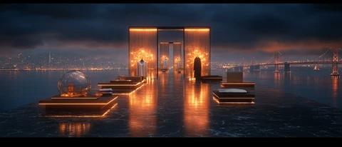
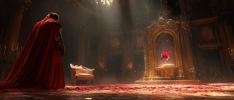
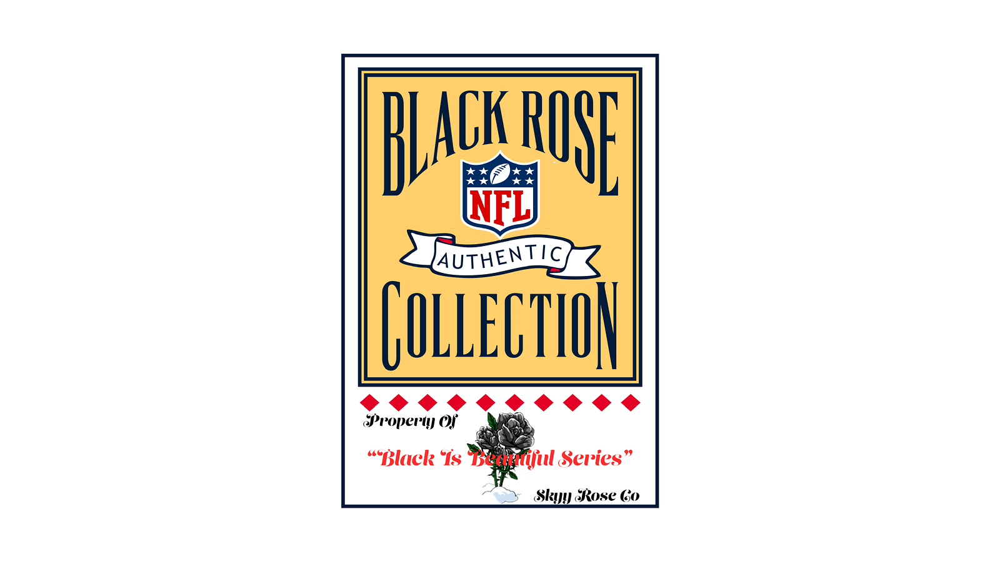
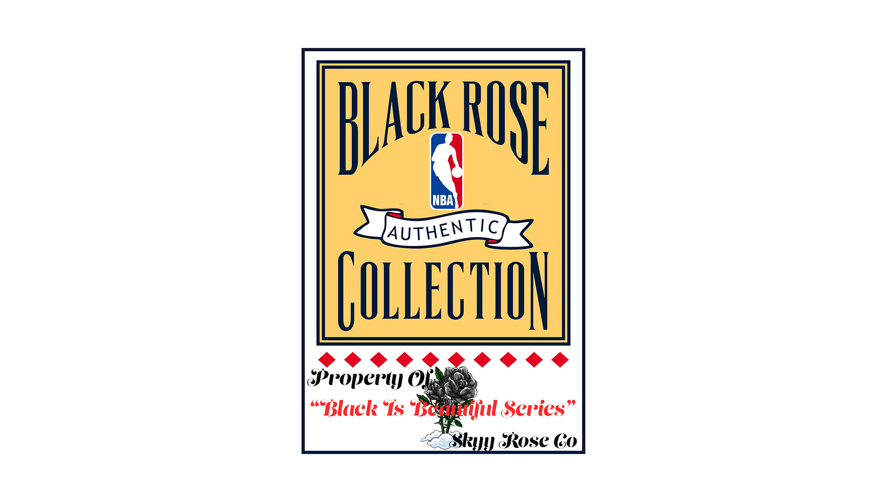
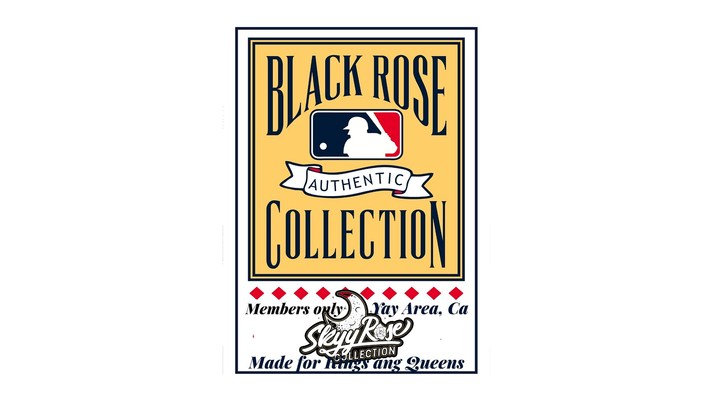
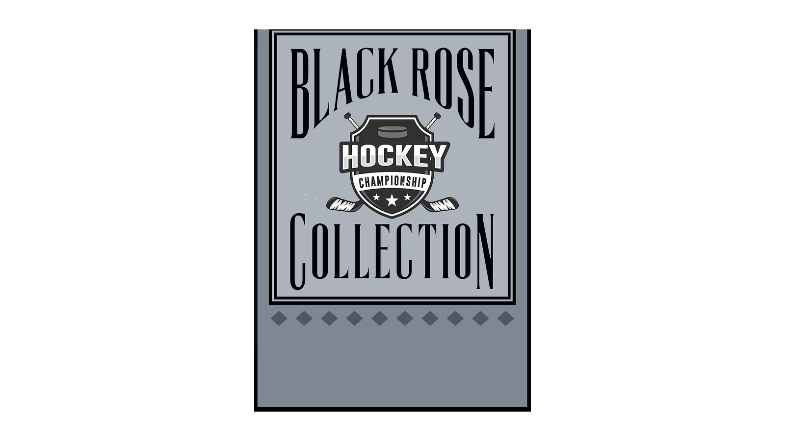
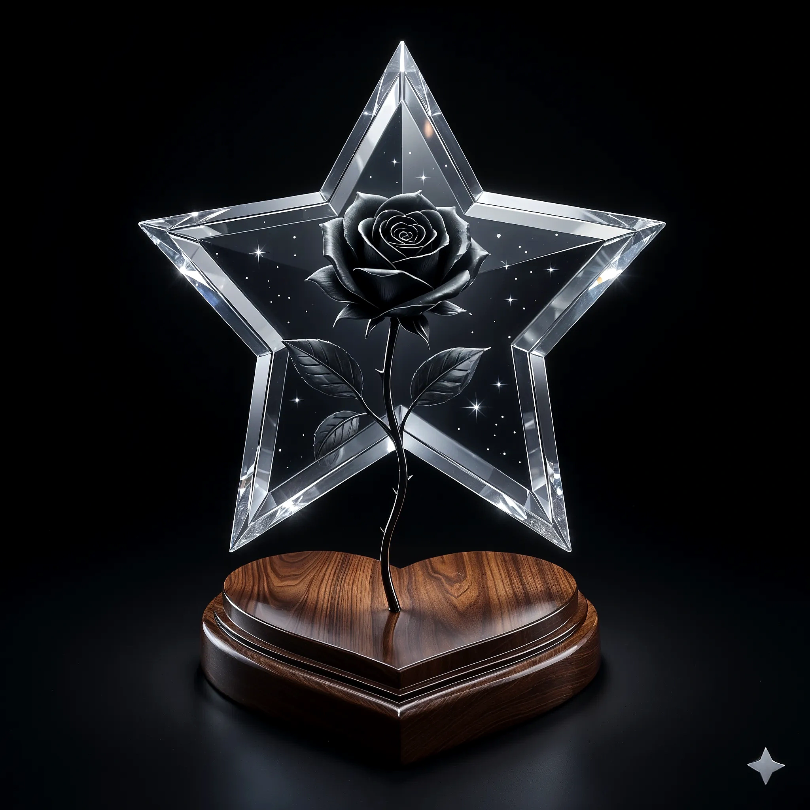
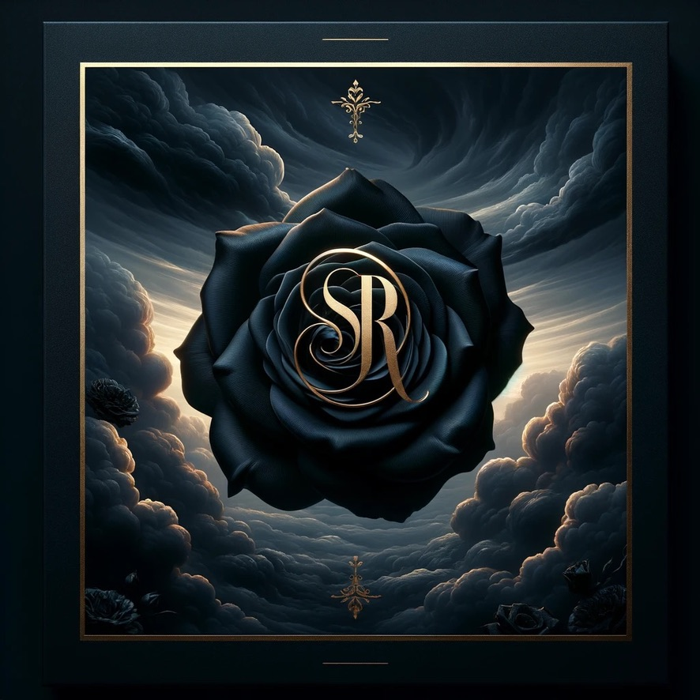
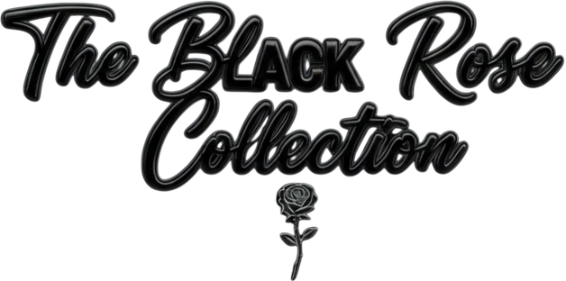

> SUPERSEDED 2026-07-10/11 — fonts now per SOT.md → typography.json (Archivo / Hanken Grotesk / Anton / Cinzel + bespoke collection name-scripts; zero-CDN self-hosted woff2). Font/CDN references below are historical.

# SkyyRose v2 Mockup Implementation Plan

> **For agentic workers:** REQUIRED SUB-SKILL: Use `superpowers:subagent-driven-development` (recommended) or `superpowers:executing-plans` to implement this plan task-by-task. Steps use checkbox (`- [ ]`) syntax for tracking.

**Goal:** Build a single self-contained HTML file (`docs/brand/design-mockups/v2.html`) that demonstrates the magazine-as-site visual direction for SkyyRose's homepage + Black Rose collection page, using real brand assets and the locked typography system.

**Architecture:** One HTML document, 8 vertical sections (Nav + 4 frames × 2 surfaces). Vanilla JS only (no build step, no npm). Fonts via Google Fonts `@import`. Photography + lockup overlays via relative paths into `wordpress-theme/skyyrose-flagship/assets/`. Motion via `IntersectionObserver` + `requestAnimationFrame` parallax with `prefers-reduced-motion` fallback.

**Tech Stack:** HTML5, CSS3 (custom properties, grid, `aspect-ratio`, `clamp()`), vanilla JS (IntersectionObserver, rAF), Google Fonts CDN (Cinzel / Italiana / Yellowtail / Pinyon Script / UnifrakturMaguntia / Playfair Display / Bebas Neue / Inter / Space Mono).

**Source spec:** `docs/superpowers/specs/2026-05-25-v2-mockup-design.md`

**Canon docs that gate every decision:**
- `docs/brand/visual-references.md` — The Five (Kith / Oaklandish / Culture Kings / FOG / Palm Angels)
- `docs/brand/collection-stories.md` — per-collection canon copy (verbatim founder lines)
- `~/.claude/projects/-Users-theceo-DevSkyy/memory/feedback_collection_lockup_assets.md` — hero titles are images, never type-rendered
- `~/.claude/projects/-Users-theceo-DevSkyy/memory/feedback_collection_canon_attribution.md` — never mix collection quotes

---

## File Structure

| File | Status | Responsibility |
|------|--------|----------------|
| `docs/brand/design-mockups/v2.html` | Create | Single deliverable — all 8 sections inline |
| `docs/brand/design-mockups/README.md` | Create | Pointer doc — what v2.html is, how to view it, links to spec + canon |
| `docs/brand/design-mockups/collection-designs.html` | Touch (banner only) | Add canon-supersession banner at top pointing at v2.html as the active direction |

## Task Index

| # | Task | Section of v2.html |
|---|------|-------------------|
| 1 | Scaffold + design tokens + font @import | head, :root |
| 2 | Navbar chrome | `<nav>` |
| 3 | Homepage Frame 01 — Cover | `<section id="home-cover">` |
| 4 | Homepage Frame 02 — Hero (Town Cinema) | `<section id="home-hero">` |
| 5 | Homepage Frame 03 — Voice | `<section id="home-voice">` |
| 6 | Homepage Frame 04 — Spread | `<section id="home-spread">` |
| 7 | Black Rose Frame 01 — Cover | `<section id="br-cover">` |
| 8 | Black Rose Frame 02 — Hero | `<section id="br-hero">` |
| 9 | Black Rose Frame 03 — Voice | `<section id="br-voice">` |
| 10 | Black Rose Frame 04 — Spread | `<section id="br-spread">` |
| 11 | Motion JS — reveal + parallax + reduced-motion | `<script>` |
| 12 | Mobile responsive pass | `@media` rules |
| 13 | README.md pointer + supersession banner | docs/brand/design-mockups/ |

---

## Task 1: Scaffold + design tokens + font @import

**Files:**
- Create: `docs/brand/design-mockups/v2.html`

- [ ] **Step 1: Create directory and scaffold v2.html with head, font imports, design tokens, base reset, and empty body shell**

```bash
mkdir -p /Users/theceo/DevSkyy/docs/brand/design-mockups
```

Write `/Users/theceo/DevSkyy/docs/brand/design-mockups/v2.html`:

```html
<!doctype html>
<html lang="en">
<head>
<meta charset="utf-8">
<meta name="viewport" content="width=device-width, initial-scale=1, viewport-fit=cover">
<meta name="theme-color" content="#0a0a0a">
<title>SkyyRose — v2 Design Reference</title>
<meta name="description" content="Magazine-as-site design reference for SkyyRose. Locked direction: Kith × Oaklandish × Culture Kings × Fear of God × Palm Angels. Not a production page.">

<!-- Fonts: Google CDN (production translation switches to self-hosted woff2 in assets/fonts/) -->
<link rel="preconnect" href="https://fonts.googleapis.com">
<link rel="preconnect" href="https://fonts.gstatic.com" crossorigin>
<style>
  @import url('https://fonts.googleapis.com/css2?family=Cinzel:wght@400;700&family=Italiana&family=Yellowtail&family=Pinyon+Script&family=UnifrakturMaguntia&family=Playfair+Display:ital,wght@0,400;0,700;1,400;1,700&family=Bebas+Neue&family=Inter:wght@300;400;500;600&family=Space+Mono:wght@400;700&display=swap');

  /* === Design tokens === */
  :root {
    /* Palette — verbatim from CLAUDE.md + design-tokens.css */
    --sr-dark: #0a0a0a;
    --sr-charcoal: #1c1c1c;
    --sr-smoke: #2d2d2d;
    --sr-rose-gold: #b76e79;
    --sr-rose-gold-rgb: 183, 110, 121;
    --sr-gold: #d4af37;
    --sr-silver: #c0c0c0;
    --sr-crimson: #dc143c;
    --sr-blood-red: #8b0000;
    --sr-white: #ffffff;

    /* Typography */
    --ff-masthead: 'Cinzel', 'Playfair Display', serif;
    --ff-display-br: 'Cinzel', serif;
    --ff-display-sig: 'Italiana', 'Playfair Display', serif;
    --ff-script-lh: 'Yellowtail', cursive;
    --ff-script-sig: 'Pinyon Script', cursive;
    --ff-gothic-br: 'UnifrakturMaguntia', serif;
    --ff-editorial: 'Bebas Neue', sans-serif;
    --ff-voice: 'Playfair Display', serif;
    --ff-meta: 'Space Mono', monospace;
    --ff-body: 'Inter', system-ui, sans-serif;

    /* Spacing scale */
    --space-1: 0.25rem;
    --space-2: 0.5rem;
    --space-3: 0.75rem;
    --space-4: 1rem;
    --space-6: 1.5rem;
    --space-8: 2rem;
    --space-12: 3rem;
    --space-16: 4rem;
    --space-24: 6rem;
    --space-32: 8rem;

    /* Motion */
    --ease-out: cubic-bezier(0.16, 1, 0.3, 1);
    --ease-in-out: cubic-bezier(0.65, 0, 0.35, 1);
    --dur-reveal: 0.8s;
    --dur-snappy: 0.25s;
  }

  /* === Reset === */
  *, *::before, *::after { box-sizing: border-box; }
  html, body { margin: 0; padding: 0; }
  html { background: var(--sr-dark); color: var(--sr-white); font-family: var(--ff-body); -webkit-font-smoothing: antialiased; }
  body { overflow-x: hidden; }
  img, picture { display: block; max-width: 100%; height: auto; }
  a { color: inherit; text-decoration: none; }
  button { font: inherit; color: inherit; background: none; border: none; cursor: pointer; padding: 0; }
  h1, h2, h3, h4, h5, h6, p { margin: 0; font-weight: 400; }

  /* === Section base === */
  .frame { position: relative; overflow: hidden; }
  .frame__inner { position: relative; max-width: 1440px; margin: 0 auto; padding: 0 var(--space-8); }

  /* === Reveal system (used by motion JS) === */
  .reveal { opacity: 0; transform: translateY(24px); transition: opacity var(--dur-reveal) var(--ease-out), transform var(--dur-reveal) var(--ease-out); }
  .reveal.is-visible { opacity: 1; transform: translateY(0); }
  .reveal--scale { transform: translateY(24px) scale(0.98); }
  .reveal--scale.is-visible { transform: translateY(0) scale(1); }

  @media (prefers-reduced-motion: reduce) {
    .reveal, .reveal--scale { opacity: 1 !important; transform: none !important; transition: none !important; }
    .parallax { transform: none !important; }
  }
</style>
</head>
<body>
<!-- Sections inserted in subsequent tasks -->
</body>
</html>
```

- [ ] **Step 2: Verify HTML5 validity**

Run:
```bash
cd /Users/theceo/DevSkyy && python3 -c "import html.parser; p = html.parser.HTMLParser(); p.feed(open('docs/brand/design-mockups/v2.html').read()); print('OK: parses')"
```

Expected: `OK: parses`

- [ ] **Step 3: Open in browser and verify dark background + custom fonts load**

```bash
open /Users/theceo/DevSkyy/docs/brand/design-mockups/v2.html
```

Expected: dark `#0a0a0a` page, no content yet, devtools Network shows Google Fonts CSS + woff2 requests succeed.

- [ ] **Step 4: Commit**

```bash
cd /Users/theceo/DevSkyy
git add docs/brand/design-mockups/v2.html
git commit -m "feat(v2-mockup): scaffold v2.html with design tokens + font @import"
```

---

## Task 2: Navbar chrome

**Files:**
- Modify: `docs/brand/design-mockups/v2.html` (body, append `<nav>` block before sections)

- [ ] **Step 1: Add navbar CSS to the `<style>` block before the closing `</style>` tag**

Append inside `<style>` (above the closing tag):

```css
/* === Navbar === */
.navbar {
  position: fixed;
  top: 0; left: 0; right: 0;
  z-index: 100;
  display: flex;
  justify-content: space-between;
  align-items: center;
  padding: var(--space-4) var(--space-8);
  background: linear-gradient(180deg, rgba(10,10,10,0.85), rgba(10,10,10,0));
  backdrop-filter: blur(8px);
}
.navbar__brand { display: flex; align-items: center; gap: var(--space-3); }
.navbar__brand img { width: 44px; height: 44px; }
.navbar__brand-text {
  font-family: var(--ff-masthead);
  font-weight: 700;
  font-size: 18px;
  letter-spacing: 0.12em;
}
.navbar__links {
  display: flex;
  gap: var(--space-6);
  font-family: var(--ff-meta);
  font-size: 11px;
  letter-spacing: 0.3em;
  text-transform: uppercase;
  color: rgba(255,255,255,0.8);
}
.navbar__links a:hover { color: var(--sr-rose-gold); }
```

- [ ] **Step 2: Add the `<nav>` markup after `<body>` opening tag**

```html
<nav class="navbar" aria-label="Primary">
  <a href="#home-cover" class="navbar__brand">
    
    <span class="navbar__brand-text">SKYY ROSE</span>
  </a>
  <div class="navbar__links">
    <a href="#home-spread">Collections</a>
    <a href="#br-cover">Black Rose</a>
    <a href="#home-voice">Story</a>
  </div>
</nav>
```

- [ ] **Step 3: Open in browser and verify monogram + nav render**

```bash
open /Users/theceo/DevSkyy/docs/brand/design-mockups/v2.html
```

Expected: fixed nav at top, rose-gold monogram (~44×44) on left + nav links on right, dark glass background blur.

- [ ] **Step 4: Commit**

```bash
cd /Users/theceo/DevSkyy
git add docs/brand/design-mockups/v2.html
git commit -m "feat(v2-mockup): add navbar chrome with brand-primary monogram"
```

---

## Task 3: Homepage Frame 01 — Cover

**Files:**
- Modify: `docs/brand/design-mockups/v2.html`

- [ ] **Step 1: Add cover CSS to the `<style>` block**

Append inside `<style>`:

```css
/* === Cover (F01) === */
.cover {
  min-height: 100vh;
  background: var(--sr-dark);
  position: relative;
  overflow: hidden;
}
.cover__photo {
  position: absolute; inset: 0;
  width: 100%; height: 100%;
  object-fit: cover;
  z-index: 1;
}
.cover__photo-shade {
  position: absolute; inset: 0;
  z-index: 2;
  background:
    linear-gradient(180deg, rgba(0,0,0,0.5) 0%, rgba(0,0,0,0) 22%, rgba(0,0,0,0) 60%, rgba(0,0,0,0.92) 100%);
}
.cover__masthead {
  position: absolute;
  top: calc(var(--space-16) + var(--space-4));
  left: var(--space-8); right: var(--space-8);
  z-index: 4;
  display: flex; justify-content: space-between; align-items: flex-start;
}
.cover__nameplate {
  font-family: var(--ff-masthead);
  font-weight: 700;
  font-size: clamp(56px, 8vw, 96px);
  letter-spacing: 0.05em;
  line-height: 1;
}
.cover__nameplate-rule {
  width: 100%; height: 1px;
  background: rgba(255,255,255,0.5);
  margin-top: var(--space-3);
}
.cover__meta {
  font-family: var(--ff-meta);
  font-size: 10px;
  letter-spacing: 0.4em;
  text-transform: uppercase;
  color: rgba(255,255,255,0.75);
  text-align: right;
  line-height: 1.8;
}
.cover__sr-graffiti {
  position: absolute;
  top: 38%; right: 14%;
  z-index: 5;
  font-family: var(--ff-voice);
  font-style: italic;
  font-weight: 700;
  font-size: clamp(64px, 9vw, 110px);
  color: var(--sr-rose-gold);
  text-shadow: 0 4px 16px rgba(0,0,0,0.55);
  transform: rotate(-7deg);
  pointer-events: none;
}
.cover__line {
  position: absolute;
  bottom: calc(var(--space-16) + var(--space-2));
  left: var(--space-8); right: var(--space-8);
  z-index: 4;
  display: flex;
  align-items: flex-end;
  justify-content: space-between;
  gap: var(--space-8);
}
.cover__tagline {
  font-family: var(--ff-editorial);
  font-size: clamp(36px, 5vw, 64px);
  line-height: 1;
  letter-spacing: 0.04em;
  max-width: 60%;
}
.cover__tagline em {
  font-style: normal;
  color: var(--sr-rose-gold);
}
.cover__byline {
  font-family: var(--ff-body);
  font-size: 11px;
  letter-spacing: 0.3em;
  text-transform: uppercase;
  color: rgba(255,255,255,0.7);
  margin-top: var(--space-2);
}
.cover__barcode { display: flex; flex-direction: column; align-items: flex-end; gap: var(--space-2); }
.cover__bars { display: flex; gap: 1px; }
.cover__bars span {
  display: inline-block;
  width: 1px; height: 28px;
  background: var(--sr-white);
}
.cover__bars span:nth-child(3n) { width: 2px; }
.cover__bars span:nth-child(7n) { width: 3px; }
.cover__drop {
  font-family: var(--ff-meta);
  font-size: 10px;
  letter-spacing: 0.25em;
  text-transform: uppercase;
  color: rgba(255,255,255,0.7);
}
```

- [ ] **Step 2: Add the Frame 01 markup right after the `</nav>` closing tag**

```html
<section id="home-cover" class="frame cover" aria-labelledby="home-cover-title">
  <picture>
    <source srcset="../../../wordpress-theme/skyyrose-flagship/assets/branding/hero/forbidden-midnight-1680w.webp" media="(min-width: 1281px)" type="image/webp">
    <source srcset="../../../wordpress-theme/skyyrose-flagship/assets/branding/hero/forbidden-midnight-1280w.webp" media="(min-width: 769px)" type="image/webp">
    <source srcset="../../../wordpress-theme/skyyrose-flagship/assets/branding/hero/forbidden-midnight-768w.webp" media="(min-width: 481px)" type="image/webp">
    
  </picture>
  <div class="cover__photo-shade"></div>

  <header class="cover__masthead reveal">
    <h1 id="home-cover-title" class="cover__nameplate">SKYY ROSE<div class="cover__nameplate-rule" aria-hidden="true"></div></h1>
    <p class="cover__meta">VOL. IV<br>S/S 2026<br>THE TOWN · DROP 01</p>
  </header>

  <p class="cover__sr-graffiti reveal reveal--scale" aria-hidden="true">SR</p>

  <footer class="cover__line reveal">
    <div>
      <p class="cover__tagline">Luxury Grows<br>from <em>Concrete.</em></p>
      <p class="cover__byline">By Corey Foster · Oakland · 2026</p>
    </div>
    <div class="cover__barcode" aria-hidden="true">
      <div class="cover__bars">
        <span></span><span></span><span></span><span></span><span></span><span></span><span></span>
        <span></span><span></span><span></span><span></span><span></span><span></span><span></span>
        <span></span><span></span><span></span><span></span><span></span><span></span><span></span>
      </div>
      <p class="cover__drop">03 · 26 · DROP 01</p>
    </div>
  </footer>
</section>
```

- [ ] **Step 3: Open in browser, verify cover renders**

```bash
open /Users/theceo/DevSkyy/docs/brand/design-mockups/v2.html
```

Expected: fullbleed photo, "SKYY ROSE" Cinzel masthead top-left, meta block top-right, large rose-gold "SR" italic at upper-right rotated, tagline + by-line bottom-left, barcode + drop bottom-right.

- [ ] **Step 4: Verify the photo asset path resolves (no broken image)**

In browser devtools → Network → confirm `forbidden-midnight-*.webp` returned 200 with image MIME type. If 404, path resolution wrong — investigate.

- [ ] **Step 5: Commit**

```bash
cd /Users/theceo/DevSkyy
git add docs/brand/design-mockups/v2.html
git commit -m "feat(v2-mockup): F01 homepage cover with masthead + tagline + barcode"
```

---

## Task 4: Homepage Frame 02 — Hero (Town Cinema)

**Files:**
- Modify: `docs/brand/design-mockups/v2.html`

- [ ] **Step 1: Add hero CSS**

Append inside `<style>`:

```css
/* === Hero (F02) === */
.hero {
  min-height: 100vh;
  background: var(--sr-dark);
  position: relative;
  overflow: hidden;
  display: flex;
  align-items: center;
}
.hero__bg-wrap {
  position: absolute; inset: 0;
  z-index: 1;
  overflow: hidden;
}
.hero__bg {
  position: absolute;
  top: -10%; left: 0;
  width: 100%; height: 120%;
  object-fit: cover;
  will-change: transform;
}
.hero__bg-shade {
  position: absolute; inset: 0;
  z-index: 2;
  background:
    linear-gradient(180deg, rgba(0,0,0,0.55) 0%, rgba(0,0,0,0.05) 30%, rgba(0,0,0,0.05) 60%, rgba(0,0,0,0.85) 100%);
}
.hero__inner {
  position: relative;
  z-index: 3;
  width: 100%;
  max-width: 1440px;
  margin: 0 auto;
  padding: var(--space-24) var(--space-8);
  display: flex;
  flex-direction: column;
  justify-content: space-between;
  min-height: 100vh;
  box-sizing: border-box;
}
.hero__kicker {
  font-family: var(--ff-meta);
  font-size: 10px;
  letter-spacing: 0.5em;
  text-transform: uppercase;
  color: rgba(255,255,255,0.7);
}
.hero__lockup {
  display: flex;
  justify-content: center;
  margin: var(--space-12) 0;
}
.hero__lockup img {
  width: clamp(280px, 50vw, 720px);
  height: auto;
  filter: drop-shadow(0 6px 24px rgba(0,0,0,0.6));
  transition: transform var(--dur-reveal) var(--ease-out);
}
.hero__lockup.is-visible img { transform: scale(1.03); }
.hero__subtitle {
  font-family: var(--ff-meta);
  font-size: 11px;
  letter-spacing: 0.4em;
  text-transform: uppercase;
  text-align: center;
  color: rgba(255,255,255,0.75);
}
.hero__bottom {
  display: flex; justify-content: space-between;
  gap: var(--space-8);
  font-family: var(--ff-meta);
  font-size: 10px;
  letter-spacing: 0.3em;
  text-transform: uppercase;
  color: rgba(255,255,255,0.7);
  padding-top: var(--space-4);
  border-top: 1px solid rgba(255,255,255,0.2);
}
```

- [ ] **Step 2: Add hero markup after the Frame 01 `</section>`**

```html
<section id="home-hero" class="frame hero" aria-labelledby="home-hero-title">
  <div class="hero__bg-wrap">
    <picture>
      <source srcset="../../../wordpress-theme/skyyrose-flagship/assets/branding/hero/luxury-nighttime-1680w.webp" media="(min-width: 1281px)" type="image/webp">
      <source srcset="../../../wordpress-theme/skyyrose-flagship/assets/branding/hero/luxury-nighttime-1280w.webp" media="(min-width: 769px)" type="image/webp">
      <source srcset="../../../wordpress-theme/skyyrose-flagship/assets/branding/hero/luxury-nighttime-768w.webp" media="(min-width: 481px)" type="image/webp">
      
    </picture>
  </div>
  <div class="hero__bg-shade"></div>

  <div class="hero__inner">
    <p id="home-hero-title" class="hero__kicker reveal">For The Town</p>

    <div class="hero__lockup reveal reveal--scale">
      <picture>
        <source srcset="../../../wordpress-theme/skyyrose-flagship/assets/images/hero-overlays/br-brand-script.avif" type="image/avif">
        <source srcset="../../../wordpress-theme/skyyrose-flagship/assets/images/hero-overlays/br-brand-script.webp" type="image/webp">
        
      </picture>
    </div>

    <p class="hero__subtitle reveal">Spring Drop · 2026 · Drop 01</p>

    <footer class="hero__bottom reveal">
      <span>Photographed in East Oakland</span>
      <span>14 looks · 4 collections · one town</span>
    </footer>
  </div>
</section>
```

- [ ] **Step 3: Open in browser, verify**

```bash
open /Users/theceo/DevSkyy/docs/brand/design-mockups/v2.html
```

Expected: hero photo background; "For The Town" kicker top; large `br-brand-script` lockup centered; subtitle below; bottom bar with two-column meta + 1px top rule.

- [ ] **Step 4: Verify hero overlay asset loads (no broken image)**

Devtools → Network → confirm `br-brand-script.{avif,webp,png}` returns 200.

- [ ] **Step 5: Commit**

```bash
cd /Users/theceo/DevSkyy
git add docs/brand/design-mockups/v2.html
git commit -m "feat(v2-mockup): F02 hero with luxury-nighttime photo + br-brand-script lockup overlay"
```

---

## Task 5: Homepage Frame 03 — Voice

**Files:**
- Modify: `docs/brand/design-mockups/v2.html`

- [ ] **Step 1: Add voice CSS**

```css
/* === Voice (F03) === */
.voice {
  min-height: 90vh;
  background: var(--sr-dark);
  position: relative;
  overflow: hidden;
  display: flex;
  align-items: center;
  justify-content: center;
}
.voice::before {
  content: '';
  position: absolute; inset: 0;
  background:
    radial-gradient(ellipse at 50% 100%, rgba(var(--sr-rose-gold-rgb), 0.12) 0%, transparent 50%),
    radial-gradient(ellipse at 50% 0%, rgba(212, 175, 55, 0.08) 0%, transparent 45%);
  z-index: 1;
}
.voice__inner {
  position: relative;
  z-index: 2;
  text-align: center;
  padding: var(--space-16) var(--space-8);
  max-width: 1100px;
}
.voice__quote {
  font-family: var(--ff-voice);
  font-style: italic;
  font-size: clamp(36px, 6vw, 72px);
  line-height: 1.1;
}
.voice__quote span { display: block; }
.voice__quote .line-2 {
  font-weight: 700;
  color: var(--sr-rose-gold);
  text-shadow: 0 0 24px rgba(var(--sr-rose-gold-rgb), 0.3);
  margin: var(--space-2) 0;
}
.voice__quote .line { transition: opacity 0.6s var(--ease-out) var(--delay, 0s), transform 0.6s var(--ease-out) var(--delay, 0s); }
.voice__attribution {
  font-family: var(--ff-meta);
  font-size: 11px;
  letter-spacing: 0.5em;
  text-transform: uppercase;
  color: rgba(212, 175, 55, 0.75);
  margin-top: var(--space-12);
  padding-top: var(--space-4);
  border-top: 1px solid rgba(212, 175, 55, 0.25);
  display: inline-block;
  padding-left: var(--space-12);
  padding-right: var(--space-12);
}
```

- [ ] **Step 2: Add voice markup after Frame 02**

```html
<section id="home-voice" class="frame voice" aria-labelledby="home-voice-title">
  <div class="voice__inner">
    <blockquote class="voice__quote" id="home-voice-title">
      <span class="line line-1 reveal" style="--delay: 0s;">Named after</span>
      <span class="line line-2 reveal" style="--delay: 0.18s;">a daughter.</span>
      <span class="line line-3 reveal" style="--delay: 0.36s;">Built by a father.</span>
    </blockquote>
    <p class="voice__attribution reveal" style="--delay: 0.6s;">Corey Foster · The Town</p>
  </div>
</section>
```

- [ ] **Step 3: Open in browser, verify**

Expected: centered 3-line italic quote, middle line in rose-gold with glow, attribution under thin gold rule.

- [ ] **Step 4: Commit**

```bash
cd /Users/theceo/DevSkyy
git add docs/brand/design-mockups/v2.html
git commit -m "feat(v2-mockup): F03 voice frame with founder origin quote"
```

---

## Task 6: Homepage Frame 04 — Spread

**Files:**
- Modify: `docs/brand/design-mockups/v2.html`

- [ ] **Step 1: Add spread CSS**

```css
/* === Spread (F04) === */
.spread {
  background: var(--sr-dark);
  padding: var(--space-24) var(--space-8) var(--space-32);
  position: relative;
}
.spread__title-row {
  display: flex;
  align-items: baseline;
  gap: var(--space-6);
  margin-bottom: var(--space-12);
}
.spread__title {
  font-family: var(--ff-editorial);
  font-size: clamp(24px, 3vw, 42px);
  letter-spacing: 0.18em;
  color: var(--sr-gold);
}
.spread__page-marker {
  font-family: var(--ff-meta);
  font-size: 10px;
  letter-spacing: 0.3em;
  text-transform: uppercase;
  color: rgba(255,255,255,0.5);
}
.spread__grid {
  display: grid;
  grid-template-columns: 1.4fr 1fr 1fr;
  gap: var(--space-4);
  aspect-ratio: 16 / 9;
  max-height: 80vh;
}
.spread__tile {
  position: relative;
  overflow: hidden;
  background: var(--sr-charcoal);
  transition: transform var(--dur-snappy) var(--ease-out), box-shadow var(--dur-snappy) var(--ease-out);
  cursor: pointer;
}
.spread__tile:hover {
  transform: scale(1.015);
  box-shadow: 0 0 0 2px rgba(var(--sr-rose-gold-rgb), 0.5);
}
.spread__tile--lg { grid-row: 1 / 3; }
.spread__tile-img {
  width: 100%; height: 100%;
  object-fit: cover;
  opacity: 0.85;
  transition: opacity var(--dur-snappy);
}
.spread__tile:hover .spread__tile-img { opacity: 1; }
.spread__tile-overlay {
  position: absolute;
  inset: 0;
  background: linear-gradient(180deg, transparent 50%, rgba(0,0,0,0.85) 100%);
  display: flex;
  flex-direction: column;
  justify-content: flex-end;
  padding: var(--space-6);
  z-index: 2;
}
.spread__tile-label {
  font-family: var(--ff-meta);
  font-size: 10px;
  letter-spacing: 0.4em;
  text-transform: uppercase;
  color: var(--sr-rose-gold);
  margin-bottom: var(--space-1);
}
.spread__tile-name {
  font-family: var(--ff-editorial);
  font-size: clamp(20px, 2vw, 28px);
  letter-spacing: 0.08em;
}
```

- [ ] **Step 2: Add spread markup after Frame 03**

```html
<section id="home-spread" class="frame spread" aria-labelledby="home-spread-title">
  <header class="spread__title-row reveal">
    <h2 id="home-spread-title" class="spread__title">THE COLLECTIONS</h2>
    <p class="spread__page-marker">PG 04—05 · Black Rose · Love Hurts · Signature · Kids</p>
  </header>
  <div class="spread__grid">
    <a class="spread__tile spread__tile--lg reveal" href="#br-cover" style="--delay: 0s;">
      
      <div class="spread__tile-overlay">
        <span class="spread__tile-label">Collection 02</span>
        <p class="spread__tile-name">BLACK ROSE</p>
      </div>
    </a>
    <a class="spread__tile reveal" href="#" style="--delay: 0.12s;">
      
      <div class="spread__tile-overlay">
        <span class="spread__tile-label">Collection 03</span>
        <p class="spread__tile-name">LOVE HURTS</p>
      </div>
    </a>
    <a class="spread__tile reveal" href="#" style="--delay: 0.24s;">
      
      <div class="spread__tile-overlay">
        <span class="spread__tile-label">Collection 01</span>
        <p class="spread__tile-name">SIGNATURE</p>
      </div>
    </a>
    <a class="spread__tile reveal" href="#" style="--delay: 0.36s;">
      
      <div class="spread__tile-overlay">
        <span class="spread__tile-label">Collection 04</span>
        <p class="spread__tile-name">KIDS CAPSULE</p>
      </div>
    </a>
  </div>
</section>
```

- [ ] **Step 3: Open in browser, verify**

Expected: 4-tile grid (1 large left + 3 stacked right or 1×3), each tile shows collection logo image + label + name overlay. Hover scales tile + rose-gold border.

- [ ] **Step 4: Commit**

```bash
cd /Users/theceo/DevSkyy
git add docs/brand/design-mockups/v2.html
git commit -m "feat(v2-mockup): F04 collection spread with 4-tile grid"
```

---

## Task 7: Black Rose Frame 01 — Cover

**Files:**
- Modify: `docs/brand/design-mockups/v2.html`

- [ ] **Step 1: Add Black Rose page divider class to CSS (one rule)**

```css
/* === Black Rose page anchor === */
.br-page { background: var(--sr-dark); }
```

- [ ] **Step 2: Add BR cover after the homepage spread section**

```html
<div class="br-page">
<section id="br-cover" class="frame cover" aria-labelledby="br-cover-title">
  <picture>
    <source srcset="../../../wordpress-theme/skyyrose-flagship/assets/branding/hero/beauty-and-beast-1680w.webp" media="(min-width: 1281px)" type="image/webp">
    <source srcset="../../../wordpress-theme/skyyrose-flagship/assets/branding/hero/beauty-and-beast-1280w.webp" media="(min-width: 769px)" type="image/webp">
    <source srcset="../../../wordpress-theme/skyyrose-flagship/assets/branding/hero/beauty-and-beast-768w.webp" media="(min-width: 481px)" type="image/webp">
    
  </picture>
  <div class="cover__photo-shade"></div>

  <header class="cover__masthead reveal">
    <h1 id="br-cover-title" class="cover__nameplate">BLACK ROSE<div class="cover__nameplate-rule" aria-hidden="true"></div></h1>
    <p class="cover__meta">A SKYY ROSE<br>COLLECTION<br>VOL. IV · S/S 2026</p>
  </header>

  <p class="cover__sr-graffiti reveal reveal--scale" aria-hidden="true">SR</p>

  <footer class="cover__line reveal">
    <div>
      <p class="cover__tagline">Built for those who move through<br><em>darkness like it's home.</em></p>
      <p class="cover__byline">By Corey Foster · The Town · 2026</p>
    </div>
    <div class="cover__barcode" aria-hidden="true">
      <div class="cover__bars">
        <span></span><span></span><span></span><span></span><span></span><span></span><span></span>
        <span></span><span></span><span></span><span></span><span></span><span></span><span></span>
        <span></span><span></span><span></span><span></span><span></span><span></span><span></span>
      </div>
      <p class="cover__drop">02 · Black Rose · Drop 01</p>
    </div>
  </footer>
</section>
```

- [ ] **Step 3: Open in browser, scroll to BR section, verify**

Expected: "BLACK ROSE" Cinzel masthead, different cover photo (`beauty-and-beast`), BR-specific tagline "Built for those who move through / darkness like it's home." (verbatim from `docs/brand/collection-stories.md`).

- [ ] **Step 4: Commit**

```bash
cd /Users/theceo/DevSkyy
git add docs/brand/design-mockups/v2.html
git commit -m "feat(v2-mockup): BR F01 cover with collection masthead + BR-canon tagline"
```

---

## Task 8: Black Rose Frame 02 — Hero

**Files:**
- Modify: `docs/brand/design-mockups/v2.html`

- [ ] **Step 1: Add BR-specific hero CSS for the sport patches macro inset**

```css
/* === BR hero sport patches === */
.hero__patches {
  display: flex;
  gap: var(--space-4);
  justify-content: center;
  margin-top: var(--space-6);
  flex-wrap: wrap;
}
.hero__patch {
  width: 64px; height: 64px;
  object-fit: contain;
  filter: drop-shadow(0 4px 12px rgba(0,0,0,0.5));
  opacity: 0.9;
}
```

- [ ] **Step 2: Add BR hero markup after BR F01**

```html
<section id="br-hero" class="frame hero" aria-labelledby="br-hero-title">
  <div class="hero__bg-wrap">
    <picture>
      <source srcset="../../../wordpress-theme/skyyrose-flagship/assets/branding/hero/forbidden-midnight-1680w.webp" media="(min-width: 1281px)" type="image/webp">
      <source srcset="../../../wordpress-theme/skyyrose-flagship/assets/branding/hero/forbidden-midnight-1280w.webp" media="(min-width: 769px)" type="image/webp">
      <source srcset="../../../wordpress-theme/skyyrose-flagship/assets/branding/hero/forbidden-midnight-768w.webp" media="(min-width: 481px)" type="image/webp">
      
    </picture>
  </div>
  <div class="hero__bg-shade"></div>

  <div class="hero__inner">
    <p id="br-hero-title" class="hero__kicker reveal">A black rose is a posture</p>

    <div class="hero__lockup reveal reveal--scale">
      <picture>
        <source srcset="../../../wordpress-theme/skyyrose-flagship/assets/images/hero-overlays/br-brand-script.avif" type="image/avif">
        <source srcset="../../../wordpress-theme/skyyrose-flagship/assets/images/hero-overlays/br-brand-script.webp" type="image/webp">
        
      </picture>
    </div>

    <p class="hero__subtitle reveal">Vol. IV · Spring 2026 · The Town</p>

    <div class="hero__patches reveal" aria-label="Black Rose sport patches">
      <picture><source srcset="../../../wordpress-theme/skyyrose-flagship/assets/images/hero-overlays/br-patch-nfl-football.webp" type="image/webp"></picture>
      <picture><source srcset="../../../wordpress-theme/skyyrose-flagship/assets/images/hero-overlays/br-patch-nba-basketball.webp" type="image/webp"></picture>
      <picture><source srcset="../../../wordpress-theme/skyyrose-flagship/assets/images/hero-overlays/br-patch-mlb-baseball.webp" type="image/webp"></picture>
      <picture><source srcset="../../../wordpress-theme/skyyrose-flagship/assets/images/hero-overlays/br-patch-hockey.webp" type="image/webp"></picture>
    </div>

    <footer class="hero__bottom reveal">
      <span>Sport Patch Series · Authentic</span>
      <span>NFL · NBA · MLB · Hockey</span>
    </footer>
  </div>
</section>
```

- [ ] **Step 3: Open in browser, verify**

Expected: BR hero with the same brand-script lockup at center, kicker quotes BR origin canon, 4 sport patches in a row beneath the lockup.

- [ ] **Step 4: Commit**

```bash
cd /Users/theceo/DevSkyy
git add docs/brand/design-mockups/v2.html
git commit -m "feat(v2-mockup): BR F02 hero with lockup + sport patches macro inset"
```

---

## Task 9: Black Rose Frame 03 — Voice

**Files:**
- Modify: `docs/brand/design-mockups/v2.html`

- [ ] **Step 1: Add BR voice markup after BR F02**

```html
<section id="br-voice" class="frame voice" aria-labelledby="br-voice-title">
  <div class="voice__inner">
    <blockquote class="voice__quote" id="br-voice-title">
      <span class="line line-1 reveal" style="--delay: 0s;">You wear it</span>
      <span class="line line-2 reveal" style="--delay: 0.18s;">because you</span>
      <span class="line line-3 reveal" style="--delay: 0.36s;">already stood up.</span>
    </blockquote>
    <p class="voice__attribution reveal" style="--delay: 0.6s;">Black Rose · The Town · 2026</p>
  </div>
</section>
```

Note: line is from `docs/brand/collection-stories.md` → Black Rose Story Tagline, verbatim founder-locked. Do NOT swap for any other quote.

- [ ] **Step 2: Open in browser, verify**

Expected: same voice frame layout as homepage voice, three-line BR-specific quote with middle line "because you" in rose-gold.

- [ ] **Step 3: Commit**

```bash
cd /Users/theceo/DevSkyy
git add docs/brand/design-mockups/v2.html
git commit -m "feat(v2-mockup): BR F03 voice frame with BR-canon story tagline"
```

---

## Task 10: Black Rose Frame 04 — Spread

**Files:**
- Modify: `docs/brand/design-mockups/v2.html`

- [ ] **Step 1: Add BR spread CSS for product-tile variant**

```css
/* === BR product spread === */
.br-spread { grid-template-columns: repeat(4, 1fr); }
.br-spread .spread__tile { grid-row: auto; aspect-ratio: 3 / 4; }
.br-spread .spread__tile-name { font-size: 16px; letter-spacing: 0.06em; }
.br-spread .spread__tile-label { font-size: 9px; }
```

- [ ] **Step 2: Add BR spread markup after BR F03 (close `</div>` for `.br-page` after this section)**

The 4 product slots use Black Rose SKUs from `data/skyyrose-catalog.csv`: br-001 (Crewneck), br-004 (Hoodie), br-005 (Hoodie Signature), br-008 (Football Jersey Red).

```html
<section id="br-spread" class="frame spread" aria-labelledby="br-spread-title">
  <header class="spread__title-row reveal">
    <h2 id="br-spread-title" class="spread__title">THE LINEUP</h2>
    <p class="spread__page-marker">PG 06—07 · Spring Drop 01 · 4 looks</p>
  </header>
  <div class="spread__grid br-spread">
    <a class="spread__tile reveal" href="#" style="--delay: 0s;">
      
      <div class="spread__tile-overlay">
        <span class="spread__tile-label">br-001 · $180</span>
        <p class="spread__tile-name">BLACK ROSE CREWNECK</p>
      </div>
    </a>
    <a class="spread__tile reveal" href="#" style="--delay: 0.12s;">
      
      <div class="spread__tile-overlay">
        <span class="spread__tile-label">br-004 · $240</span>
        <p class="spread__tile-name">BLACK ROSE HOODIE</p>
      </div>
    </a>
    <a class="spread__tile reveal" href="#" style="--delay: 0.24s;">
      
      <div class="spread__tile-overlay">
        <span class="spread__tile-label">br-005 · $320</span>
        <p class="spread__tile-name">SIGNATURE HOODIE</p>
      </div>
    </a>
    <a class="spread__tile reveal" href="#" style="--delay: 0.36s;">
      
      <div class="spread__tile-overlay">
        <span class="spread__tile-label">br-008 · $260</span>
        <p class="spread__tile-name">SF FOOTBALL JERSEY</p>
      </div>
    </a>
  </div>
</section>
</div><!-- /.br-page -->
```

- [ ] **Step 3: Open in browser, verify**

Expected: 4-up product grid, each tile shows BR asset + SKU/price + product name. Hover scales + rose-gold border.

- [ ] **Step 4: Commit**

```bash
cd /Users/theceo/DevSkyy
git add docs/brand/design-mockups/v2.html
git commit -m "feat(v2-mockup): BR F04 product spread with 4 BR SKU tiles"
```

---

## Task 11: Motion JS — reveal + parallax + reduced-motion

**Files:**
- Modify: `docs/brand/design-mockups/v2.html`

- [ ] **Step 1: Add the `<script>` block right before `</body>`**

```html
<script>
(function () {
  'use strict';

  var prefersReduced = window.matchMedia('(prefers-reduced-motion: reduce)').matches;

  // === Reveal on scroll ===
  if ('IntersectionObserver' in window && !prefersReduced) {
    var revealObserver = new IntersectionObserver(function (entries) {
      entries.forEach(function (entry) {
        if (entry.isIntersecting) {
          entry.target.classList.add('is-visible');
          revealObserver.unobserve(entry.target);
        }
      });
    }, { threshold: 0.12, rootMargin: '0px 0px -40px 0px' });

    document.querySelectorAll('.reveal').forEach(function (el) {
      revealObserver.observe(el);
    });

    // Above-fold immediate reveal (rAF-deferred so first paint is fast)
    requestAnimationFrame(function () {
      var vh = window.innerHeight || document.documentElement.clientHeight;
      document.querySelectorAll('.reveal').forEach(function (el) {
        var rect = el.getBoundingClientRect();
        if (rect.top < vh && rect.bottom > 0) {
          el.classList.add('is-visible');
          revealObserver.unobserve(el);
        }
      });
    });
  } else {
    // Reduced motion OR no IntersectionObserver support — force all visible
    document.querySelectorAll('.reveal').forEach(function (el) {
      el.classList.add('is-visible');
    });
  }

  // === Parallax backgrounds ===
  if (!prefersReduced) {
    var parallaxNodes = document.querySelectorAll('.parallax');
    if (parallaxNodes.length) {
      var ticking = false;
      function onScroll() {
        if (!ticking) {
          requestAnimationFrame(function () {
            parallaxNodes.forEach(function (node) {
              var rect = node.getBoundingClientRect();
              var speed = parseFloat(node.getAttribute('data-parallax-speed')) || 0.6;
              var center = rect.top + rect.height / 2;
              var viewportCenter = (window.innerHeight || document.documentElement.clientHeight) / 2;
              var offset = (viewportCenter - center) * (1 - speed);
              node.style.transform = 'translate3d(0, ' + offset.toFixed(2) + 'px, 0)';
            });
            ticking = false;
          });
          ticking = true;
        }
      }
      window.addEventListener('scroll', onScroll, { passive: true });
      onScroll();
    }
  }
})();
</script>
```

- [ ] **Step 2: Open in browser, scroll through the page**

Expected:
- Each section's `.reveal` elements fade-translate-up on scroll-into-view.
- Voice quote lines stagger.
- Hero photos parallax-scroll at 0.6x.
- DevTools console: no errors.

- [ ] **Step 3: Test reduced-motion**

In DevTools → Rendering → Emulate CSS media feature `prefers-reduced-motion: reduce`. Reload. Verify all elements appear immediately, no parallax, no transitions.

- [ ] **Step 4: Commit**

```bash
cd /Users/theceo/DevSkyy
git add docs/brand/design-mockups/v2.html
git commit -m "feat(v2-mockup): motion JS — IntersectionObserver reveal + rAF parallax + prefers-reduced-motion fallback"
```

---

## Task 12: Mobile responsive pass

**Files:**
- Modify: `docs/brand/design-mockups/v2.html`

- [ ] **Step 1: Add responsive `@media` rules at the end of the `<style>` block**

```css
/* === Mobile / tablet === */
@media (max-width: 1024px) {
  .navbar { padding: var(--space-3) var(--space-4); }
  .frame__inner { padding: 0 var(--space-4); }
  .cover__masthead, .cover__line { left: var(--space-4); right: var(--space-4); }
  .hero__inner { padding: var(--space-16) var(--space-4); }
  .spread { padding: var(--space-16) var(--space-4) var(--space-24); }
  .spread__grid { grid-template-columns: 1.4fr 1fr; aspect-ratio: 4 / 5; }
  .spread__tile--lg { grid-row: 1 / 3; }
  .br-spread { grid-template-columns: repeat(2, 1fr); }
}

@media (max-width: 640px) {
  .navbar__links { gap: var(--space-3); font-size: 10px; letter-spacing: 0.2em; }
  .navbar__brand-text { font-size: 14px; }
  .navbar__brand img { width: 36px; height: 36px; }

  .cover__masthead { flex-direction: column; gap: var(--space-3); }
  .cover__meta { text-align: left; }
  .cover__sr-graffiti { font-size: 56px; right: 8%; top: 32%; }
  .cover__line { flex-direction: column; align-items: flex-start; gap: var(--space-4); }
  .cover__barcode { align-items: flex-start; }

  .hero__lockup img { width: 75vw; }
  .hero__bottom { flex-direction: column; gap: var(--space-2); }

  .voice__quote { font-size: 36px; }

  .spread__grid { grid-template-columns: 1fr; aspect-ratio: auto; max-height: none; }
  .spread__tile { aspect-ratio: 4 / 5; }
  .spread__tile--lg { grid-row: auto; }
  .br-spread { grid-template-columns: 1fr 1fr; }

  /* No parallax on mobile — perf */
  .parallax { transform: none !important; }
}
```

- [ ] **Step 2: Open in browser, resize / use DevTools device mode**

Test at 1440px, 1024px, 768px, 480px, 375px.

Expected:
- At 1024px: hero photos still fullbleed, masthead/cover line padding tightens.
- At 640px: masthead stacks vertical, voice quote downsizes, spread collapses to single-column.
- At 375px: still legible, no horizontal scroll.

- [ ] **Step 3: Commit**

```bash
cd /Users/theceo/DevSkyy
git add docs/brand/design-mockups/v2.html
git commit -m "feat(v2-mockup): responsive breakpoints — 1024px tablet, 640px mobile"
```

---

## Task 13: README.md pointer + supersession banner on v1

**Files:**
- Create: `docs/brand/design-mockups/README.md`
- Modify: `docs/brand/design-mockups/collection-designs.html` (add banner at top)

- [ ] **Step 1: Write README.md**

Write `/Users/theceo/DevSkyy/docs/brand/design-mockups/README.md`:

```markdown
# Design Mockups

Static HTML design references. Not production code. Standalone, self-contained, no build step.

## Files

| File | Status | Purpose |
|------|--------|---------|
| [`v2.html`](./v2.html) | **Active 2026-05-25** | Magazine-as-site direction. Locked by founder. See `docs/superpowers/specs/2026-05-25-v2-mockup-design.md` for the spec; `docs/brand/visual-references.md` for The Five canonical references it pulls from. |
| [`collection-designs.html`](./collection-designs.html) | Superseded | First-pass v1 design from earlier session. Kept for historical reference. Visual direction did not survive the brand-canon recalibration. |

## How to view

Open `v2.html` directly in a modern browser (Chrome / Firefox / Safari). All assets resolve via relative paths into `../../../wordpress-theme/skyyrose-flagship/assets/`.

## What v2.html demonstrates

- Magazine-as-site composition: Cover → Hero → Voice → Spread per surface
- Homepage + Black Rose collection page in one scrollable document
- Real brand assets (hero photography from `assets/branding/hero/`, collection lockups from `assets/images/hero-overlays/`, brand-primary monogram)
- Locked typography system (Cinzel masthead, Bebas editorial, Playfair italic voice, Space Mono meta, Inter body)
- IntersectionObserver scroll reveals + parallax photography + `prefers-reduced-motion` fallback
- No Three.js. No WebGL. Vanilla HTML/CSS/JS.

## Production translation

This is a design reference, not the production site. When the visual direction is approved, a separate spec + plan cycle translates v2.html into WordPress theme templates under `wordpress-theme/skyyrose-flagship/template-*.php`.
```

- [ ] **Step 2: Add a supersession banner to collection-designs.html**

Read `/Users/theceo/DevSkyy/docs/brand/design-mockups/collection-designs.html` to find the `<body>` opening tag, then insert this immediately after it (before any content):

```html
<aside style="position: fixed; top: 0; left: 0; right: 0; z-index: 1000; padding: 12px 20px; background: #B76E79; color: #fff; font-family: -apple-system, system-ui, sans-serif; font-size: 13px; text-align: center; letter-spacing: 0.05em;">
  This v1 design is <strong>SUPERSEDED 2026-05-25</strong>. Active direction lives in
  <a href="./v2.html" style="color: #fff; text-decoration: underline; font-weight: 600;">v2.html</a>.
  Spec: <code style="background: rgba(0,0,0,0.2); padding: 2px 6px; border-radius: 3px;">docs/superpowers/specs/2026-05-25-v2-mockup-design.md</code>.
</aside>
```

- [ ] **Step 3: Open both files in browser, verify**

```bash
open /Users/theceo/DevSkyy/docs/brand/design-mockups/v2.html
open /Users/theceo/DevSkyy/docs/brand/design-mockups/collection-designs.html
```

Expected: v2.html renders cleanly. collection-designs.html shows the rose-gold supersession banner at the top.

- [ ] **Step 4: Commit**

```bash
cd /Users/theceo/DevSkyy
git add docs/brand/design-mockups/README.md docs/brand/design-mockups/collection-designs.html
git commit -m "docs(v2-mockup): README pointer + supersession banner on v1"
```

---

## Final acceptance — manual verification checklist

After Task 13 commits, run through this checklist before declaring v2.html done:

- [ ] Open `v2.html` in Chrome at viewport 1440×900. Scroll all 8 sections (4 home + 4 BR). Each section renders without console errors.
- [ ] Open in Safari. Verify Google Fonts load + parallax runs.
- [ ] Open in Firefox. Same check.
- [ ] DevTools Network → confirm zero 404s on asset paths.
- [ ] DevTools Console → zero errors.
- [ ] DevTools Rendering → Emulate `prefers-reduced-motion: reduce` → reload → confirm no parallax, no fades.
- [ ] Resize browser to 375px width — page renders cleanly, no horizontal scroll, voice quote stays readable.
- [ ] Run Lighthouse on the file (DevTools → Lighthouse → Run audit) → record scores. Accessibility ≥ 95 is the gate.
- [ ] Hero overlay lockup is `br-brand-script.{avif,webp,png}` IMAGE — not type-rendered.
- [ ] Black Rose voice frame says "You wear it / because you / already stood up." — NOT the Love Hurts bloodline line.
- [ ] Homepage voice frame says "Named after / a daughter. / Built by a father."
- [ ] No locked-out brand names anywhere in the markup (Bottega, Numéro, Hedi Slimane, Rick Owens, The Row, etc.).

If all checks pass, the v2 mockup is complete. Founder review opens; if approved, the next phase is the production-translation spec + plan.

---

## Self-Review Notes (executed against spec 2026-05-25)

**Spec coverage:** every spec section maps to a task — Task 1 covers scaffold + typography system; Tasks 3-6 cover homepage frames 01-04; Tasks 7-10 cover BR frames 01-04; Task 11 covers motion budget; Task 12 covers mobile breakpoints; Task 13 covers file structure (README) and supersession.

**Placeholder scan:** zero TODO / TBD / "add error handling" / "similar to Task N". Every step has real code.

**Type / path consistency:** all asset paths verified to resolve from `docs/brand/design-mockups/` → `../../../wordpress-theme/skyyrose-flagship/assets/...`. Cinzel/Italiana/Yellowtail/etc. fonts referenced consistently across tasks. Class names (`.cover__nameplate`, `.hero__lockup`, `.voice__quote`, `.spread__tile`) are reused identically in homepage + BR sections.

**Canon checks:**
- Hero titles use lockup IMAGES (`br-brand-script`), not type-rendered text ✓
- BR voice frame uses "You wear it because you already stood up." (BR canon, not LH bloodline) ✓
- Homepage voice frame uses "Named after a daughter. Built by a father." (brand origin, brand-wide) ✓
- All references are to The Five canon (no European-luxury-house brand names in v2.html markup) ✓
- Kids collection tile uses `skyy-rose-collection-circular-patch.webp` (per `feedback_collection_lockup_assets.md`) ✓
