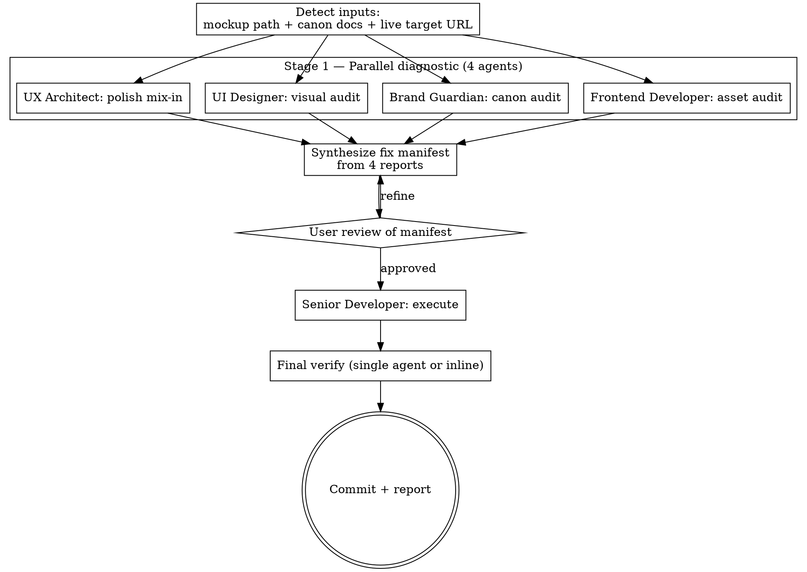

# Luxury Mockup Pipeline

Composite pipeline that orchestrates **five specialist agents** to refine a standalone HTML design mockup from rough draft to luxury-grade production-ready artifact.

## Token-Aware Runtime Guard (always-on)

This skill runs alongside **`token-aware-behavior`** at all times. Apply these rules on every agent dispatch + every synthesis step:

| Budget state | Pipeline behavior |
|--------------|-------------------|
| `nominal` | Full agent briefs, full deliverables, all 5 agents parallel |
| `warn` | Brief budgets tightened (200 → 120 word return summaries); deliverable docs stay full |
| `compress` | Emit `[PHASE SUMMARY]` before Stage 2 synthesis; reference prior agent outputs by path, not by quoted content |
| `handoff` | Stop mid-stage at atomic boundary (after current agent finishes), emit RESUME PROMPT with manifest path + commit SHAs |
| `critical` | Final 3-line summary only; defer Stage 4 to fresh session |

**Never:** re-quote whole audit docs back to other agents (they get the path, they read it themselves). Never paste >40 lines of prior agent output into Stage 2 synthesis — extract findings, cite paths.

**Always:** when dispatching parallel agents in a single message, pre-allocate token budget: ~8k per agent × 5 = ~40k synthesis ceiling. If close to ceiling, dispatch in waves of 2 instead of 4 parallel.

Cross-reference: skill `userSettings:token-aware-behavior` defines the canonical budget thresholds (60/75/88/95). This pipeline inherits them.

## Live Documentation Access (mandatory for any external library / API call)

Every agent that touches an external library, framework, API, or web platform feature MUST use these sources in this order:

| Order | Source | Use case |
|-------|--------|----------|
| 1 | **Context7 MCP** (`mcp__claude_ai_Context7__resolve-library-id` → `mcp__claude_ai_Context7__query-docs`) | Library/framework API: React, Next.js, Tailwind, Liquid, Three.js, FastAPI, etc. Returns current docs — overrides training-data drift. |
| 2 | **Curl + grep** | Live HTML inspection, JSON-LD validation, OG/Twitter meta verification, API response shape testing. CRITICAL: **never use WebFetch for `<script>` blocks** — it strips them. |
| 3 | **WebFetch** | Markdown / prose documentation pages (MDN, blog posts, vendor docs), NOT for HTML pages with critical `<script>` content. |
| 4 | **GitHub search** (`gh search code` / `gh search repos`) | Find adaptable implementations before writing new code. Battle-tested patterns. |

### When to invoke each

- **Before recommending any CSS feature** (e.g., `animation-timeline`, `:has()`, `color-mix()`, `@scope`): Context7 query `css-features` library + cite browser support matrix from MDN-current.
- **Before recommending any JS API** (View Transitions, IntersectionObserver, Houdini, container queries): Context7 query for current stability + caniuse data.
- **Before claiming a vendor behavior** (Vercel, Cloudflare, WP.com, Stripe): Context7 their docs + curl the live API response.
- **Before citing JSON-LD / OG tags on a live site**: `curl -s "URL?cb=$(date +%s)" | grep -oE` (cache-bust, don't trust Batcache).
- **Before adopting a new pattern**: GitHub search for proven implementations — port battle-tested code over hand-rolling.

### Anti-pattern

```
WRONG: "I'll just use my training knowledge for view-transitions API"
RIGHT: Context7 resolve-library-id → query-docs → then write code with verified API shape
```

The cost of a Context7 round-trip is < 1k tokens. The cost of writing against stale API knowledge is 10k+ tokens of debugging.

## High-Performance Asset Patterns (mandatory invocation)

Every agent that recommends or generates assets MUST encourage the highest-performing pattern available:

### Image pipeline (in priority order)

| Source | When | Output |
|--------|------|--------|
| **Existing optimized asset** | Asset exists in `assets/images/<name>.{avif,webp,jpg}` with full variant set | Direct reference |
| **avifenc** (libavif) | Need AVIF variant from source PNG/JPG | `avifenc --min 25 --max 35 -s 4 source.png target.avif` |
| **cwebp** (libwebp) | Need WebP variant | `cwebp -q 82 -m 6 source.png -o target.webp` |
| **sharp** (npm) | Need batch responsive variants (480w/768w/1280w/1680w + retina) | `sharp().resize(width).avif({quality:80}).toFile()` |
| **squoosh-cli** | Need single-asset optimization with multiple format outputs | `squoosh-cli --avif '{"cqLevel":28}' --webp '{"quality":82}' source.png` |
| **rembg** (Python) | Need transparent monogram / logo (alpha extraction) | `rembg i source.png target.png` → re-encode to AVIF/WebP preserving alpha |
| **ImageMagick** (identify / convert) | Need dimensions, alpha inspection, format conversion | `identify -format "%w×%h %[channels]" source.avif` |
| **ffmpeg** | Need hero video loop optimization (silent, < 1MB) | `ffmpeg -i source.mp4 -vf scale=1280:-2 -an -c:v libx264 -crf 24 -preset slow -pix_fmt yuv420p -movflags +faststart out.mp4` |

### Asset hierarchy enforcement

1. **Above-fold (cover / hero LCP)**: AVIF source @ q80 + WebP @ q85 + JPG fallback @ q88. `fetchpriority="high"`. `<link rel="preload" as="image">` in `<head>`. Master source ≥ 2× rendered viewport width.
2. **Below-fold collection/product**: AVIF + WebP only (no fallback). `loading="lazy"`. `decoding="async"`. Aspect-ratio CSS.
3. **Logos / monograms**: SVG inline if < 4KB. Otherwise AVIF + WebP with alpha + PNG fallback.
4. **Background patterns / textures**: tileable PNG → AVIF lossless or WebP. Use CSS `background-image` with multiple `image-set()` sources.

### Verification commands (run BEFORE recommending in any audit)

```bash
identify -format "%w×%h %m %[channels] %B\n" <asset>      # dims, format, channels, bytes
file <asset>                                              # mime sanity check
ls -la <asset>                                            # file size + existence
exiftool -ImageWidth -ImageHeight -ImageSize <asset>      # full metadata
```

### CDN / serve-time optimization (when platform supports)

- **Vercel Image**: `next/image` with `fill` + `sizes` + `priority` for above-fold
- **Cloudflare Images**: `/<id>/<variant>" />` with auto-format negotiation
- **Cloudinary**: `f_auto,q_auto,w_auto,dpr_auto` transformation chain
- **WordPress**: `wp_get_attachment_image()` with `loading="lazy"` + AVIF plugin (Performance Lab)

### Anti-pattern

```
WRONG: "Use a single 1920×1920 master for hero — it'll scale fine"
RIGHT: Generate 480w/768w/1280w/1680w variants in AVIF+WebP. Master must exceed largest render dim by 2×.
```

Mobile LCP suffers 0.8–1.2s when desktop-only masters serve mobile viewports. **Variant generation is non-negotiable** for any hero-class asset.

## Memory System (always-on, per-agent + shared)

The pipeline has a file-based memory system at `~/.claude/skills/luxury-mockup-pipeline/memory/`. It is the agents' persistent knowledge layer across dispatches.

**Layout:**

```
memory/
├── _shared/INDEX.md             # facts useful to all 5 agents
├── _shared/<slug>.md            # one fact per file (YAML frontmatter + body)
├── ux-architect/INDEX.md        # UX-specific facts
├── ui-designer/INDEX.md         # UI-specific facts
├── brand-guardian/INDEX.md      # canon-specific facts
├── frontend-developer/INDEX.md  # perf/asset-specific facts
└── senior-developer/INDEX.md    # impl-specific facts
```

**Read protocol** (every dispatch):
1. Agent reads its own `<agent-slug>/INDEX.md` (one-liner index of discipline facts)
2. Agent reads `_shared/INDEX.md` (one-liner index of cross-agent facts)
3. For any entry that matches the current task, agent reads the full fact file
4. Agent treats memory as authoritative AT WRITE TIME — if fact references a file path or asset, verify it still exists before recommending action on it

**Write protocol** (after correction or pattern lock):
1. When founder corrects the agent, the orchestrator appends a memory entry
2. When the agent discovers a non-obvious pattern that worked, write a memory entry
3. One fact per file, YAML frontmatter (`name`, `description`, `tags`, `applies_to`, `last_verified`), body explains WHAT + WHY + HOW TO APPLY
4. Append to the INDEX as `- [Title](slug.md) — one-line hook` (under 150 chars)

**Cross-reference** (existing infrastructure):
- DevSkyy project memory: `/Users/theceo/.claude/projects/-Users-theceo-DevSkyy/memory/MEMORY.md`
- Claude-mem observation DB: `~/.claude-mem/claude-mem.db` (SQLite, project-scoped, ~15k observations)
- OpenWolf cerebrum: `/Users/theceo/DevSkyy/.wolf/cerebrum.md`
- Canon docs: `/Users/theceo/DevSkyy/docs/brand/` (read-only — never write from skill memory)

**Decay:** facts about repo state (file paths, asset dims, function names) carry `last_verified: YYYY-MM-DD`. If older than 30 days, re-verify on next read. Stale memory > no memory.

**Seed entries** (already in `_shared/`):
- `the-five.md` — The Five canonical brands lock
- `scope-policy.md` — full-site scope + primary_focus_surfaces discipline
- `saas-gate.md` — SaaS Product Delivery Standard
- `stop-and-show.md` — paid/production/irreversible action protocol
- `audit-verification.md` — multi-agent audit false-positive discipline
- `no-webfetch-for-scripts.md` — WebFetch strips script tags

Agents inherit ALL shared facts by default. Per-agent dirs hold corrections/patterns specific to that discipline.

## SaaS Product Delivery Standard (always-on quality contract)

Every agent in this pipeline operates as if they are their own **standalone SaaS product**. The output they ship is the product. There is no "internal-only draft" stage. Every deliverable — audit report, fix manifest, v2.html commit, asset generation, ROI upgrade — must clear the SaaS gate before it surfaces to the founder.

**The SaaS Gate (every deliverable passes ALL):**

| Gate | Requirement | Verification |
|------|-------------|--------------|
| **Mobile-first verified** | Layout tested at 320 / 375 / 414 / 768 / 1024 / 1440 viewport widths. No horizontal scroll. Touch targets ≥ 44×44 px. Font scale clamps. | Open in browser, throttle to 360px width, screenshot, confirm no overflow + no broken tap targets |
| **Images optimized before publish** | Every image referenced has: AVIF + WebP + fallback present, dimensions declared (no CLS), proper srcset coverage (480w/768w/1280w/1680w for hero-class), `loading` attribute correct (eager above-fold / lazy below), `decoding="async"`. Source dims ≥ render dims (no upscale blur). | Run `identify` on each asset, grep `<picture>` blocks for variant coverage, fail if any asset upscales |
| **Sales-presentation grade** | Output reads like a product page section, not raw notes. Every section has a one-line headline + 1–3 supporting lines + verification call. No placeholder text, no "TBD", no "see other doc" without quoted summary. | Read aloud at start of doc — first 200 words must close a sale on the recommendation |
| **Accessibility verified** | WCAG 2.2 AA min, `prefers-reduced-motion` honored, all interactive `focus-visible`, color contrast ≥ 4.5:1 body / 3:1 large text, heading hierarchy intact | Lighthouse a11y ≥ 100 OR axe DevTools 0 violations |
| **Performance verified** | LCP image preloaded + `fetchpriority="high"`, no blocking JS, critical CSS inlined, font preload, JS bundle < 200 KB compressed | Lighthouse perf ≥ 95 on mobile throttle |
| **Self-contained reading** | Founder can read the deliverable cold. Every term defined or linked. Every claim cited with file:line. No insider shorthand without translation. | New-reader test: would someone with no context understand it? |
| **Conversion-ready CTAs** | When the deliverable proposes work (a fix, an upgrade, a swap), it ends with: exact commit message, verification command, one-line "ship it" call to action | Grep deliverable for the 3-element CTA pattern |

**Agents that ship raw notes, half-baked drafts, or assets without optimization are out of contract.** The orchestrator (this skill) rejects sub-SaaS deliverables and re-dispatches with explicit notes.

### Mobile-first verification protocol

Before any agent declares a deliverable DONE:

1. **Viewport sweep**: confirm the artifact (or its target file, in refine mode) renders correctly at 320 / 375 / 414 / 768 / 1024 / 1440 widths. For HTML deliverables: open in headless browser at each width, screenshot, eye-check.
2. **Touch target audit**: every clickable element ≥ 44×44 px (Apple HIG) or ≥ 48×48 px (Material). Tap-zone overlap test.
3. **Type scale check**: heading + body sizes clamp via `clamp(min, vw-based, max)`. No fixed px in headings ≥ 24px.
4. **Image flexibility**: every `` in `<picture>` has correct `sizes` attribute matching layout. Source variant matches viewport width served.
5. **Reflow test**: no horizontal scrollbar at any breakpoint. Aspect-ratio maintained or content reflows gracefully.

### Image optimization pre-publish gate

Before any agent references an asset in a deliverable, the asset MUST clear:

1. **Format priority**: AVIF source present (best compression) → WebP source present (Safari ≤ 15 fallback) → JPG/PNG fallback (legacy).
2. **Variant coverage**: hero-class assets have 480w/768w/1280w/1680w + 2x retina for above-fold LCP. Non-hero: minimum 480w/960w.
3. **Source resolution**: master source dimension ≥ 2× rendered dimension at largest viewport. No upscale blur.
4. **Alpha discipline**: if the asset needs transparency (logos, monograms), confirm alpha is preserved in AVIF + WebP (not just PNG). Run `identify -format "%[channels]"` to verify.
5. **File-size budget**: above-fold hero AVIF ≤ 400 KB, hero WebP ≤ 500 KB, below-fold images ≤ 200 KB at 1280w.
6. **CDN-ready filename**: content-hashed or versioned (e.g., `name.v2.avif`) for long-cache headers.

**If any asset fails these gates**, the agent flags it in their deliverable with a precise remediation command (`cwebp -q 80 ...` / `avifenc --min 25 ...` / `rembg ...`) and tier-routes the asset upgrade to Tier U or Tier 4 (deferred) — never to Tier 0–3 (would block the fix sprint).

## Agent Capability Charter (full-stack theme expertise)

The five agents in this pipeline are **end-to-end theme development experts**, not mockup tweakers. Each agent operates as if they could ship a complete production-ready theme on any of the platforms below, against any brand/criteria/vertical. The mockup-refinement loop is a subset of their competency.

**Platform coverage (agents pick the right stack for the job):**

| Platform | When to choose | Senior Developer artifact |
|----------|----------------|----------------------------|
| **WordPress / WooCommerce** | Live e-commerce + content site, founder owns CMS, SEO-critical | `wordpress-theme/<slug>/` (PHP 8.2 + theme.json + block patterns + WC overrides) |
| **Next.js** (App Router + RSC) | Headless commerce, marketing, dashboards, anything requiring React + edge | `frontend/` (Next 16 + React 19 + Server Components + Cache Components) |
| **Shopify** (Liquid + Hydrogen) | Native Shopify store, OS 2.0 themes, Storefront API headless | `shopify-theme/<slug>/` (Liquid + sections + blocks) or Hydrogen via Remix |
| **Astro** | Content-heavy marketing, blog, partial-hydration islands | `astro-theme/<slug>/` (`.astro` + content collections) |
| **Webflow → Code Export** | Founder-designed in Webflow, needs production export hardening | Cleaned Webflow export + tokens extracted |
| **Standalone HTML/CSS/JS** | Design refs, mockups, single-page landings, internal tools | `docs/brand/design-mockups/` (current pipeline default) |
| **Wix / Squarespace** | Founder-managed, agents author custom-code blocks + DNS guidance | Embedded code blocks + integration spec |

**Criteria coverage (agents apply the right system):**

| Criteria | Patterns the agents apply |
|----------|---------------------------|
| **Luxury / fashion** | Editorial typography, scene-takeover photography, ambient motion, restrained palette, magazine grid, lockup-image hero |
| **SaaS / B2B** | Above-fold value prop, gradient/blur backgrounds, social proof rail, pricing table, demo-CTA, dashboard preview |
| **E-commerce** | PLP/PDP/cart/checkout flows, holo product cards, sticky add-to-cart, size guide, reviews, recommendation slots |
| **Marketing / lead-gen** | Hero CTA → form, benefit grid, testimonial carousel, FAQ accordion, conversion optimization |
| **Editorial / publishing** | Long-form typography, reading progress, footnote system, related articles, newsletter capture |
| **Portfolio / agency** | Case-study spreads, scroll-driven storytelling, project filter, contact form |

**Deliverable depth (agents always produce the full set, not partial):**

- **Visual system**: tokens (color, type, spacing, motion, radius, shadow) — design-tokens.css / theme.json / tailwind.config.ts
- **Component library**: every reusable unit with BEM/utility classes + ARIA + keyboard nav
- **Page templates**: every canonical surface (home / collection / detail / cart / about / contact / 404 / search)
- **Animation system**: single source of truth for reveals, parallax, hovers — IntersectionObserver OR scroll-driven CSS
- **Performance budget**: LCP < 2.5s, CLS < 0.1, INP < 200ms, image sizes documented, font subset declared
- **Accessibility**: WCAG 2.2 AA minimum — `prefers-reduced-motion`, `prefers-contrast`, focus-visible, ARIA labels
- **SEO baseline**: title/meta/OG/JSON-LD per template, sitemap, robots
- **Deploy pipeline**: deploy script + verify gate + rollback path
- **Documentation**: README + tokens + component reference + handoff doc

When the founder asks "build me a theme" — **the pipeline scales to the full stack**, not just polish. The mockup-refinement flow is what runs when the artifact already exists; full theme creation runs the same 5-agent pipeline but each agent's audit becomes a build.

**Mode switching:**

- `mode=refine` (default) — agents audit + propose fixes against existing mockup. Senior Dev applies.
- `mode=build` — agents design + scaffold a complete theme from canon docs + spec. Senior Dev assembles the full artifact tree.
- `mode=migrate` — agents port an existing theme to a new platform (e.g., WP → Next.js). Senior Dev does the platform translation.
- `mode=harden` — agents take a working theme and bring it to production-grade (a11y, perf, SEO, security). Senior Dev ships the upgrades.

The skill orchestrator picks mode from user intent or explicit arg.

## High-ROI Upgrade Mandate (per agent — non-negotiable)

Every agent MUST propose **exactly 1 high-ROI premium upgrade** as part of their deliverable. The upgrade is in addition to (not in place of) their normal audit work. Mandates:

| Agent | Required Upgrade Category | Example |
|-------|---------------------------|---------|
| **UX Architect** | One signature **motion / interaction moment** — scroll-driven scene takeover, hero loop spec, parallax depth system, view-transitions choreography | "Scroll-snap section reveal with cinematic crossfade between Cover and Hero — 600ms cubic-bezier(0.65,0,0.35,1), `<section>` opacity + scale + clip-path" |
| **UI Designer** | One **luxury detail system** — custom cursor, ambient grain layer, type-rhythm escalator, magnetic hover, frame transition, micro-spacing token | "Magnetic cursor on `.spread__tile` — 24px attraction radius, `transform: translate3d()` follow with 80ms lag, GPU-accelerated, prefers-reduced-motion fallback" |
| **Brand Guardian** | One **canon-signature touch** — color pulse for brand accent, monogram emergence pattern, signature copy beat, brand-mark micro-interaction | "Rose-gold accent pulse on hover for any element bearing `--sr-accent` — 1.5s ease loop, opacity 0.4 → 1.0, locked to The Five reference brands' use of color-as-signature" |
| **Frontend Developer** | One **asset upgrade** that resolves a known degradation — transparent monogram (rembg pass), AVIF re-encode, color grading LUT applied to hero, missing srcset variant generation | "Generate transparent `sr-monogram-rose-gold.{avif,webp}` via rembg; outputs to `assets/images/branding/sr-monogram-rose-gold-transparent.*` — single asset, single PR, immediate visual impact" |
| **Senior Developer** | One **advanced CSS / web platform feature** beyond the manifest — CSS scroll-timeline / scroll-driven animations, view-transitions API, CSS Houdini paint worklet, container queries, `@scope`, `:has()` selector chains for state-driven design, color-mix() palette derivation | "CSS scroll-driven animation on `.hero__bg.parallax` via `animation-timeline: scroll()` — replaces JS rAF parallax with native CSS, deletes 22 lines of JS, runs at 120fps, falls back gracefully on Safari < 18" |

**Upgrade must be:**
- **High ROI** — small implementation cost, large perceived-luxury jump
- **Self-contained** — lands in a single commit, no cross-system refactor
- **Production-grade** — no proof-of-concept code, no placeholder values
- **Accessibility-respectful** — honors `prefers-reduced-motion`, `prefers-contrast`, keyboard nav
- **Browser-safe** — graceful fallback for browsers without the feature
- **Documented in deliverable** — under header `## ROI Upgrade Proposal` with: name, what it does, source inspiration, exact CSS/HTML/JS diff, ROI rationale (1 paragraph), fallback strategy

The synthesis step (Stage 2) **must roll all 5 upgrades into the fix manifest** as their own tier: **Tier U (Upgrades)** — applied AFTER Tier 3 polish, BEFORE final commit.

## When to invoke

- User has an HTML design-reference mockup (e.g., `docs/brand/design-mockups/*.html`) and asks for "elevation", "polish pass", "professional refinement", or "mix in live homepage polish".
- User explicitly invokes `/luxury-mockup-pipeline` or says "use the 5-agent pipeline".
- A design mockup has been hand-reviewed and the user calls out specific issues (sizing, canon misattribution, sloppy execution) that require coordinated multi-discipline fixes.

## When NOT to invoke

- Net-new mockup creation from scratch (use `frontend-design` skill + `brainstorming` + `writing-plans` instead — those build the artifact; this skill refines it).
- Single-issue fix (e.g., "fix this typo") — use direct Edit.
- Production WordPress theme work (use `wordpress-platform-pipeline` or direct theme template edits).

## The Five Agents

| Stage | Agent | Responsibility | Deliverable |
|-------|-------|----------------|-------------|
| 1a | **UX Architect** | Compare live production page vs new mockup. Identify polish layers (grain, vignette, parallax, particles, scroll-progress, etc.) worth mixing in. | `<docroot>/v2-polish-mix.md` |
| 1b | **UI Designer** | Audit mockup for visual fidelity issues. Image sizing, type rhythm, hover states, spacing, contrast. Produce specific component-level fixes with exact CSS diffs. | `<docroot>/v2-visual-fixes.md` |
| 1c | **Brand Guardian** | Enforce brand canon — verify every photo, lockup, color, and copy line against the canon docs. Flag P0/P1/P2 violations. | `<docroot>/v2-canon-audit.md` |
| 1d | **Frontend Developer** | Asset triage. Identify transparency / alpha-channel needs, oversized files, missing variants. Recommend asset swaps or generation steps. | `<docroot>/v2-asset-audit.md` |
| 2 | **Senior Developer** | Execute the consolidated fix manifest. Premium implementation specialist — applies the CSS/HTML/asset changes from the 4 audit reports atomically with TDD-style commits per fix-group. | Commits + final v2.html state |

## Process Flow



## Inputs (gather before invoking)

| Input | Source | Required |
|-------|--------|----------|
| Mockup HTML path | `docs/brand/design-mockups/<name>.html` | yes |
| Live homepage URL (for mix-in comparison) | Project context (e.g., `https://skyyrose.co/`) | yes |
| Source PHP template (for polish-layer extraction) | `wordpress-theme/<theme>/front-page.php` | yes if mixing from production |
| Canon docs path | `docs/brand/` (visual-references.md, collection-stories.md, asset-hierarchy.md) | yes |
| Memory canon files | `~/.claude/projects/<project>/memory/feedback_*` | yes (read-only) |

## Stage 1 — Parallel diagnostic

Dispatch **all 4 agents in a single message** (parallel tool calls). Each agent gets:

- **Structured brief**: a JSON file at `prompts/<agent-slug>.json` validating against `schemas/agent-brief.schema.json`. The agent reads this for: mission / scope (header→body→footer) / performance baseline / deliverables / ROI mandate / constraints / return format.
- **Layout reference**: `references/full-theme-skeleton.html` — canonical full-theme structure spanning every page / component / widget / layout slot, with always-on performance + a11y + SEO checklists. Agent reads this for: which surfaces exist, what high-performing defaults look like per slot.
- **Inline dispatch prompt**: brief pointer to the JSON + HTML files plus the verbatim founder feedback (for emphasis). Avoids restating the contract.

### Dispatch contract

The skill's prompt scaffolding lives at:

```
~/.claude/skills/luxury-mockup-pipeline/
├── SKILL.md                           # this file
├── schemas/
│   ├── agent-brief.schema.json        # JSON Schema for prompt files
│   └── deliverable.schema.json        # JSON Schema for outputs
├── references/
│   └── full-theme-skeleton.html       # canonical layout contract — header / body / footer / every component+widget+layout slot
└── prompts/
    ├── ux-architect.json
    ├── ui-designer.json
    ├── brand-guardian.json
    ├── frontend-developer.json
    └── senior-developer.json
```

Every dispatch follows this pattern:

> Read your structured brief at `<skill-root>/prompts/<agent-slug>.json` AND the layout reference at `<skill-root>/references/full-theme-skeleton.html`. The brief defines mission, scope (header→body→footer), performance baseline, deliverables, mandatory ROI upgrade, constraints. The HTML reference is the canonical layout contract — every page/component/widget/layout slot you must consider. Founder verbatim feedback: "<quote>". Produce your deliverable per the JSON brief's `deliverables[]` and `return_format`.

This pattern stays constant across `mode=refine` / `build` / `migrate` / `harden`. Only the JSON brief contents change per mode.

### Highest-performing features mandate (always on)

Every agent encourages and verifies the highest-performing default for every slot they touch. Defaults are encoded in `references/full-theme-skeleton.html`:

| Surface | Highest-performing default the agent must encourage |
|---------|-----------------------------------------------------|
| **Header** | Sticky w/ shadow-on-scroll, transparent over hero, inline SVG monogram, mega-menu (hover + focus), focus-trapped mobile drawer, search overlay (debounced instant results), cart drawer |
| **Hero / Cover** | `<picture>` w/ avif+webp+img, `fetchpriority="high"`, preload tag, aspect-ratio CSS (no CLS), `<source>` w/ proper `sizes` |
| **Page body** | Skip link first focusable, ARIA live regions, semantic landmarks, heading hierarchy h1→h2→h3, every interactive `focus-visible` |
| **Collection grid** | 4 evenly aligned tiles desktop / 2 tablet / 1 mobile, scene photo per tile (avif/webp/img), explicit dimensions, lazy below-fold |
| **Product card** | Wishlist + quick-view, `<picture>` responsive, price w/ visually-hidden label, hover-state for keyboard parity |
| **Newsletter** | Native form validation + ARIA-live status, autocomplete=email, error linkage |
| **Footer** | 4-col link grid + newsletter + payment icons + legal + founder signature + back-to-top |
| **Widgets** | Toast (ARIA polite), modal (focus-trap), cookie consent (GDPR opt-in), scroll progress (decorative aria-hidden), back-to-top (IO-driven appearance) |
| **Performance** | Critical CSS < 14KB inlined, fonts self-hosted woff2, JS deferred, gzip/brotli, content-hash filenames, HTTP/2+ |
| **A11Y** | WCAG 2.2 AA min, `prefers-reduced-motion` + `prefers-contrast` honored, keyboard nav complete |
| **SEO** | Unique title/desc/canonical/OG/Twitter, JSON-LD per page type, sitemap+robots, hreflang if multi-locale |

Agents that touch a surface MUST verify these defaults are present (refine mode) or generate them (build mode). They do not need to re-explain the defaults in their deliverable — only flag gaps.

**Stage 1a — UX Architect prompt template:**
> Compare the live `<live-url>` homepage against the new mockup at `<mockup-path>`. Identify polish layers from production worth porting into the standalone mockup. For each layer: source location (CSS file + line), visual effect, mix-in recommendation (YES/NO/OPTIONAL), implementation difficulty. **Plus: propose exactly 1 high-ROI motion / interaction upgrade per the Upgrade Mandate (see skill header) — append as `## ROI Upgrade Proposal` section in your deliverable.** Output: `<docroot>/v2-polish-mix.md`. Return: top 3 Tier 1 mix-ins + 1-line ROI upgrade name.

**Stage 1b — UI Designer prompt template:**
> Audit `<mockup-path>` for visual fidelity issues. Image sizing, type scale, hover states, spacing rhythm, contrast. For each issue: file:line, problem, root cause, exact CSS/HTML fix diff. **Plus: propose exactly 1 high-ROI luxury detail system per the Upgrade Mandate (cursor / grain / type rhythm / magnetic hover / frame transition) — append as `## ROI Upgrade Proposal` section.** Output: `<docroot>/v2-visual-fixes.md`. Return: top 5 fixes ranked by impact + 1-line ROI upgrade name.

**Stage 1c — Brand Guardian prompt template:**
> Audit `<mockup-path>` against `<canon-docs>`. Verify every photo asset, collection lockup, palette use, and copy line. Classify violations P0 (canon-breaking) / P1 (canon-adjacent inconsistency) / P2 (stylistic concern). **Plus: propose exactly 1 high-ROI canon-signature touch per the Upgrade Mandate (accent pulse / monogram emergence / signature beat) — append as `## ROI Upgrade Proposal` section.** Output: `<docroot>/v2-canon-audit.md`. Return: per-violation summary with severity + 1-line ROI upgrade name.

**Stage 1d — Frontend Developer prompt template:**
> Asset triage for `<mockup-path>`. For each image asset: identify dimensions, file size, alpha channel presence, where it's used, whether transparency is needed. Recommend swaps or remediation (rembg / cwebp / new export). **Plus: propose exactly 1 high-ROI asset upgrade per the Upgrade Mandate (transparent monogram / AVIF re-encode / color-grade LUT / variant generation) — append as `## ROI Upgrade Proposal` section. Recommend only — do NOT execute paid or compute-heavy operations.** Output: `<docroot>/v2-asset-audit.md`. Return: blocker count + specific swap paths + 1-line ROI upgrade name.

## Stage 1.5 — Automated deliverable validation (NEW)

After each Stage 1 agent reports DONE, the orchestrator runs:

```bash
bash <skill-root>/scripts/dispatch.sh <agent-slug> <deliverable-manifest.json> --html <target-html-if-any>
```

This wraps three automated checks:

1. **`validate-deliverable.sh`** — runs the deliverable against `schemas/deliverable.schema.json`. Verifies:
   - JSON parse + required fields
   - All 7 SaaS gates marked `passed: true`
   - `roi_upgrade.proposed: true` + `prefers_reduced_motion_safe: true`
   - `memory_writes` array has ≥ 1 entry (enforces memory write mandate)
   - `return_summary.word_count` ≤ 280 (token-aware compliance)

2. **`saas-gate.sh`** — runs the 13 automated checks on any HTML deliverable (AVIF coverage, preload, skip link, focus-visible, asset paths resolve, etc.)

3. **Memory verification** — confirms the agent's memory dir grew by ≥ 1 fact file since dispatch start

**If any check fails**: deliverable is REJECTED. The orchestrator re-dispatches the agent with the specific failure notes. Re-dispatch limit: 3 attempts. After that, surface BLOCKED to founder.

**If all checks pass**: deliverable enters Stage 2 synthesis. Manifest is added to the synthesis pool.

This gate is **non-skippable** — manifest dispatches that bypass validation are out of contract.

## Stage 2 — Synthesize fix manifest

Read the 4 deliverable docs. Produce a single consolidated manifest at `<docroot>/v2-fix-manifest.md` that:

1. **Groups fixes by surface** (e.g., F01 Cover, F02 Hero, F04 Spread, etc.) so Senior Developer can apply them in spatial order.
2. **Ranks by priority**: P0 canon violations > Visual blockers > Polish mix-ins > Asset optimizations.
3. **For each fix**: exact file:line + before/after diff + which source audit it came from + verification step.
4. **Flags conflicts** between agent recommendations (e.g., UI Designer says larger lockup, UX Architect says add particle layer at same z-index). Resolve in the manifest or surface to user.

## Stage 3 — User review gate

Present the fix manifest to the user. Get explicit approval before executing. Auto Mode behavior: if user has pre-approved the pipeline + their previous interactions show no canon-blocking concerns, skip to Stage 4. Otherwise pause for sign-off.

## Stage 4 — Senior Developer execution

Dispatch the **Senior Developer** agent (subagent_type: `Senior Developer`) with the fix manifest. The agent is the premium implementation specialist — masters advanced CSS, Three.js integration, Laravel/Livewire/FluxUI, and standalone HTML/CSS/JS pipelines.

**Senior Developer prompt template:**
> You are executing the fix manifest at `<manifest-path>` against `<mockup-path>`. Apply fixes in priority order grouped by surface (Tier 0 → 1 → 2 → 3 → U). After each fix-group, commit atomically with conventional commit messages (`fix(<scope>): <description>` / `feat(<scope>): <addition>`). Run HTML parse verification + asset path verification after each group. Stop and surface BLOCKED if any fix conflicts with existing markup or canon. **Plus: implement exactly 1 high-ROI advanced web-platform feature per the Upgrade Mandate (scroll-driven animations / view-transitions / Houdini / container queries / `:has()` selectors / color-mix()) as Tier U commit — production-grade only, with graceful fallback, honoring `prefers-reduced-motion`. Append a `## ROI Upgrade Implemented` section to the final report with: feature name, commit SHA, lines added/removed, browser support matrix, fallback strategy.** Final report: commit SHAs per fix-group + Tier U upgrade SHA + before/after line counts + acceptance criteria pass/fail.

Senior Developer SHOULD:
- Apply fixes atomically per surface or per priority tier
- Verify HTML parses after each commit
- Verify canon-doc references are intact
- Use the existing `.cover__*` / `.hero__*` / `.voice__*` / `.spread__*` BEM namespaces from the mockup
- Add new CSS classes only when an existing class doesn't fit

Senior Developer MUST NOT:
- Introduce Three.js or WebGL into a standalone-mockup context (unless spec explicitly permits)
- Reference locked-out brands or break canon
- Re-fetch assets from CDNs
- Skip verification steps

## Stage 4.5 — Loop integration (drives Stage 4 to completion)

After dispatching Senior Developer (Stage 4) the orchestrator wraps execution in a `/loop` cycle so the pipeline iterates against the manifest's acceptance criteria until every fix lands or a hard block surfaces.

**Loop invocation:**

```
/loop "execute v2-fix-manifest.md until all tiers complete and acceptance criteria pass" \
  --target docs/brand/design-mockups/v2.html \
  --manifest docs/brand/design-mockups/v2-fix-manifest.md \
  --on-cycle "dispatch Senior Developer with next-unlanded tier" \
  --on-block "stop loop, surface BLOCKED report to user" \
  --max-cycles 6 \
  --acceptance-check "html parses + grep canon-violation patterns = 0 + git diff --name-only shows only target file"
```

**Loop cycle (one iteration):**

1. Read manifest, identify lowest-tier fix not yet committed
2. Dispatch Senior Developer (or appropriate agent) for that fix-group only
3. After agent reports DONE: run acceptance check
4. If pass and more fixes remain → next cycle
5. If pass and all done → exit loop, advance to Stage 5
6. If BLOCKED → exit loop, surface to user with state + commit SHAs landed so far

**Why a loop:** the manifest can be 10–20 fixes across 5 tiers. A single Senior Developer dispatch occasionally returns DONE_WITH_CONCERNS or hits a partial block (one fix conflicts with a prior fix's edit). The loop lets the pipeline:
- Auto-retry the failing fix with refined instructions
- Add a new agent (e.g., re-dispatch Brand Guardian) mid-stream if a canon question surfaces
- Stop cleanly when human input is required (rembg, founder asset call, ambiguous canon)

**Loop guards:**
- Hard ceiling: `--max-cycles 6` (prevents runaway)
- Atomic boundary: loop only advances at full fix-group completion, never mid-fix
- Token-aware integration: if budget state ≥ `handoff`, loop exits with RESUME PROMPT
- Branch protection: loop NEVER force-pushes, NEVER skips hooks, NEVER amends prior commits

**When NOT to wrap in /loop:**
- Manifest has ≤3 fixes (overhead exceeds benefit — use direct dispatch)
- All fixes share a single file with no inter-fix dependency (one Senior Developer dispatch is enough)
- User is actively reviewing — loop interrupts the human-in-loop pattern

For SkyyRose v2 work (12+ fixes typical, multi-tier): always wrap.

## Stage 5 — Final verify

Either:
- Dispatch a final review agent (subagent_type: `Reality Checker` or `Accessibility Auditor`) for a fresh-eyes pass
- OR inline: run HTML parse + grep for canon-violation patterns + diff summary

Acceptance criteria (mockup-specific, document in the manifest):
- HTML parses
- All canon docs unmodified during execution
- Zero locked-out brand references
- All asset paths resolve (no 404s on local file://)
- Each fix-group has a corresponding commit

## Stage 6 — Commit + report

Final report to user includes:
- Commit list (SHA + message per fix-group)
- Before/after line count
- Acceptance criteria pass/fail table
- Remaining items (deferred to production translation or future passes)

## Anti-Patterns to Avoid

- ❌ Dispatching agents sequentially when they're independent (always parallel in Stage 1)
- ❌ Skipping Stage 2 synthesis — Senior Developer should NOT read 4 raw reports, only the consolidated manifest
- ❌ Letting Senior Developer make canon decisions — those belong in Stage 1c (Brand Guardian) and locked before Stage 4
- ❌ Approving Stage 3 without surfacing the manifest to user when canon-breaking fixes are present
- ❌ Running Stage 4 without Stage 3 user gate (unless Auto Mode + pre-approved scope)
- ❌ Final verify (Stage 5) executed by Senior Developer themselves — must be independent

## Integration with other skills

- **`token-aware-behavior`** runs ALONGSIDE this skill at all times. Budget thresholds (60/75/88/95) govern dispatch density, return-summary length, and synthesis behavior. See "Token-Aware Runtime Guard" section above.
- **`/loop`** runs INSIDE this skill at Stage 4.5. Drives Senior Developer to manifest-complete or surfaces clean BLOCKED state. See "Stage 4.5 — Loop integration" above.
- **`brainstorming`** runs BEFORE this skill (creates the mockup spec). This skill is the REFINEMENT loop.
- **`writing-plans`** runs BEFORE this skill (creates the initial implementation plan). This skill polishes the result.
- **`subagent-driven-development`** is the orchestration pattern this skill uses internally for Stage 1 + 4.
- **`finishing-a-development-branch`** runs AFTER this skill (merge / PR / cleanup).

## Reference invocation

For SkyyRose v2 mockup refinement:

```
Inputs:
  mockup-path = docs/brand/design-mockups/v2.html
  live-url = https://skyyrose.co/
  source-template = wordpress-theme/skyyrose-flagship/front-page.php
  canon-docs = docs/brand/visual-references.md + collection-stories.md + asset-hierarchy.md
  memory-canon = ~/.claude/projects/-Users-theceo-DevSkyy/memory/feedback_collection_canon_attribution.md
```

Outputs land at:
- `docs/brand/design-mockups/v2-polish-mix.md` (UX Architect)
- `docs/brand/design-mockups/v2-visual-fixes.md` (UI Designer)
- `docs/brand/design-mockups/v2-canon-audit.md` (Brand Guardian)
- `docs/brand/design-mockups/v2-asset-audit.md` (Frontend Developer)
- `docs/brand/design-mockups/v2-fix-manifest.md` (synthesis)
- Modified `docs/brand/design-mockups/v2.html` (Senior Developer execution)
- New asset variants if Frontend Developer flagged any (e.g., transparent monogram export)

## Quick reference card

```
luxury-mockup-pipeline =
  token-aware guard (always-on)
  + 4 parallel auditors (each delivers 1 ROI upgrade)
  → manifest (Tiers 0–3 + Tier U upgrades)
  → 1 executor wrapped in /loop (max 6 cycles)
    (executor also delivers 1 ROI upgrade)
  → 1 verifier
```

**Auditors:** UX Architect / UI Designer / Brand Guardian / Frontend Developer
**Executor:** Senior Developer (wrapped in `/loop`)
**Verifier:** Reality Checker OR Accessibility Auditor OR inline
**Guards:** `token-aware-behavior` (budget) + `/loop --max-cycles 6` (iteration ceiling)
**Mandatory ROI upgrades:** 5 (one per agent), all rolled into manifest Tier U
