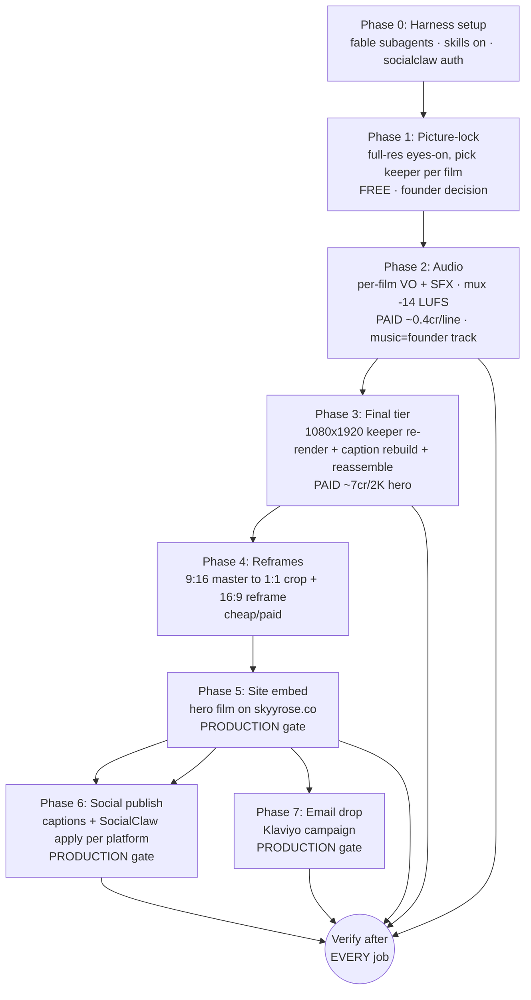

# SkyyRose Films — Finish → Distribute → Verify (execution plan)

**Authored:** 2026-07-19. **Scope:** take the 6 previz-tier films from silent 720p drafts to
shipped, verified, distributed assets — across site + social + email — with a fail-able
verification gate after **every** job. Sources verified this session by 3 parallel Explore agents
(video pipeline · social/connectors · verification infra). Nothing here is assumed; every path is
cited to a file that exists.

Governing rule (founder-mandated): **one manifest → one "y" → one paid call**, and **full-res-only
QC** (never a verdict from a contact sheet). Every paid/production/irreversible step below is a
STOP-AND-SHOW gate.

---

## Current state (verified)

| Asset | File (`renders/scroll-world/ad/out/`) | Tier | Audio |
|---|---|---|---|
| Signature | `film-signature.mp4` 10s | previz 720p | silent |
| Black Rose | `film-black-rose.mp4` 10s | previz 720p | silent |
| Love Hurts | `film-love-hurts.mp4` 10s | previz 720p | silent |
| Kids Capsule | `film-kids-capsule.mp4` 10s | previz 720p | silent |
| Jersey Series | `film-jersey-series.mp4` 12s | previz 720p | silent |
| **The House** (anthology) | `master-warm-street-canon-vo.mp4` 23s | previz 720p | **VO only** |

- Finishing engine: `.claude/workflows/skyyrose-ad-previz.js` — phase `final` (PAID, gated, capCr-signed manifest, `:161-200`).
- Durable assembly scripts: `renders/scroll-world/ad/work/filmbuild/build-collection.sh`, `jersey-build.sh` ONLY. Master-tier xfade/caption/mux was inline — **not scripted** (must re-derive or script).
- PIL caption code = **NOT checked in** (only PNG outputs + Archivo/Anton TTFs survive) → must rewrite for 1080×1920.
- `renders/scroll-world/ad/final/` = **empty** — `final` phase never run.
- Audio: `renders/scroll-world/ad/audio/vo-house-skye.wav` only (voice "Skye" `1fb253b8`, 0.4cr). Music bed = **BLOCKED** (Higgsfield has no music gen; needs founder/royalty-free track).
- Social publish path: **SocialClaw CLI installed this session** (v0.1.17). No repo code posts today — SocialClaw is the only real path. Auth pending (`SC_API_KEY` → `.env.secrets`).

---

## Pipeline

Build order (founder-set 2026-07-18): **House first** → Love Hurts → Black Rose & Signature → Jersey → Kids Capsule.

---

## Phase 0 — Harness setup (bundled config)

1. `CLAUDE_CODE_SUBAGENT_MODEL`: `sonnet`→`fable` in `.claude/settings.json:4` (worktree) + `~/.claude/settings.json:4` (global). **Needs Claude Code restart** to take effect.
2. `skillOverrides`: `budgeted-subagent-dispatch` (`~/.claude/settings.json:237`) `off`→`on`; `subagent-conductor` (`:324`) `off`→`on`.
3. SocialClaw: CLI installed ✅. `SC_API_KEY`→`.env.secrets` (user-filled, gitignored). Then `socialclaw login --api-key "$SC_API_KEY" --base-url https://getsocialclaw.com` → `socialclaw accounts list --json`.
   - **Verify:** `accounts list` returns ≥1 linked platform (empty ⇒ OAuth each platform in SocialClaw dashboard first).

## Phase 1 — Picture-lock (DONE 2026-07-19)

- House candidate `master-warm-street-canon-vo.mp4` QC'd full-res (14 native frames). **LOCK-ABLE ✅** — all 4 collections present (SIG gold @3s → BR silver/black-rose @4.5s → LH cathedral/bomber @7.5-10.5s → KC child reveal @15s → rose-gold finale @21s), every caption spelled correct, on-canon palettes, no wrong-garment. Frames in `scratchpad/house-qc/`.
- Minor flags: faststart=NO (free re-mux), 720p previz (→ final tier), dissolve seams read busy as stills (fine in motion).

## Phase 1b — FINAL-CUT DIRECTION (founder 2026-07-19)

**"In the final cut, put Skye in something from each collection."** The mascot (child, "Skye") must be
seen wearing each collection's garment across the cut — the "next generation grows up in the whole
house" through-line — culminating in the KC reveal + finale. Finish tier = **max**: 1080×1920 upscale
+ full SFX sound-statements under the existing Skye VO, mixed −14 LUFS.

**New mascot beats (PAID, identity-locked). Compose mascot Element `cf20a690` + garment Element in each prompt. Identity gate has PASSED repeatedly (spec:190) — low drift risk.**

| Beat | Collection | Skye garment (CLEAN prop Element, created 2026-07-19) | Status |
|---|---|---|---|
| M1 | Signature | `garment-sg009-sherpa-flat` `528d8f2a-85ec-4b5d-9125-50a0c93b58da` | **RENDER** |
| M2 | Black Rose | `garment-br004-hoodie-flat` `50345f16-e22a-43fb-9020-a70e42702bf1` | **RENDER** |
| M3 | Love Hurts | mascot-canon LH bomber (she already wears it) | **HAVE** — reuse `previz/street/skyy-walk-oakland.mp4` / reveal clip |
| M4 | Kids Capsule | `garment-kids001-set-flat` `077539a4-4e22-4cb8-bb13-39bd54d16c8a` | **RENDER** |

**GATE CLOSED (2026-07-19):** the OLD garment Elements (`807cba2a`, `93cda914`, `5222699b`) are CONTAMINATED — built from on-model photos (adult male / a different child) and auto-classified as `character`. Composing them with the mascot = two people fighting for the frame = wasted paid run (the bug-271 trap). DO NOT USE them for mascot beats. The `-flat` Elements above are `prop`-classified, garment-only, from the verified flat product photos I eyes-on'd. Mascot Element `cf20a690` verified clean (canonical sources).

- Identity source: mascot Element `cf20a690` (sources = `skyy-canonical-reference.jpeg` + `skyyrose-mascot-reference.png`). Never anchor to a generated render (bug-268).
- **Still-first fidelity gate (cost control + spec:71):** per beat, fire a `gpt_image_2` 1k/low anchor still (**0.5cr**) = Skye-in-garment-in-world → eyes-on full-res (identity + garment↔collection + any lettering). Only if it PASSES, animate via `seedance_2_0` fast/480p (**~6cr**) or mini/480p (**4cr**) driven from the still.
- **Gate:** EVERY paid call = its own STOP-AND-SHOW manifest + its own "y" (founder rule, no batch). Est total: 3 stills (1.5cr) + 3 clips (~12–18cr) + upscale + SFX ≈ **~20–25cr** of 851.
- **Verify each:** get_cost preflight (≤est×1.5 or abort) → job_status poll → download → full-res eyes-on.
- Assemble: intercut M1/M2/M4 + reused LH at each collection beat → 1080×1920 upscale → SFX sound-statements under Skye VO → −14 LUFS mux → +faststart.

**Fire order:** M1 Signature anchor still (identity test) → eyes-on → M1 animate → M2 → M4 → assemble → upscale → SFX.

**M1 RESULT (2026-07-19, job `97cce0bd-f2b3-4d14-bb5c-edf1948edd90`, 0.5cr, balance ~850.6):** identity PERFECT (one child, no adult bleed — clean-Element fix validated), Sherpa design ACCURATE (black shell + cream lining + rose emblem), Signature world PERFECT. **Issue:** mascot Element carries her full canonical Love Hurts outfit → Sherpa layered OVER the LH varsity + rose joggers (LH script visible) = not a clean Signature-only look. Full-res render: `scratchpad/mascot-qc/m1-sig-sherpa.png`. Fix = 0.5cr re-fire with explicit "replace her default outfit, no Love Hurts varsity/script, plain Signature bottoms" — the still-first gate catching outfit-layering at 0.5cr, exactly as designed. Lesson: mascot Element = full outfit; new-garment prompts must explicitly REPLACE, not add.

**CLEAN GARMENT ELEMENTS (House round, all `prop`/garment-only, created 2026-07-19 — USE THESE, never the contaminated originals):**
- SIG: sherpa `528d8f2a-85ec-4b5d-9125-50a0c93b58da` · stay-golden `d591a362-ee6d-4815-b282-b735242e54a1` · windbreaker `8f56befb-08ed-4f74-9e58-5e3ff5cf2fda`
- BR: hoodie `50345f16-e22a-43fb-9020-a70e42702bf1` · sig-hoodie br-005 `a4862549-cf53-4845-9b66-fd41e5f9b8d8` · bomber-sherpa br-006 `c0cdb532-9110-4d8c-9087-17d4146daa6e`
- LH: bomber-canon `2d708bf2-7369-477f-908c-bd19fcc17f9e` · joggers lh-002 `67681dc6-fdbe-4f72-a604-0d2083a477d8`
- KC: red kids-001 `077539a4-4e22-4cb8-bb13-39bd54d16c8a` · purple kids-002 `2148e501-ec1d-4291-ac1c-228c6ebdf72b`
- Mascot: `cf20a690-7828-4738-9557-2ef00bc42591`. Jersey round (Deliverable B, later): br-009 white football, br-007 shorts, br-012 green/gold — Elements TBD.

**JERSEY SKUs verified 2026-07-19:** white football = **br-009** (white #32, BLACK IS BEAUTIFUL) · BR basketball shorts = **br-007** (black/rose, "OAKLAND Love Hurts") · green&gold baseball = **br-012** (A's tribute). Founder: br-009+br-007 pairing + br-012 are Skye jersey looks for the dedicated Jersey Series video (Bay Area tribute).

**HOUSE STILL-ROUND JOB IDS (2026-07-19, gpt_image_2 1k/low 0.5cr each; batch cap 6cr; reconcile via job_status before any re-fire, bug-269):**
- M1 layered (superseded) `97cce0bd-f2b3-4d14-bb5c-edf1948edd90` · M1-v2 SIG sherpa CLEAN ✅ `5166abdf-5397-48bd-88f2-4fd8b74cd295`
- SIG stay-golden `acced302-1d91-4b88-83b5-d66eec07652d` · SIG windbreaker `ec8c94bc-e811-470e-a344-d1eefd337fc4`
- BR hoodie `935b3a1a-772b-4e3b-ae86-54950e4732fe` · BR sig-hoodie `ca4740c9-6a06-4bc8-9e89-022c7fab74a4` · BR bomber-sherpa `4ed63ad5-5e66-49a2-bcfa-dda2f19cc610`
- LH bomber+joggers `52f948f1-2aac-478a-93a8-8e2599bb2720`
- KC red `08103114-b886-4cb9-920d-f3c9f1a60497` · KC purple `9b711bc8-28a1-4320-9cab-a08cb4f9be18`
- Round spend: 5.0cr (10 stills). Balance ~845.6. Each downloads to `scratchpad/mascot-qc/`, full-res eyes-on before animate.
- **QC RESULT 2026-07-19: ALL 9 CLEAN LOOKS PASS full-res** (M1-v2 sherpa + stay-golden + windbreaker + br-hoodie + br-sighood + br-bomber-sherpa + lh-bomber/joggers + kc-red + kc-purple). Identity held across all 9, garments match reference, clean swaps (no LH bleed except intended LH beat), Oakland-anchored. Zero re-fires. Files in `scratchpad/mascot-qc/`.
- **NEXT:** founder picks which looks animate (paid seedance ~4–6cr each, SEPARATE gate) → integrate into House cut at each collection beat → 1080 upscale + SFX. Jersey Series = own dedicated round (br-009/br-007/br-012 + full 8). br-006→"The Bomber Sherpa" rename subagent pending.

**HERO ANIMATIONS (founder y 2026-07-19, seedance_2_0_mini 480p/4s/9:16/silent = 4cr each, 16cr total):**
- SIG sherpa `ea5d23ab-52a2-4885-a92e-c26166e41c16` · BR hoodie `e03278bb-5628-4862-8b3b-1cff3e4efcee` · LH bomber `f20827e6-1645-4933-9e29-09e252831d75` · KC red `05b6c1a0-c6c9-4c44-a217-0174a592b75a`
- start_image = the QC-passed still. Balance ~846→~830. Reconcile via job_status before any re-fire (bug-269). Full-res eyes-on each before assembly.

**JERSEY-ROUND ELEMENTS (created 2026-07-19, prop/clean):** br-009 football `f0dd1673-ebdb-4583-9e68-c89c51559d4b` · br-007 shorts `dda63e00-d684-4602-9e7a-80110c305a05` · br-012 baseball `52d0f385-6f52-41f9-b7a5-e55f5deb3870`. Mascot `cf20a690`. Jersey video not yet fired.

**br-006 RENAME DONE (subagent, main checkout, uncommitted):** 7 files → "The Bomber Sherpa" (catalog CSV SOT, 2 dossiers, logo-registry, black-rose sot.json, index.html, v7-cards). No WC/deploy/commit. Follow-ups flagged: orphan dossier not deleted, `product-bundles/` dir still old-named, CLIP embeddings + LoRA trigger-map need paid regen, THIS branch still carries old name (fix on merge).

## Phase 2 — Audio (PAID · gated per line)

- Per-film VO line (Higgsfield `generate_audio`/seed_audio ~0.4cr each) in voice "Skye" (`1fb253b8`) — **confirm Skye is the intended brand voice or run `create_voice` first** (unresolved: no `create_voice` event is logged; may be stock).
- SFX / sound-statements per spec (sub-boom hook, per-reveal impacts, resolving harmonic).
- Music bed: **DECISION** — founder supplies a royalty-free/licensed track, or films ship VO+SFX only.
- Mux: `loudnorm I=-14:TP=-1:LRA=11`, AAC 192k.
- **Verify:** ffprobe audio stream present + loudnorm target + eyes/ears-on the muxed cut.
- **Gate:** each seed_audio fire = its own manifest + "y".

## Phase 3 — Final tier (PAID · gated)

- Re-render only founder-marked **keeper** clips at 1080×1920 via ad-previz `final` phase (capCr-signed manifest; 2K heroes ~7cr each).
- **Rewrite the PIL caption system** at 1080×1920 (SKYYROSE wordmark, per-collection kinetic captions, end card) — original not checked in.
- Reassemble each film + House master at 1080×1920, normalize crf18, xfade seams (`off_n = Σdur − n·0.2`), `+faststart`.
- **Verify:** ffprobe 1080×1920/codec/faststart (moov before mdat) + programmatic caption safe-zone assertion + full-res frame grid.
- **Gate:** each final-tier render fire = its own manifest + "y".

## Phase 4 — Reframes (cheap/paid)

- 9:16 master → **1:1** center-crop pre-caption master + re-caption; **16:9** via Higgsfield `reframe` (final tier only; never ship blur-pillarbox).
- Platform map: 9:16 → TikTok/Reels/Shorts · 1:1 → IG feed · 16:9 → YouTube/pre-roll.
- **Verify:** ffprobe each aspect + eyes-on caption not cropped.

## Phase 5 — Site embed (PRODUCTION · STOP-AND-SHOW)

- Embed hero film on skyyrose.co (homepage hero / collection page / blog drop post). Media upload + block content via `scripts/deploy-theme.sh` or WP.com MCP `wpcom-mcp-content-authoring`. Creds `.env.wordpress`.
- **Verify:** `wp_verify_live` / `deploy-theme.sh verify_live()` — curl cache-bust (200 + ≥50KB + no PHP-fatal + version-stamp) → Scrapling DOM → **Playwright screenshot mobile + desktop** (pageerror budget; rollback on fail).

## Phase 6 — Social publish (PRODUCTION · STOP-AND-SHOW)

- Captions/hashtags per platform via free skills: `skyyrose-social-tiktok-script`, `-instagram-carousel`, `-twitter-thread`, `-hashtag-strategy`.
- SocialClaw per film/platform: `assets upload --file <final.mp4> --json` → author `schedule.json` → `validate -f schedule.json --json` → **STOP-AND-SHOW** → `apply -f schedule.json --json`.
- **Verify:** `socialclaw status --run-id <id> --json` poll — hard per-platform succeeded/failed. (`virality_predictor` is PRE-publish prediction, not verification.)
- **Gate:** `apply` (live post) = STOP-AND-SHOW per run.

## Phase 7 — Email drop (PRODUCTION · STOP-AND-SHOW)

- Klaviyo drop campaign (video poster frame + link to site). Creds live in WP `wp_options` (`inc/klaviyo-integration.php`), NOT `.env` — **verify connectivity before claiming wired**.
- **Verify:** campaign send/status via Klaviyo API/MCP.
- **Gate:** any Klaviyo send = STOP-AND-SHOW.

---

## Verification matrix (the method that CAN fail — per job)

| Job | Fail-able proof |
|---|---|
| Higgsfield render/audio/video | `job_status` poll → download → ffprobe(video)/size(still) → **full-res eyes-on grid** (no auto video judge) |
| Video master/film assembly | ffprobe res/dur/codec/faststart (hard) + caption safe-zone assert (hard) + full-res N-frame grid |
| skyyrose.co deploy | curl cache-bust 200/≥50KB/no-PHP-fatal/version-stamp (hard) → Scrapling DOM → Playwright pageerror-budget mobile+desktop (rollback on fail) |
| Social publish | `socialclaw status --run-id` per-platform status (hard) |
| Email send | Klaviyo campaign send-status |
| API connectivity | per-integration probe (no unified util) — real call before blocked/working claim |
| Code "done" | `.claude/hooks/stop-test-gate.sh` — `pytest -x -q` + settle-retry, blocks on reproduced failure |

Independent re-verify (per `adversarial-verification` skill): a fresh memory-less agent re-derives the
evidence itself (re-ffprobe, re-status-poll, re-screenshot) rather than trusting the builder's
self-report. Ties → "not shipped."

---

## Paid budget (all STOP-AND-SHOW, per call)

| Item | Est | Unit |
|---|---|---|
| Per-film VO (5 films × ~0.4cr) | ~2cr | Higgsfield credits |
| SFX/sound-statements | TBD/film | Higgsfield credits |
| Final-tier 2K heroes (~7cr × keepers) | ~7cr each | Higgsfield credits |
| Reframe 16:9 (final tier) | low | Higgsfield credits |
| Music bed | founder-supplied | — |
| Higgsfield balance (last seen) | ~851cr | — |

No dollar (OpenAI) spend in this plan unless a product still needs re-render.

---

## Decisions needed from founder (before paid phases fire)

1. **Scope:** House-first only (per build order), or all 6 films this pass?
2. **Music bed:** supply a track, or ship VO+SFX-only?
3. **Voice:** confirm "Skye" as the SkyyRose voice, or create a bespoke `create_voice` identity?
4. **Distribution platforms:** which get the drop (TikTok / Reels / Shorts / IG feed / X / YouTube)?
5. **Paid ceiling:** credit cap for this finish pass (audio + final tier).

## Open risks / gaps

- Master-tier assembly + PIL captions are un-scripted → rebuild cost (one-time; will script for reuse).
- SocialClaw `accounts list` may be empty → per-platform OAuth is a manual dashboard step (blocks Phase 6 until done).
- Klaviyo live-auth unverifiable from files → connectivity probe required before Phase 7.
- "Skye" voice provenance unconfirmed → verify before per-film VO spend.

---

## FOUNDER DECISIONS 2026-07-19 (House cut finish)

- **4 hero mascot clips (SIG sherpa / BR hoodie / LH bomber / KC red) REJECTED** — hallucinated
  (mascot identity drift + garments not matched to real SKUs). 16cr spent, no re-spend. Root cause:
  lenient description-based QC. New CLAUDE.md standing rule #3 added (QC vs real reference, blocking;
  bug-276). Mascot animation **SHELVED** — "work on the film, she can be added later."
- **House master `master-warm-street-canon-vo.mp4` = PICTURE-LOCKED.** Re-QC'd full-res vs canon:
  BR/LH worlds on-canon, LH on-model garment accurate, captions all spelled correct, finale rose-gold
  monogram + concrete + tagline on-canon.
  - **Skye reveal @~15s = KEEP** (founder: "keep her in the original"). On-canon — reuses her
    canonical Love Hurts varsity + rose joggers, identity held (why it survived where the clips failed).
  - **SIG-beat gold SR monogram = KEEP** (founder: "our brand uses both colors" — gold AND rose-gold
    are both brand-canon). Softens the 2026-07-16 "never plain-gold for new work" monogram note:
    both colorways acceptable in film grade.
- **NEXT:** finish path = 1080×1920 upscale (cost TBD — verify for 24s video, not still) + SFX under
  existing Skye VO + −14 LUFS mux + faststart. All paid steps STOP-AND-SHOW per call.

## VERIFIED 2026-07-19 — upscale_video is UNPRICEABLE ahead of time
- `mcp__higgsfield__upscale_video` tool schema: **"does not support cost preflight"** (no get_cost).
- Transaction history (last 30): NO video upscale ever fired — no historical unit cost.
- Context7 `/llmstxt/higgsfield_ai_llms_txt`: no published upscale credit pricing.
- ⇒ AI upscale (bytedance/topaz) = UNKNOWN spend, fails the get_cost-preflight gate. Do NOT fire blind.
  Free alternative: local ffmpeg lanczos 720→1080×1920 (delivery res, no AI detail-add).
- Balance verified: **830.1cr** (plus plan).

---

## THE WINNING RECIPE (scoped 2026-07-19, founder-gated before execution)

Goal: on-canon, non-hallucinated per-collection beats (garment on a body + optional mascot),
reproducible. Every claim tagged PROVEN (observed this session) or PROPOSED (validate cheaply first).

### 1. Reference chain — the authoritative inputs (rule #3: side-by-side vs REAL, never a description)
| Input | Source | Status |
|---|---|---|
| Garment | real SKU photo `assets/products/references/{sku}-*real*front*` (fallback techflat; NEVER prose) | PROVEN — LH beat matched canon because it used the real varsity |
| World | collection canonical scene (SIG=golden-hour Oakland penthouse/street · BR=moonlit gothic rooftop+black roses · LH=candlelit cathedral+red-rose window · KC=dusk rose-gold Oakland street) | PROVEN on-canon in House cut |
| Monogram/lettering | canonical SR monogram (gold OR rose-gold — BOTH brand-canon per founder) + wordmark spelled correct | PROVEN — captions all correct |
| Mascot identity | `assets/branding/mascot/skyy-face-ref.jpeg` (face/identity ONLY) — NOT `skyy-canonical-reference.jpeg` (outfit-locked to Love Hurts → why she's always in the LH jacket + why the 4 clips drifted) | PROPOSED — validate via V1 |

### 2. Per-beat pipeline
1. Prompt = face-ref (identity) + real-SKU garment (image ref) + world + monogram. For non-LH beats:
   explicit "REPLACE her default outfit — no Love Hurts varsity/script" (M1 lesson: mascot Element ADDS, doesn't replace).
2. Anchor still: `gpt_image_2` 1k/low = **0.5cr** [PROVEN cost]. Download full-res.
3. QC GATE (rule #3, blocking): full-res side-by-side vs real SKU photo + face-ref. PASS = identity held
   + garment matches SKU detail-for-detail + world on-canon + lettering correct. FAIL → re-spec, re-fire 0.5cr
   (the gate catches at 0.5cr — it caught M1 outfit-layering exactly this way).
4. Only on PASS → animate from the still. Tier: seedance_2_0 (NOT mini) — **mini/480p drifted identity on all 4 hero clips**.
   Fast/480p = 6cr; needs a 1-clip identity test before batch. [PROPOSED tier]
5. Clip QC (rule #3): identity holds ACROSS the clip vs face-ref; garment stays correct in-motion.

### 3. Assembly / finish [PROVEN, FREE]
- Concat beats, xfade 0.2s → cut. Local ffmpeg lanczos upscale → 1080×1920 (AI upscale UNPRICEABLE — avoid).
- Audio: SFX under VO, loudnorm −14 LUFS, AAC 192k, +faststart.

### 4. Cost ladder (every paid call = own manifest + own "y")
| Step | Cost | Status |
|---|---|---|
| Anchor still | 0.5cr/beat | PROVEN |
| Animate | 4cr mini (DRIFTS) / 6cr seedance_2_0 fast 480p | mini proven-bad; 2.0 unvalidated |
| Upscale | FREE (ffmpeg) | PROVEN |
| Audio SFX | 0.4cr/line (seed_audio) or free royalty-free | seed_audio proven |

### 5. VALIDATE THE RECIPE FIRST — V1 (single 0.5cr test, gated)
Before re-rendering ANY collection beat: fire ONE `gpt_image_2` 1k/low still =
**Skye in a NON-Love-Hurts garment (e.g. real SIG or KC SKU), identity anchored to `skyy-face-ref.jpeg`**.
Full-res QC: did identity hold AND did the outfit actually replace (no LH jacket bleed)?
- PASS ⇒ face-ref fix works → recipe green → proceed to per-collection stills.
- FAIL ⇒ face-ref alone insufficient → need a Souls-tier identity (5-20 photos, ~10min) or accept mascot=LH-only.
This 0.5cr test de-risks the whole re-render before spending on it.

### What we DON'T re-render (already clean)
- House cut worlds + monuments + LH beats + endcard = PICTURE-LOCKED. Love Hurts collection beat = clean.
- Only SIG / BR / KC garment beats + Jersey (off-brand teal hockey = scrap, re-shoot vs br-009/br-012) need rebuild.

## V1 RESULT — RECIPE GREEN (2026-07-19, PASS)
- Job `80e87b04-004c-42bb-a453-57c5053090af` · gpt_image_2 1k/low · 0.5cr (get_cost preflight = 0.5 exact) · balance ~830.1→~829.6.
- Elements: identity `a9e77c95-e3ee-4834-85d1-6f45926e96fb` (skyy-face-only — NEW, face-only crop of skyy-face-ref.jpeg, character) + garment `077539a4` (kids001 red set).
- Full-res QC PASS: identity held; **outfit REPLACED clean — no red-tee bleed, no Love Hurts jacket**; garment matches real kids-001; Oakland-anchored world, lettering correct. File: scratchpad/mascot-qc/v1-kc-facetest.png.
- ⇒ **face-ref (face-only crop) anchor = PROVEN.** Recipe §1 mascot-identity row promoted PROPOSED→PROVEN.
  The "always Love Hurts" + identity-drift problem is solved at the still tier. Souls-tier escalation NOT needed.
- Reusable: identity Element `a9e77c95` (skyy-face-only) — REUSE for all future mascot beats, never the outfit-locked `cf20a690`/canonical.

## FOUNDER DECISION 2026-07-19 — mascot scope FINAL
- **Leave Skye OUT of new work. Use her ONLY as already presented** = the existing House-cut reveal
  @~15s (canonical Love Hurts look, on-canon, already in the 1080 master). No new mascot stills/clips.
- Collection still round (B) + V2 animation (C) = NOT this pass. V1 recipe + identity Element
  `a9e77c95` BANKED for a future mascot round.
- House cut `house-1080-9x16.mp4` = FINAL picture (her existing reveal kept). Remaining = finish/distribute.

## CORRECTION 2026-07-20 — jersey solo is REAL (br-011), not hallucinated
- Earlier QC called the teal hockey jersey "off-brand hallucination — no teal hockey SKU." WRONG.
- `br-011 "BLACK is Beautiful Jersey Series: 4. The Rose (Hockey)"` real photo = black + TEAL/CYAN
  hockey jersey: teal hood, teal+white stripes, teal rose-in-circle, "BLACK IS BEAUTIFUL", number,
  SR monogram, hockey crests. The solo film rendered a FAITHFUL br-011.
- Same lenient-QC error rule #3 forbids: judged "teal isn't a brand color" vs an ASSUMED palette
  instead of the real photo. Recurrence of bug-276 pattern. Faithful garments in solo films:
  SIG sg-009 sherpa ✅ · LH lh-004 bomber ✅ · Jersey br-011 hockey ✅. KC = wrong (mascot-LH). BR = TBD.
- Founder feedback: solo films "looked boring" — static model-next-to-sculpture, no motion. Direction
  problem, not fidelity. Path chosen: DYNAMIC CLIPS (animate garment beats). Validate tier via V2 first.

## V2 RESULT — DYNAMIC-CLIP METHOD GREEN (2026-07-20, PASS, KEEPER)
- Job `b4010c99-1c4b-4dae-8fd3-dbcf237b3851` · seedance_2_0 fast/480p/4s/9:16/silent · 6cr (get_cost=6 exact) · balance ~829.6→~823.6.
- Source = SIG solo frame sig-5 (media f964c496, sg-009 sherpa). File: scratchpad/dyn-qc/v2-sig-dynamic.mp4 (496×864, 4s).
- QC PASS: motion dynamic (static side-pose → walk-in → hero close-up push); garment HELD across motion
  (sherpa + cream lining + red rose emblem + gold SR monogram, zero drift). **seedance_2_0 holds garments in
  motion** (vs _mini drift on mascot). **SIG dynamic clip = KEEPER** (this IS the first collection clip).
- ⇒ Dynamic-clip method PROVEN: animate an existing FAITHFUL still via seedance_2_0 fast/480p (6cr) →
  dynamic clip, no garment re-render needed.

### Remaining dynamic-clip round (each seedance = own manifest + own y)
| Collection | Source | Ready? | Cost |
|---|---|---|---|
| SIG | sig-5 (sg-009 sherpa) | ✅ DONE (keeper) | 6cr spent |
| LH | lh solo frame (lh-004 bomber, faithful) | ✅ ready | 6cr |
| Jersey | jersey solo frame (br-011 hockey, faithful) | ✅ ready | 6cr |
| BR | br solo frame — CONFIRM garment vs real (br-001/004) first (free) | needs confirm | 6cr |
| KC | solo is WRONG (mascot-LH). Need correct on-model KC still (kids-001) first | 0.5cr still + 6cr | 6.5cr |
- Remaining ≈ 24.5cr. Balance ~823.6 → ~799 after full round.

## DYNAMIC-CLIP ROUND — results 2026-07-20 ("Y ALL" round, per-clip QC held)
| Collection | Job | Verdict | Cost |
|---|---|---|---|
| SIG | b4010c99 | ✅ KEEPER (sherpa held, dynamic) | 6cr |
| LH | b7a6de64 | ✅ KEEPER ("Love Hurts" script held, dynamic) | 6cr |
| Jersey | 661e504b | ❌ FAIL — lettering degraded "BLACK IS BEAUTIFUL"→"BLACKY" (480p can't hold fine jersey text) | 6cr |
| BR | — | not started (needs free garment-fidelity check first) | — |
| KC | — | not started (solo source wrong; needs 0.5cr correct still first) | — |
- Files: scratchpad/dyn-qc/v2-{sig,lh,jersey}-dynamic.mp4. Session paid spend (post-clear): 18.5cr. Balance ~811.6.
- LEARNING: seedance 480p degrades FINE TEXT (small arced jersey lettering) but holds LARGE stylized script
  (LH "Love Hurts") + emblems (SIG rose). ⇒ dynamic clips safe for emblem/script garments; text-heavy
  jerseys need 720p+ (14cr, still risky) OR stay static OR motion that avoids pushing into the fine text.
- Round PAUSED after jersey QC fail (guardrail: stop round on any fail). BR/KC awaiting founder direction.

## FOUNDER DIRECTION 2026-07-20 (post-round)
- JERSEY = STATIC hero (keep the intact-text solo still/frame; NO dynamic clip — 480p can't hold its text).
  br-011 dynamic clip 661e504b = discard (lettering "BLACKY").
- BR = run free garment-fidelity check vs real SKUs before any animate.
- KC = generate 0.5cr correct on-model still (kids-001), gated, then animate.
- Deep-research "fidelity hardening" launched (prevent text/garment/identity degradation in the pipeline).

## BR GARMENT-FIDELITY CHECK — PASS (2026-07-21, free, rule #3 side-by-side)
- Film `film-black-rose.mp4` frames extracted (t1/4/7s → `scratchpad/br-fidelity/`) and compared vs REAL photos.
- t4s = **br-001 crewneck** vs `assets/products/source-photos/black-rose/br-001-crewneck-front-authentic.png`:
  white ringer collar/hem/cuffs ✅, two black roses w/ white outlines + sage leaves + thorn stem + cloud ✅. FAITHFUL.
- t7s = **br-004 hoodie** vs `assets/products/references/br-004-hoodie-real-front.jpeg`:
  hood + drawstrings + kangaroo pocket + all-black trim ✅, same rose-over-cloud chest graphic ✅. FAITHFUL.
- No lettering on either garment ⇒ jersey 480p text-degradation risk N/A. Sources for animate:
  `renders/scroll-world/ad/garments/br001-crewneck-world.png` (recommended — full-body + monument, SIG-keeper pattern)
  or `br004-hoodie-world.png` (tighter pillar lean). Next = 6cr seedance_2_0 fast/480p animate, OWN manifest + OWN y.
