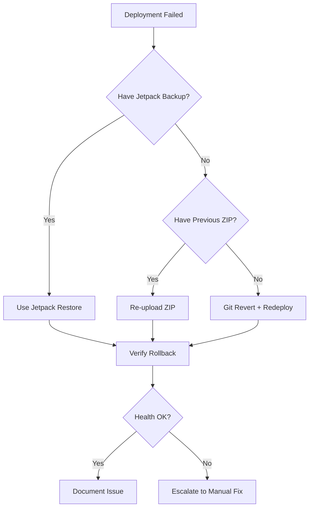

# Rollback WordPress Theme

Rollback skyyrose.co theme to previous version using WordPress.com backups or local deployment packages.

## Usage

```bash
/wordpress-copilot:rollback
/wordpress-copilot:rollback 20260205-143022
/wordpress-copilot:rollback --verify
```

## Rollback Methods

### Method 1: WordPress.com Jetpack Backup (Recommended)

**Best for:** Recent deployments within 30 days

```bash
# Open Jetpack Backup interface
open "https://wordpress.com/backup/skyyrose.co"
```

**User Steps:**
1. Select backup point (before failed deployment)
2. Review what will be restored
3. Click "Restore to this point"
4. Wait for restoration (5-10 minutes)
5. Verify site works

**Backup retention:**
- Daily backups: 30 days
- Real-time backups: Available if enabled
- On-demand backups: Before each deployment

### Method 2: Re-upload Previous Deployment Package

**Best for:** When you have the previous theme ZIP

```bash
# List available deployment packages
ls -lt /Users/coreyfoster/DevSkyy/wordpress-theme/*.zip | head -5

# Expected output:
# skyyrose-2025-deploy-20260206-120000.zip  (CURRENT - broken)
# skyyrose-2025-deploy-20260205-143022.zip  (PREVIOUS - working)
# skyyrose-2025-deploy-20260204-091530.zip  (OLDER)
```

**Process:**
1. Identify previous working version
2. Open WordPress admin
3. Upload and activate previous version

```bash
# Open WordPress themes page
open "https://wordpress.com/themes/skyyrose.co"

echo "
Rollback Steps:
1. Click 'Add New Theme' → 'Upload Theme'
2. Select: skyyrose-2025-deploy-20260205-143022.zip
3. Click 'Install Now'
4. Click 'Replace current with uploaded'
5. Click 'Activate'
6. Clear caches
"
```

### Method 3: Git Revert + Redeploy

**Best for:** When deployment package not available

```bash
cd /Users/coreyfoster/DevSkyy/wordpress-theme/skyyrose-2025

# Find commit before issue
git log --oneline --all -10

# Revert to specific commit
git checkout <commit-hash>

# Create new deployment package
cd ..
timestamp=$(date +%Y%m%d-%H%M%S)
zip -r "skyyrose-2025-rollback-${timestamp}.zip" skyyrose-2025 \
  -x "*.DS_Store" "*node_modules/*" "*.git/*"

echo "Created: skyyrose-2025-rollback-${timestamp}.zip"
echo "Now upload via WordPress admin"

# Open upload page
open "https://wordpress.com/themes/skyyrose.co"
```

## Pre-Rollback Checklist

**BEFORE rolling back, verify:**

1. **Identify the issue**
   ```bash
   # What's broken?
   # - CSP headers?
   # - Console errors?
   # - Missing files?
   # - Performance degradation?
   ```

2. **Determine last working version**
   ```bash
   # When did it last work?
   # Which deployment was successful?
   git log --all --grep="deploy" --oneline -5
   ```

3. **Create backup of current state**
   ```bash
   # Even if broken, backup current theme
   cd /Users/coreyfoster/DevSkyy/wordpress-theme
   timestamp=$(date +%Y%m%d-%H%M%S)
   zip -r "skyyrose-2025-broken-${timestamp}.zip" skyyrose-2025
   ```

4. **Document the issue**
   ```bash
   # Save error logs
   echo "Issue: [describe]" > rollback-reason-${timestamp}.txt
   echo "Error logs:" >> rollback-reason-${timestamp}.txt
   # Copy console errors, server logs, etc.
   ```

## Post-Rollback Verification

**After rollback, verify:**

### 1. Site Accessibility

```bash
# Check site loads
curl -I https://skyyrose.co

# Expected: 200 OK
```

### 2. Theme Active

```bash
# Verify correct theme version
curl -s "https://skyyrose.co/wp-json/wp/v2/themes" | \
  jq '.[] | select(.status == "active") | {name: .name, version: .version}'
```

### 3. Clear All Caches

```bash
# Open cache settings
open "https://wordpress.com/settings/performance/skyyrose.co"

echo "User: Click 'Clear all caches'"
echo "Wait 60 seconds for cache to clear"
sleep 60
```

### 4. Run Full Verification

```bash
# Use verify command to check health
/wordpress-copilot:verify --deep
```

**Expected results:**
- Console errors < 10
- CSP headers correct
- Performance metrics restored
- All 3D CDNs accessible

### 5. Test Critical Pages

```bash
# Check key pages load
urls=(
  "https://skyyrose.co"
  "https://skyyrose.co/shop"
  "https://skyyrose.co/collection/signature"
  "https://skyyrose.co/collection/black-rose"
  "https://skyyrose.co/collection/love-hurts"
)

for url in "${urls[@]}"; do
  status=$(curl -o /dev/null -s -w "%{http_code}" "$url")
  if [ "$status" == "200" ]; then
    echo "✅ $url (200 OK)"
  else
    echo "❌ $url ($status)"
  fi
done
```

## Rollback Decision Matrix

| Scenario | Method | Time | Risk |
|----------|--------|------|------|
| Deploy < 24h ago, breaking issues | Jetpack Backup | 10 min | Low |
| Deploy < 7 days ago, minor issues | Re-upload previous ZIP | 15 min | Low |
| Deploy > 7 days ago | Git revert + redeploy | 20 min | Medium |
| No previous backup | Fix forward | Varies | High |

## Rollback Workflow



## Prevention Strategies

**To minimize need for rollbacks:**

1. **Always create backup before deploy**
   ```bash
   # Automated in /wordpress-copilot:deploy
   # Manual: Create on-demand backup in Jetpack
   ```

2. **Test locally before deploying**
   ```bash
   # Run in Local by Flywheel or Docker
   # Verify all features work
   ```

3. **Deploy during off-peak hours**
   - Best time: Weekday mornings (10 AM - 12 PM PST)
   - Avoid: Friday evenings, weekends
   - Monitor: First 30 minutes after deploy

4. **Use staging site** (if available)
   ```bash
   # Deploy to staging first
   # Test for 24-48 hours
   # Then deploy to production
   ```

5. **Monitor after deployment**
   ```bash
   # First 1 hour: Active monitoring
   # First 24 hours: Check errors every 4 hours
   # First week: Daily health checks
   ```

## Rollback Documentation

**Always document rollbacks:**

```markdown
# Rollback Report: YYYY-MM-DD

## Issue
- Deployment date: 2026-02-06 12:00 PST
- Issue discovered: 2026-02-06 14:30 PST
- Symptoms: 107 console errors, CSP blocking resources

## Rollback
- Method: Jetpack Backup
- Rollback time: 2026-02-06 14:45 PST
- Restored to: 2026-02-05 14:30 PST backup
- Downtime: 15 minutes

## Verification
- Site accessible: ✅
- Console errors: 8 (down from 107)
- Performance: LCP 2.1s, FID 85ms
- All pages working: ✅

## Root Cause
- CSP headers not updated in deployment
- inc/security-hardening.php changes didn't apply

## Prevention
- Add pre-deployment CSP verification
- Test theme activation in staging
- Implement automated post-deploy verification
```

## Emergency Rollback

**If site is completely down:**

1. **Fastest recovery:**
   ```bash
   # Activate Twenty Twenty-Four (default theme)
   # Via WordPress.com dashboard
   open "https://wordpress.com/themes/skyyrose.co"
   # Click "Activate" on Twenty Twenty-Four
   # Site will load (unstyled but functional)
   ```

2. **Then rollback properly:**
   ```bash
   # Use Jetpack Backup to restore theme
   # Or re-upload working version
   ```

## Rollback Testing

**Verify rollback capability before needed:**

```bash
# Test rollback process monthly
1. Create on-demand backup
2. Make small test change
3. Deploy test change
4. Rollback using Jetpack
5. Verify site restored correctly
6. Document time taken
```

## See Also

- `/wordpress-copilot:deploy` - Deployment with automated backups
- `/wordpress-copilot:verify` - Post-rollback verification
- `skills/deployment-workflow/` - Detailed deployment docs
